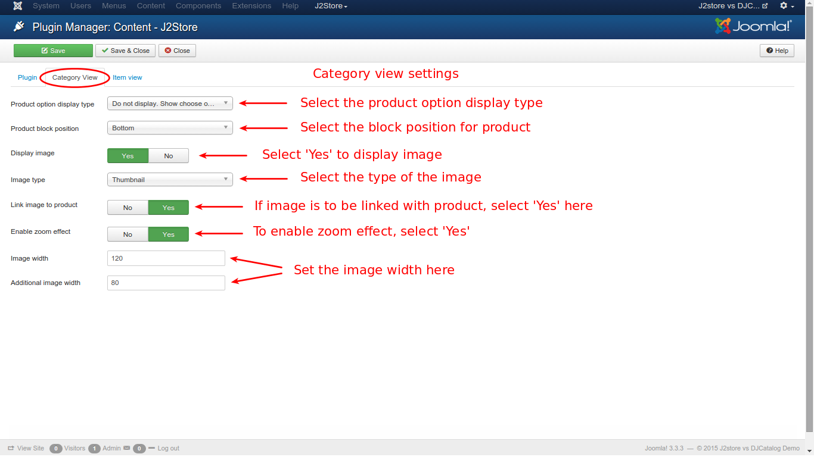

# Content Plugin Settings

Before using content plugin, some settings need to be ensured for the plugin to function properly. 

### Procedures

* From the joomla main menu, go to **Extensions -> Plugin Manager**

* From the resulting window, select **Content** from the *Select Type* filter on the left pane and click on **Content - J2Store** from the list, as illustrated in the image below

* From the resulting window, select the **Category View** tab to set the values, as shown in the image below

* Follow the steps for the settings to be made:
    * Product option display type - From the available two options, select either **Display the options and cart** or **Do not display. Show 'Choose option' button and take customer to detail view**
    * Product block position - Select **Top** or **Bottom**
    * Display image - To display the image, select **Yes**
    * Image type - Select from the three options : **Thumbnail**, **Main**, **Both Main and additional images**
    * Link image to product - Choose **Yes** if the image is to be linked with the product
    * Enable zoom effect - Select **Yes** to enable zoom effect
    * Image width & Additional image width - Set the width of the image in pixels

