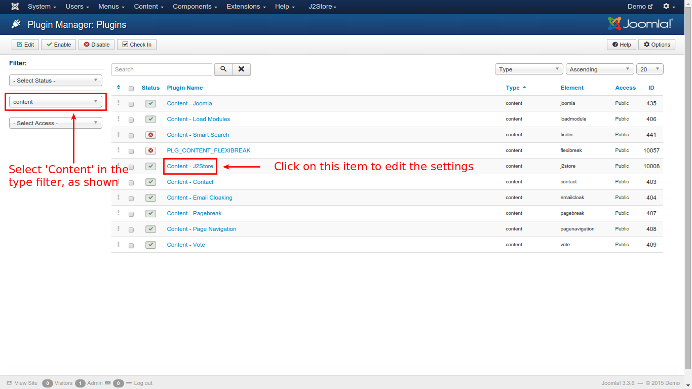
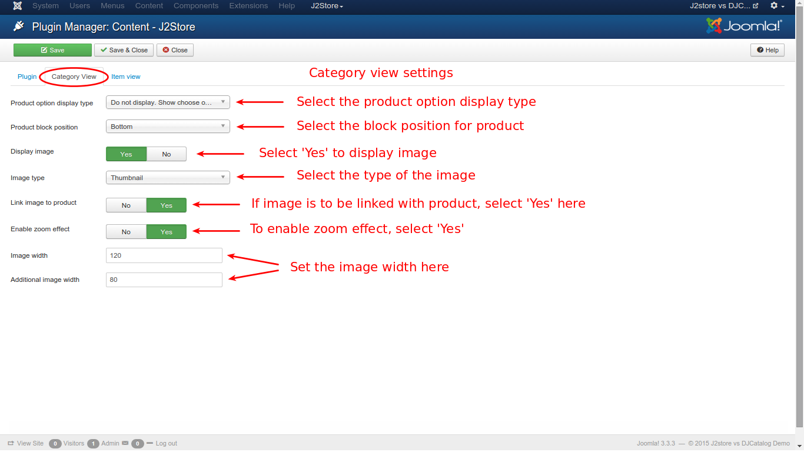
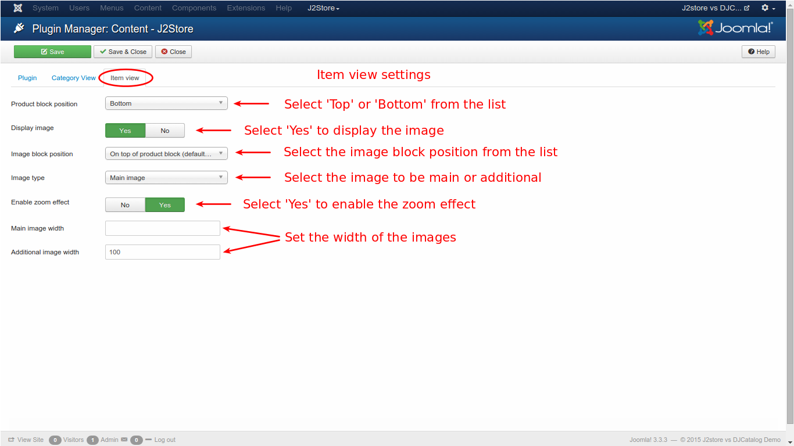

# Content Plugin Settings

To control the display in the cart section, to show or hide the images, enabling zoom effects etc., some settings have to made in advance to achieve the desired results. This section explains about how the settings can be made.

### Procedures

* From the joomla main menu, go to **Extensions -> Plugin Manager**

* From the resulting window, select **Content** from the *Select Type* filter on the left pane and click on **Content - J2Store** from the list, as illustrated in the image below

* From the resulting window, select the **Category View** tab to set the values, as shown in the image below:

* Follow the steps for the settings to be made:
    * Add to cart and options display - From the available three options, select either **Display the options and cart** or **Do not display. Show 'Choose option' button and take customer to detail view**
    * Product block position - Select **Top** or **Bottom**
    * Display image - To display the image, select **Yes**
    * Image type - Select from the three options : **Thumbnail**, **Main**, **Both Main and additional images**
    * Link image to product - Choose **Yes** if the image is to be linked with the product
    * Enable zoom effect - Select **Yes** to enable zoom effect
    * Image width & Additional image width - Set the width of the image in pixels

* Save the settings and go to **Item View** tab to set the values, as shown in the image below:

* Follow the steps for the settings to be made:
    * Product block position - Select **Top** or **Bottom** for this option
    * Display image - To display the image, select **Yes**
    * Image block position - Three options available. selct one accordingly or leave the default selection:
        * On top of product block (default)
        * Attach to Before Content plugin event
        * Attach to After Content plugin event
    * Image type - Select **Main** or **Both main and additional images**
    * Enable zoom effect - To enable, select **Yes**
    * Main image width & Additional image width - Set the image width in pixels
* Save and close the window.

Content plugin settings were made successfully. Now, it is ready to be used in the store. 

