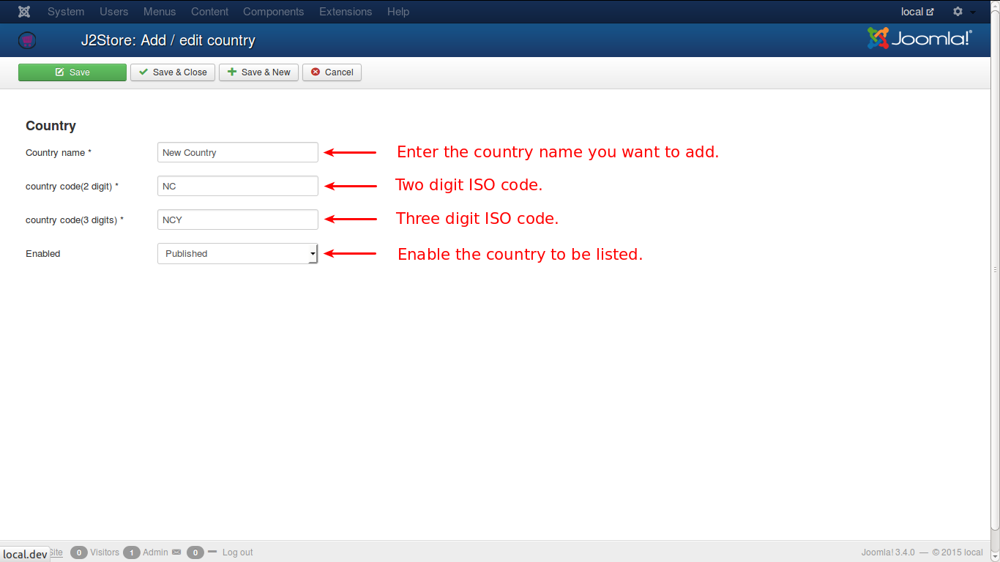
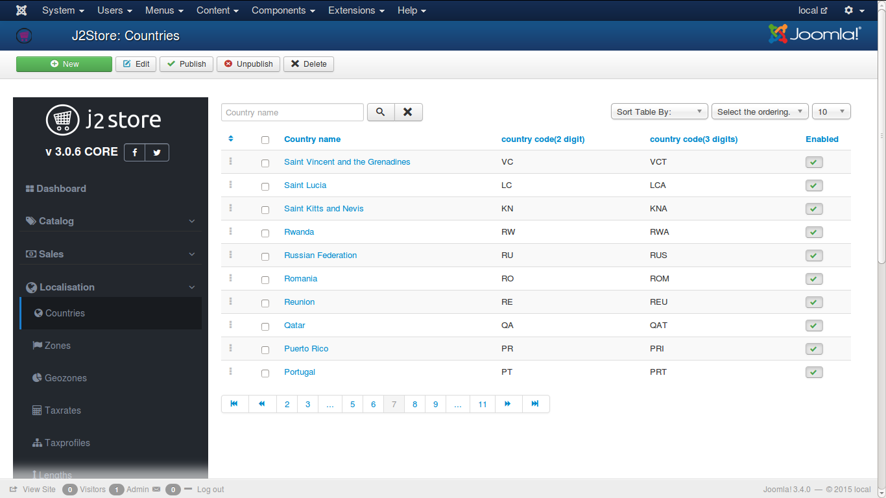

# Countries

A list of most of the countries in the world. You can choose one from the list. If any odd one, that is not found in the list, you can very well create that. The fields are:

* **Country Name** - Name of the country
* **Country code** - 2 digit international standard code
* **Country code** - 3 digit international standard code
* **Enabled** - Published or Unpublished i.e., only if the country is published, it will be available for the customer
 
Check the image below:

The listing of countries will be like this in your J2Store.

