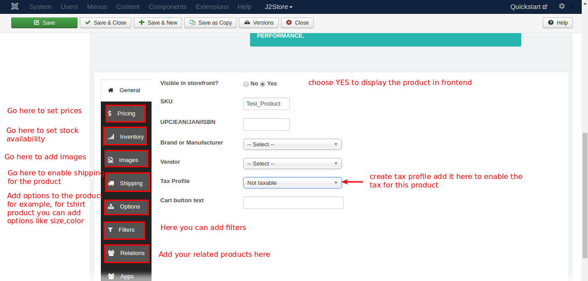
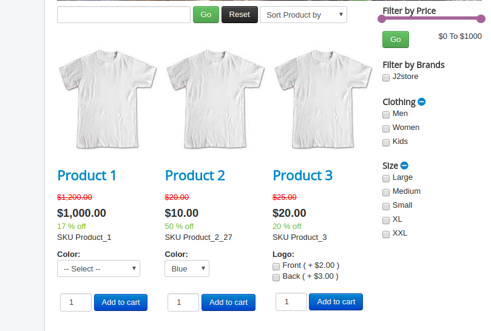

#Introduction

Integrating J2Store with your template is very easy. Following is the step by step instructions on how to develop the template with J2Store.

* **[Install Framework](#install_framework)**
* **[Download and Install J2Store](#download_install_j2store)**
    * **[Download J2Store](#download_j2store)**
    * **[Install J2Store](#install_j2store)**
    * **[J2Store Configuration](#j2store_configure)**
* **[Choose Layout to display your products](#choose_layout)**
    * **[J2Store Product List View](#j2store_layout)**
    * **[Joomla Category Blog Layout](#article_layout)**
    * **[Create Product](#create_product)**
* **[J2Store File Location and override procedure](#file_override_location)**
    * **[Layout file location](#layout_file)**
    * **[Frontpage product listing files](#product_listing)**
    * **[Product view](#product_view)**
    * **[File location of filter](#product_filter)**
    * **[Cart page](#cart)**
    * **[Checkout page](#checkout)**
    * **[Order history page](#myprofile)**

##Install Framework

Once you installed and configured the Joomla Content Management System, you have to install the template framework. For example, if you would like to develop the template using T3 framework, go to T3 framework's official website and download the framework as either Quickstart package or Blank template.

##Download and Install J2Store

####Download J2Store

1. Get the J2Store package from our website http://j2store.org/

2. If you would like to use PRO version of our product, you should be a member of J2Store.

3. Once you completed the registration process and got the login, go to http://j2store.org/my-downloads.html to download the PRO version.

####Install J2Store

1. Use the Joomla installer to install the J2store package.

2. Go to Joomla Extension > Manage > Install

3. Choose and select your file.

4. Click Upload & Install.

####J2Store Configuration

1. Once installed, you will get J2store in the Joomla component list and also separate J2store tab in Joomla backend.

2. Now, Go to J2store > Dashboard.

3. Fill all the fields in the basic settings and click Save & Proceed.

##Choose Layout to display your products

####J2Store Product List View

It is very easy and flexible to display the product in frontend using J2Store Layout. Please follow the procedure given below.

1. Go to Menu manager -> Main menu and create a new menu item.

2. Give the menu title and choose the menu type as **J2store > Product List View**

3. Choose the Category which have chosen when creating product. The category added in the product and the category added in the menu should be same.

4. In the menu you can see these three tabs **common options, Item view options in category listings, Item view options**.

 **Common Options:** Here you can choose the layout(bootstrap 2, bootstrap 3).

 **Item view options in category listings:** Here you can choose which are the things should be displayed in product pages. For example, you can hide / show price, images, filters, etc..

 **Item view options:** Here you can choose which are the things should be displayed in product view page.

####Joomla Category Blog Layout

This is the another method / way / layout to display your products. By using this layout, you can use the Joomla's native article options.

1. Go to Menu manager -> Main menu and create a new menu item.

2. Give the menu title and choose the menu type as **Articles -> Category Blog**

####Create Product

1. Since J2Store uses the default Joomla articles as its products, it lets you use native content as product.

2. Go to Content > Articles > Add new article. Now, new article page will open.

3. Give the title of the product, add your description about the product in the content tab and choose the category in which you want to display the product(category chosen here and category chosen in the menu should be same).

4. Now, go to J2store Cart tab, choose **YES** to treat article as a product then choose your **Product Type** from the list(Simple, Variable, Configurable, Downloadable) and then click **Save and Continue**.

5. After saving, again go to J2store cart tab. Now you can see the options to add image for product, set prices, add filters / Tax / Shipping.

##J2Store File Location and override procedure

####Layout file location

Go to /components/com_j2store/templates which contains two folders named **bootstrap3** and **default**(bootstrap2).

If you choose bootstrap3 as sub-template then you have to go with bootstrap3 folder.

If you choose default as sub-template then you have to go with default folder.

####Frontpage product listing files

Open your sub-template folder(/components/com_j2store/templates/YOUR-SUB-TEMPLATE) where you can find the files with name started with default_(for example, default_simple.php, default_images.php, etc). Those files controls all the features displaying in the category listing page.

**OVERRIDE PATH**
templates/YOUR-TEMPLATE/html/com_j2store/templates/YOUR-SUB-TEMPLATE/

####Product view

Open your sub-template folder where you can find the files with name started with view_(for example, view_simple.php, view_images.php, view_options.php, view_notabs.php, etc). Those files controlled all the features displaying in the Product view page.

**OVERRIDE PATH**
templates/YOUR-TEMPLATE/html/com_j2store/templates/YOUR-SUB-TEMPLATE/

####File location of filter

Following files controls filter section,

/components/com_j2store/templates/YOUR-SUB-TEMPLATE/default_filters.php

/components/com_j2store/templates/YOUR-SUB-TEMPLATE/default_sortfilter.php

**OVERRIDE PATH**
templates/YOUR-TEMPLATE/html/com_j2store/templates/YOUR-SUB-TEMPLATE/

####Cart page

Cart page is controlled by the files located in the follwing path /components/com_j2store/views/carts/tmpl

**OVERRIDE PATH**
templates/YOUR-TEMPLATE/html/com_j2store/carts/

####Checkout page

Checkout is controlled by the files located in the follwing path /components/com_j2store/views/checkout/tmpl

**OVERRIDE PATH**
templates/YOUR-TEMPLATE/html/com_j2store/checkout/

####Order history page

Order history page is controlled by the files located in the follwing path
/components/com_j2store/views/myprofile/tmpl

**OVERRIDE PATH**
templates/YOUR-TEMPLATE/html/com_j2store/myprofile/