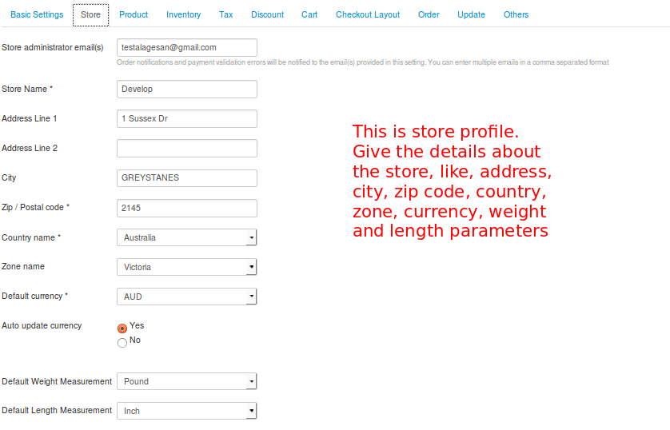
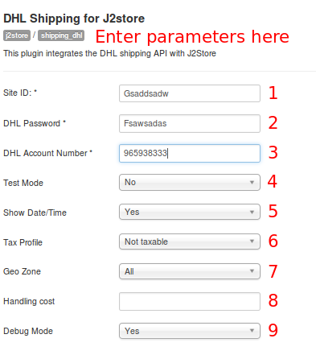
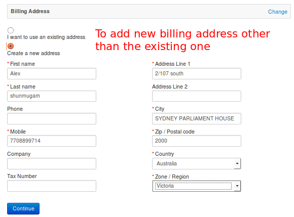
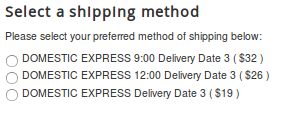

# DHL Shipping Plugin

This plugin integrates DHL Shipping Rate API with J2Store.

### Requirements

* PHP 5.2 or higher
* Joomla 2.5 or above
* J2Store 2.7.3 or above

### Installation

1. Use Joomla installer to install the plugin.
2. In the Joomla control panel, go to **Extension -> Plugin Manager.** Open the DHL Shipping(type=j2store).
3. Enable plugin.
4. Enter Plugin Params
 
####Store Profile
To add the details of your store, you need to enter the values in the fields as shown in the image below:

#### Params :

With the help of the below image, you can set the parameters for the DHL Shipping Plugin:

1. **Site ID:**
	This is your DHL Site Id associated with your DHL accout.

2. **DHL Password:**
	This is your DHL Password associated with your DHL accout.

3. **DHL Account Number:**
	This is your DHL Account Number associated with your DHL accout.

4. **Test Mode:**
	Before going live, you can test your store using the Test mode. If you want to test, set this option to **Yes**, otherwise set it to **No.**

    >IN LIVE SITE , THIS	SHOULD BE SET TO “NO”.

5. **Show Date/Time:**
	To display the delivery Date/Time in DHL Service, set this option to **Yes.**

6. **Tax Profile:**
	To apply tax on your shipping cost, please select the relevant Tax profile. If there is no tax applicable on shipping cost, you can ignore this field or leave it blank.

7. **Geo Zone:**
    You can restrict the use of this shipping plugin to a particular geozone by selecting it in this option. Choose All geozones to show this method to all customers.

8. **Handling cost:**
	If handling charges need to be applied, it can be done by entering the amount in this field.

9. ** Debug Mode:**
	Enable/Disable Log file to Debug DHL Shipping Plugin.     
    >Set this to **NO** in Live Site.

If you dont want to use the shipping address for billing but want to create a new address, you can do so as shown in the image:

You can select a shipping method of your choice from the given methods:

### Support
Still have questions? You can reach us in **support@j2store.org** 

Thank you for using our extension.