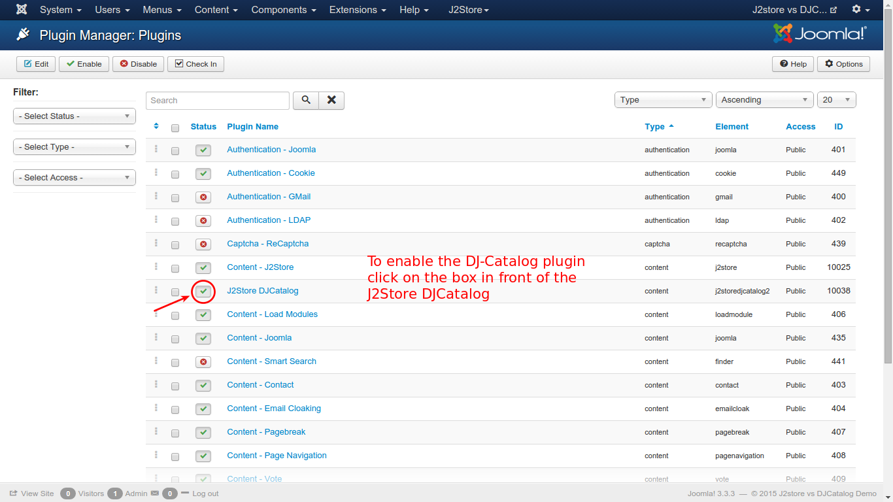

# DJ Catalog2

### Introduction
This plugin integrates the popular joomla catalog extension DJ-Catalog2 with J2Store enabling users to create a powerfull and full fledged online store. 

### Requirements
* PHP 5.2 or higher
* Joomla v-3.x
* J2Store v-3.1.6 or above
* DJ-Catalog2 v-3.5.2
* J2Store - DJ-Catalog2 integration plugin

### Installation
As shown in the image below, use joomla installer to install DJ-Catalog2:

1. Go to **Extension Manager** in control panel.
2. Select the plugin using the **Choose File** button and click *Upload &Install*
3. Go to **Extensions -> Plugin Manager -> Filter : Select type "content"** -> Select the Plugin **J2Store - DJCatalog2** and enable the content plugin as shown in the image:

###Create a product
1. Go to **Components -> DJ-Catalog2**.
2. From **DJCatalog2** Control panel, Choose **New Product** icon.
3. You can find **J2Store** Tab as shown in the image, indicating that J2Store is integrated with **DJ-Catolog2**.
4. Enter the required fields and click on the J2Store Tab, set **Yes** to **Treat as a product** option and click on **Save**. 

