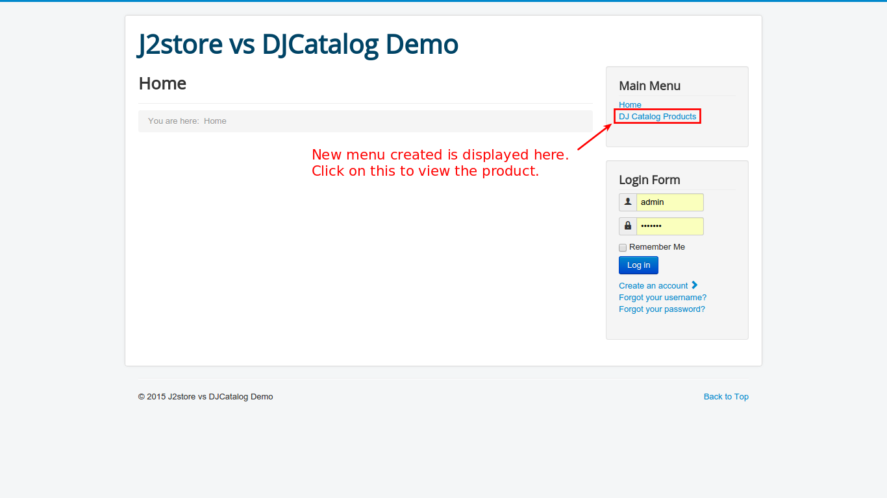

# DJ Catalog2

### Introduction
This plugin integrates the popular joomla catalog extension DJ-Catalog2 with J2Store enabling users to create a powerfull and full fledged online store. 

### Requirements
* PHP 5.3 or higher
* Joomla v-3.x
* J2Store v-3.1.6 or above
* DJ-Catalog2 v-3.5.2
* J2Store - DJ-Catalog2 integration plugin

### Installation
As shown in the image below, use joomla installer to install DJ-Catalog2:

1. Go to **Extension Manager** in control panel.
2. Select the plugin using the **Choose File** button and click *Upload &Install*
3. Go to **Extensions -> Plugin Manager -> Filter : Select type "content"** -> Select the Plugin **J2Store - DJCatalog2** and enable the content plugin as shown in the image:

### Create a product
1. Go to **Components -> DJ-Catalog2**.

2. From **DJCatalog2** Control panel, Choose **New Product** icon.

3. You can find **J2Store** Tab as shown in the image, indicating that J2Store is integrated with **DJ-Catolog2**.

4. Enter the required fields and click on the J2Store Tab, set **Yes** to **Treat as a product** option and click on **Save**. 

5. Now the product is created and will have the configuration options enabled. Enter the product details like, images, prices, options, filters, relations etc., and save the configuration.

6. The product is created using DJ-Catalog2. To display the product in the frontend, a menu is to be created. 

7. To create menu, follow the illustrative steps. Go to **Menus -> Add New Menu Item**, as shown below:

8. Enter a name for the menu and click on the *Select* button to select the menu item type.

9. Click on **DJ-Catalog2** and a list of options will be shown. From the list, select **List of items**. Now the menu item with details will look like the one below:

10. Save the menu item and go to site. You can see the menu item displayed below the **Home** menu item.

11. Click on the **DJ Catalog Products** item. The products created using this extension will be displayed in the site, as shown below:

