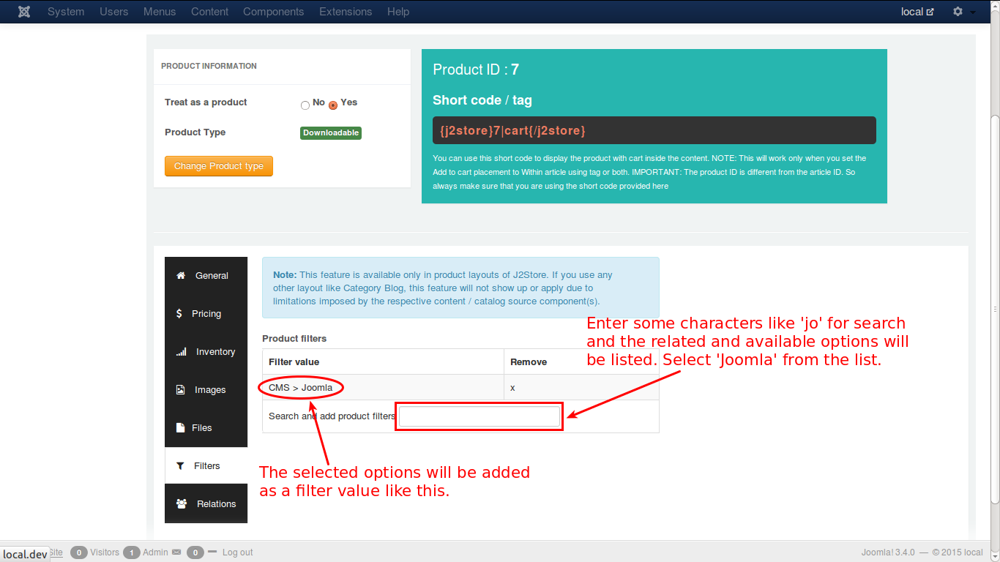

# Filters

Filters are certain attributes that help narrow the search of a particular product.

For e.g., assume that a customer searches for joomla extensions in the store. Now, the productfilter is set as cms > joomla, to narrow the search. See the image below:

Now, in the cart, the extensions of joomla alone will be listed out for the customer to select from.