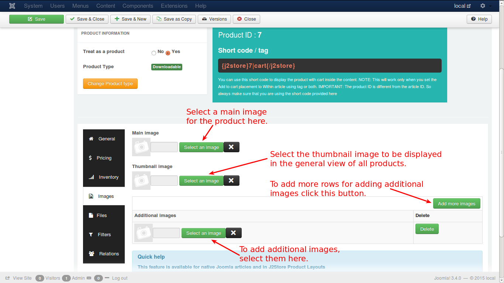

# Images

In this tab you can add images that can help the customer to more clearly understand the product he wants to buy. Images help the prospect to imagine how the product intended to purchase will look like.

Let us understand this with an example. 

Lets assume that a customer would like to purchase an extension of **Joomla**. Now, **Joomla extension** images need to be loaded in this tab. The images will help the customer to understand how the site will look like, when this **Joomla extension** is installed.

* **Main Image** - The main image will be a general screenshot image of the site when the particular extension is installed, that has to be uploaded by clicking on the 'Select an image' button and selecting the appropriate image from the files.

* **Thumbnail Image** -The thumbnail image would be something that represents the original product, but it would be a much smaller one to fit into a button, that will be shown up in the cart. By seeing this, the customer will understand that his product is displayed on the button and will click the button to see more details about the **Joomla extension**.

* **Additional Images** - Additional images help the customer to know more details about the extension, which will be showing the site view with many pages, and the customer will understand it clearly how it looks like, what the technical details of the extension, the software configuration, and so on.