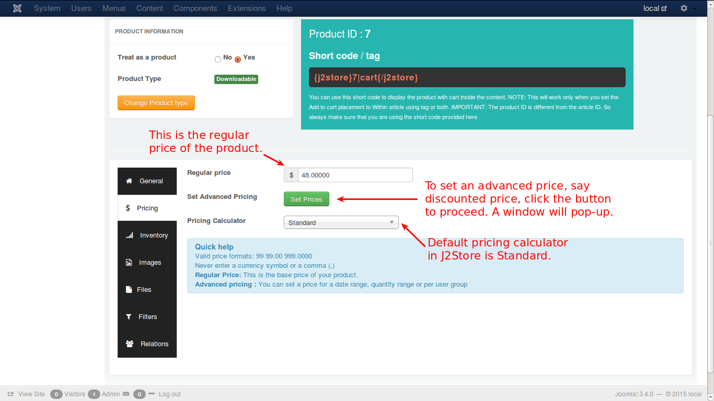
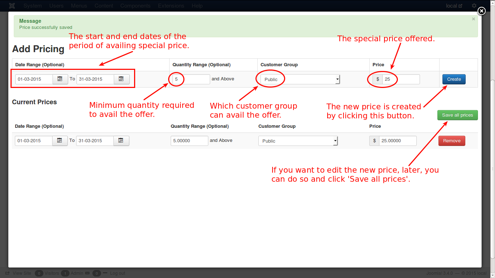

# Pricing

Here, you can configure the price settings of a product. There are two types of pricing, namely, **Regular Price** and **Advanced Price**. Let us see with the help of illustrative images.

**Regular Price**

You enter the regular price directly in the text box provided.

**Advanced Price**

Click the button '**Set Prices**' for setting up an advanced pricing configuration.

Check the image below.

Now if you click in the ***Set Prices*** button, you will see a pop-up window to set the advanced prices.

Here you go...

* First select the dates, between which you wish to set the advanced price. 

* Then enter the minimum quantity required to avail this special price. This is optional and if there is no minimum quantity required, just leave it as empty.

* Select the customer group to which you offer this special price.

* Now enter the new price and click **Create**.

The price will be added and displayed below. You can edit that if you need, and click **Save all prices**.

If you want to remove that, you can do it by clicking the **Remove** button.
