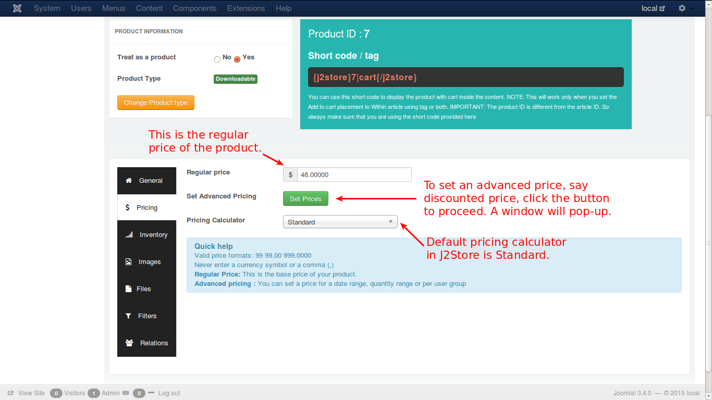
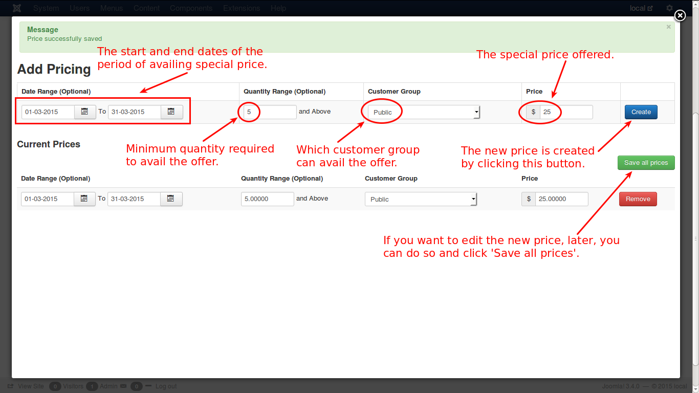

# Pricing

Here, you can configure the price settings of a product. There are two types of pricing, namely, **Regular Price** and **Advanced Price**. Let us see with the help of illustrative images.

**Regular Price**

You enter the regular price directly in the text box provided.

**Advanced Price**

Click the button '**Set Prices**' for setting up an advanced pricing configuration.

Check the image below.

Now if you click in the ***Set Prices*** button, you will see a pop-up window to set the advanced prices.

Here you go...

