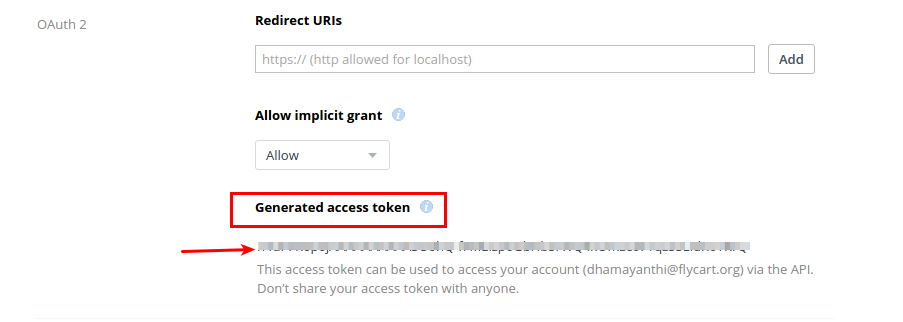

# Dropbox

Sell your files stored in dropbox with J2Store Joomla eCommerce platform. The app enables you to connect your dropbox and sell the files securely.

### Important Note

The download link sent in the email uses the Dropbox API's method to create a temporary url.

The API does not allow us to set a custom expiry date (like in Amazon S3). Dropbox itself sets the expiry time. The link expires after a few hours.

After the link expires, the customer cannot download using that link. He will have to visit the site, login and then click the Download. This would create another temporary download url and allow the customer to download.

Now there are two ways of solving this

1. You can mention in the email that the link is valid only for a few hours. if it expired, customers have to login to your site to download the file.

2. Dropbox API now allows creating a permanent sharable link. Once created it is valid till your file is removed from dropbox.

You can use the app's settings to choose whether to send a temporary url or permanent url.

### Key features

- Sell any file stored in Dropbox

- Enables you to retrive the files from the Dropbox remotely.

- Generates a temproary url for the downlodable files, which expires within minutes

- Allows you to control the expiry of the url from settings

### Known Limitations

- When you are using dropbox for selling digital files, don't set Download limit and Download expire days. Because these features are not supported by Dropbox API.

#### Requirements

* PHP 5.4 or higher
* Joomla 3.x
* J2Store 3.2.10 or above

#### Installation

1. Download Dropbox app from our site's extensions section and install it using Joomla Installer.

2. In the backend, go to J2Store > Dashboard > Apps.

3. Click Enable in the Nexmo SMS app as shown in the image below.

4. Once app is enabled, click open to setup the Basic settings of the app.

#### Basic Settings

**Folder Name:** Enter the name of the folder. The folder will be created(with the name entered here) in the path which you have entered in the J2Store configuration. All the files stored in your dropbox account will be fetched and stored in this folder.

**Access Token:** Enter the valid access token for your account provided by Dropbox.

**Dropbox Key:** Enter the valid app key associated with your dropbox account.

**Dropbox secret key:** Enter the valid app secret key associated with your dropbox account.

####How to Generate access token, key and secret key?

**Step-1:** Go to https://www.dropbox.com/developers/apps and login using your dropbox account. After logging in, you wil be having the page with Create app. Click on the Create app button.

**Step-2:** Clicking on Create app button will ask you complete the several steps to create the app.

* Choose **Dropbox API** as API in your first step of creating app

* Choose your access type.
***App folder***
A dedicated folder named after your app is created within the Apps folder of a user's Dropbox. Your app gets read and write access to this folder only.
***Full Dropbox***
You get full access to all the files and folders in a Dropbox.

* Give the name for your app and agree terms and conditions and click create app.

**Step-3:** Now the app page will be displayed which contains your **App key** and **App Secret key**.

**Step-4:** Click on **Generate** button to generate access token for your app.

**Step-5:** Copy all the credentials in your notepad and paste it in the J2Store's dropbox app basic settings.

#### Choosing files in creating digital product

1. Once finished configuring basic settings, go to article manager and open your product.
2. Move to J2Store cart tab and then navigate to Files tab
3. Click on Set Product files

4. Click on Choose file will display the folder named with the folder name you have given in the basic settings.
5. Choose your file and save.

#### Support

Still have questions? You can post in our support forum: http://j2store.org/forum/index.html

Thank you for using our extension.