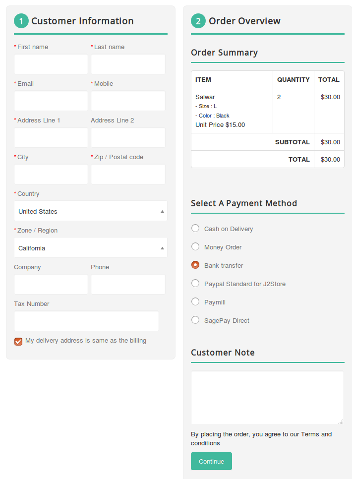
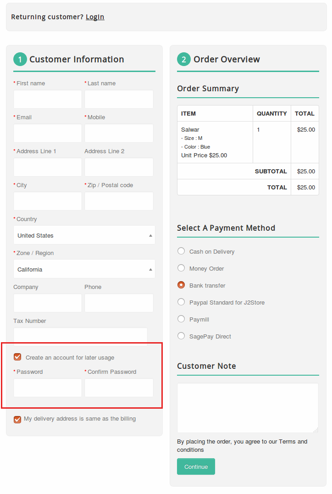
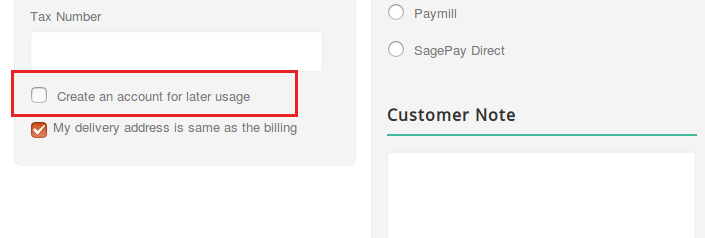
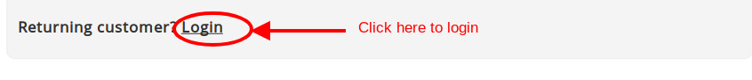
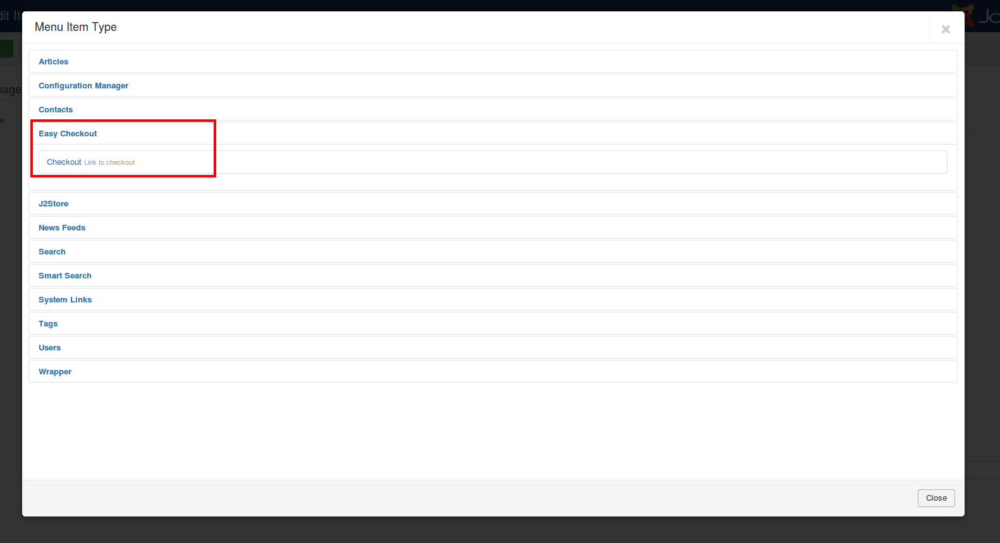
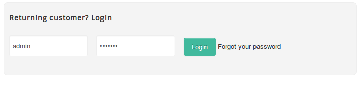
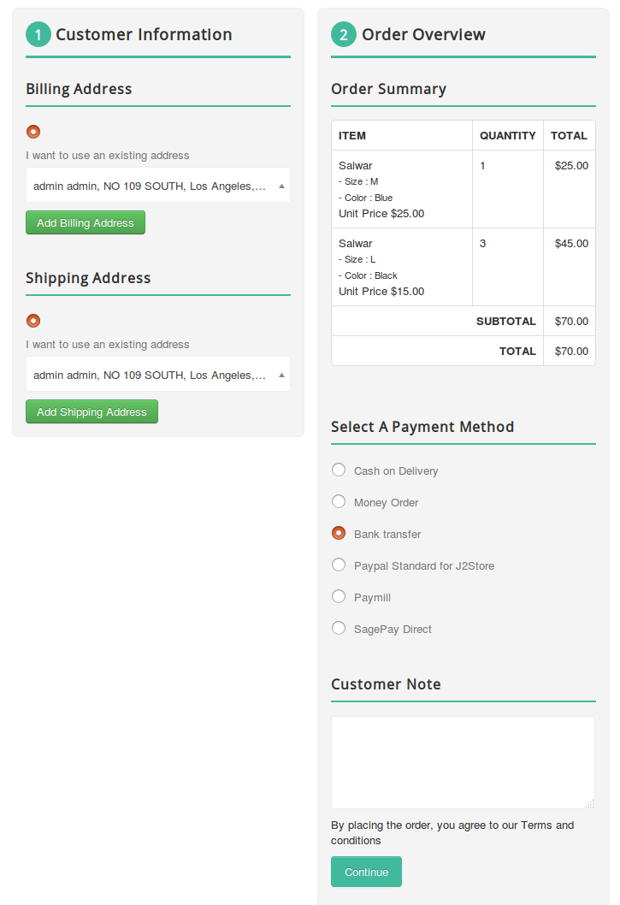
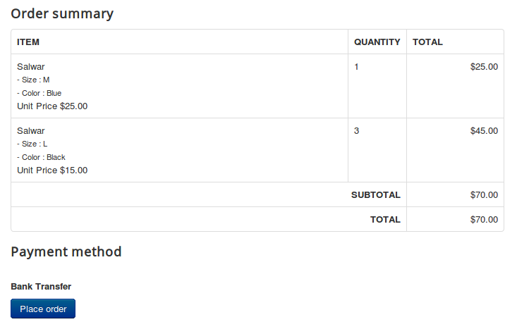

# Easy Checkout

With online shopping moving quickly, convenience is becoming a must for customers. Overcomplicating your check out process can result in lost sales and unsatisfied customers.
One would think that fewer steps would make it easier for the customer to check out, but that is not always the case.

Here we are coming up with **Easy checkout** for J2Store that makes the checkout process quiet easier.

Easy checkout is nothing but an one-page checkout that displays all elements of a standard checkout including basket contents, billing and shipping address, shipping options, and payment information on one page. Originally, one-page checkouts were put into practice in an effort to simplify the check out process with fewer clicks and fewer pages.

It will be easier to complete as less steps can appeal to time-conscious customers.

### Requirements

1. Joomla version 3.4 +

2. PHP version 5.6 +

3. J2Store 3.3.0

### Installation

1. Download and install our Easy checkout component using Joomla installer.

2. After installing, go to Extensions > Plugins and make sure that the plugin **System - EasyCheckout** has been enabled.

3. Once you enabled the system plugin, the J2Store's normal checkout will be replaced and the single step checkout will be activated.

### Few points that has to be remembered

#### 1. Guest checkout

The guest checkout form is must for all online stores for the customers who don't want to have an account.

To enable the Guest checkout, go to J2Store > Setup > Configuration > Cart tab
Set **YES** to Allow guest checkout
Save.

#### 2. New account registration

To enable the New account registration option in Easy checkout, 

Go to J2Store > Setup > Configuration > Cart tab
Set YES to Allow quick new user registration
Save.

If new user registration option is enabled, you would see the small checkbox labelled **Create an account for later usage** in the checkbox.

This checkbox will be checked automatically.

If customers don't want to register, they can uncheck the checkbox and proceed further as a guest (Non-registered).

#### 3. Existing customers

The existing customers can place the order by using the login form. You would see the login form by clicking on **Login**.

#### 4. Checkout menu

The SEF is the most important one for all the online stores. Similar to the Normal checkout, the easy checkout also has the menu item type.

By using this menu type, you can have the SEF url for checkout page.

Go to menu manager and create the menu item with type **Easy checkout > Checkout**.

### Screenshots

