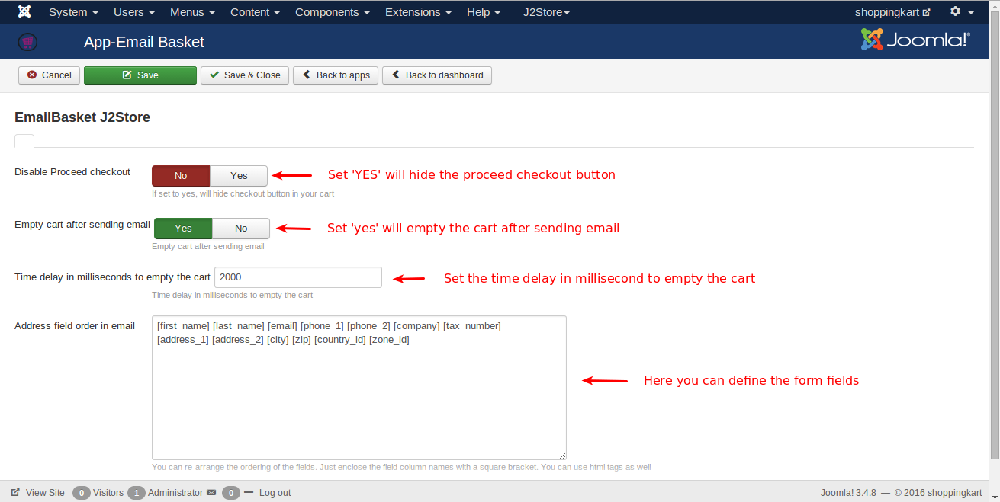

# Email Basket Plugin

This plugin allows your customers to email items in the cart to the store owner and to themselves.

The plugin nicely integrates in the default cart page of J2Store. You can ask the customers to provide their name, address or any other information while emailing the cart.

#### Requirements
* PHP 5.2 or higher
* Joomla 2.5.x
* J2Store 2.8.0 or above

#### Installation Instructions
1. Use the Joomla installer to install the plugin.
2. In the backend, go to Extensions->Plugin Manager and open the Email basket
plugin. (type=**j2store**).
3. Enable the plugin
4. Enter the parameters (read the explanation about each parameter given below)
5. Save and close it.

Now you can see the Email Basket button in the cart page.

#### Parameters
**Custom fields display type**

You can get the name and address of the customer, while he
emails you the cart. If you need some more input from the customer, go to j2store –> set up –> custom fields.

You can create more custom fields for the users to fill in while emailing the basket.

It can either be based on the Guest display layout or the register layout.

**Disable proceed checkout**

If you set this to YES, the plugin will hide the checkout button in the cart

**Empty cart after sending email**

If you set this to YES, the plugin will empty the cart after emailing the cart items to store owner.

**Time delay in milliseconds to empty the cart**

You can set a delay for emptying the cart. Default is 2 seconds.

**Address field order in email**

Here you can define the fields by enclosing the square bracket as well as html tags. You can re-arrange the ordering of fields.

####Video Tutorial

**[Here is the link](https://www.youtube.com/watch?v=IHpKrQI04Us)** to email basket video tutorial.

#### Support
Still have questions? You can reach us in support@j2store.org

Thank you for using our extension.

