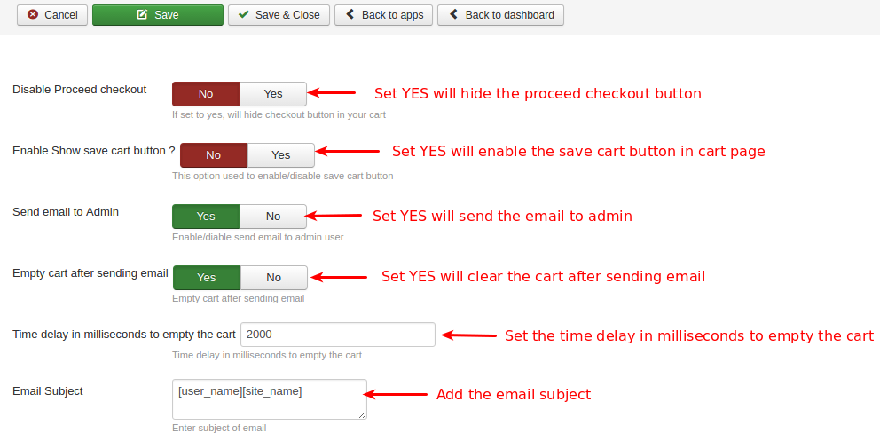

# Email Basket Plugin

This plugin allows your customers to email items in the cart to the store owner and to themselves.

The plugin nicely integrates in the default cart page of J2Store. You can ask the customers to provide their name, address or any other information while emailing the cart.

#### Requirements
* PHP 5.2 or higher
* Joomla 2.5.x
* J2Store 2.8.0 or above

#### Installation Instructions
1. Use the Joomla installer to install the plugin.
2. In the backend, go to Extensions->Plugin Manager and open the Email basket
plugin. (type=**j2store**).
3. Enable the plugin
4. Enter the parameters (read the explanation about each parameter given below)
5. Save and close it.

Now you can see the Email Basket button in the cart page.

## Parameters

#### Basic settings

**Disable proceed checkout**

If you set this to YES, the plugin will hide the checkout button in the cart.

**Enable show save cart button**

Set **YES** will display the Save cart button(which is used for un-registerd users) in cart page. Clicking on this button will redirect the customer to register. After registering and loggin in, the cart items remains in the basket.

**Send email to Admin**

Set this **YES** will send the email to admin also.

**Empty cart after sending email**

If you set this to YES, the plugin will empty the cart after emailing the cart items to store owner.

**Time delay in milliseconds to empty the cart**

You can set a delay for emptying the cart. Default is 2 seconds.

**Email Subject**

Enter the subject of the email here.

**Email Body**

In the Email body section, you can use the shortcodes to display the dynamic information such as customer's name, email, country, cart items, etc..

#### Advanced

**Modal box container Inline Style**

You can add the additional inline style to the modal box container in the given text box.

**Modal box container extra class**

You can add the additional class names to the modal box container in the given text box.

**Modal style**

You can add the custom css in the given text area.

**Redirect customer to this URL**

Enter the URL to which the customer should be redirected on the form submission.

####Video Tutorial

**[Here is the link](https://www.youtube.com/watch?v=IHpKrQI04Us)** to email basket video tutorial.

#### Support
Still have questions? You can reach us in support@j2store.org

Thank you for using our extension.

