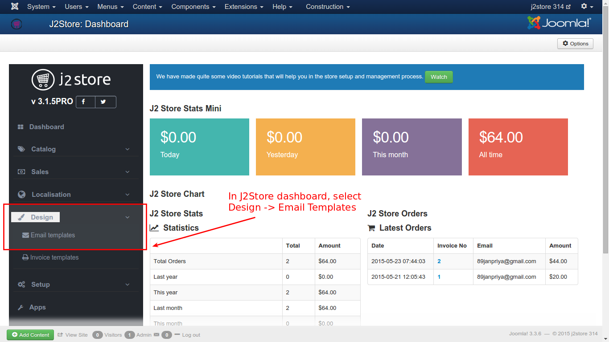
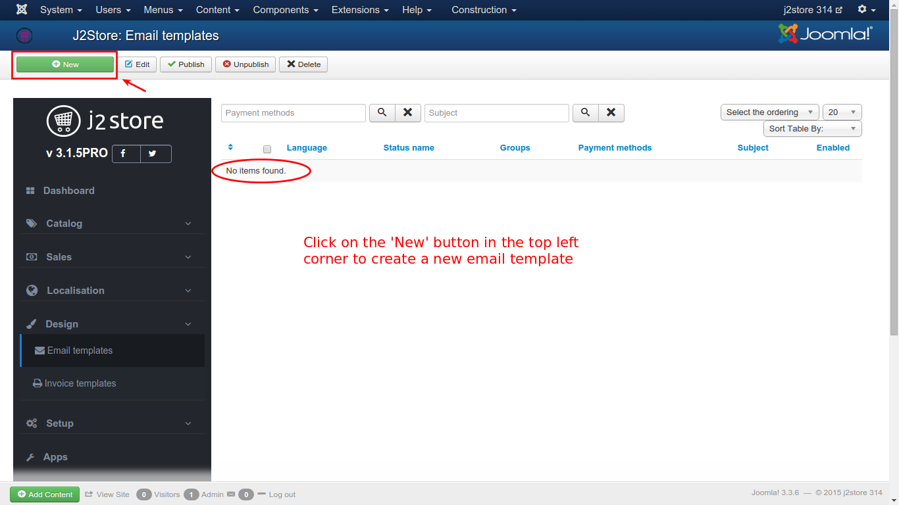
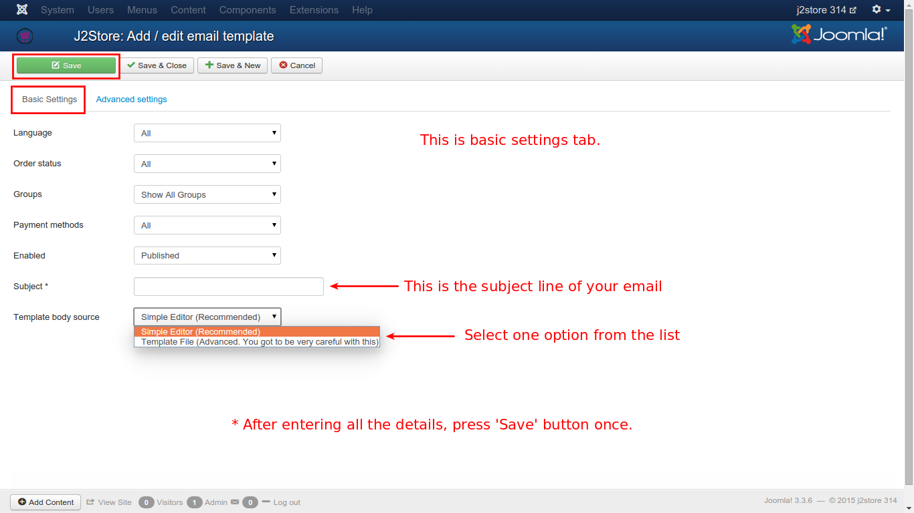
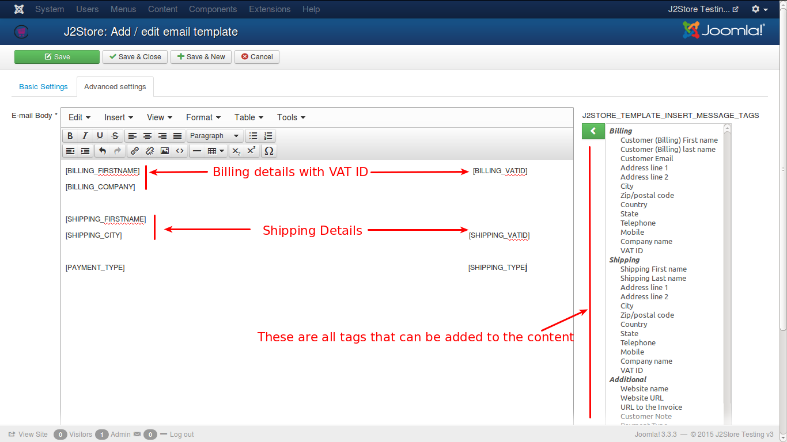
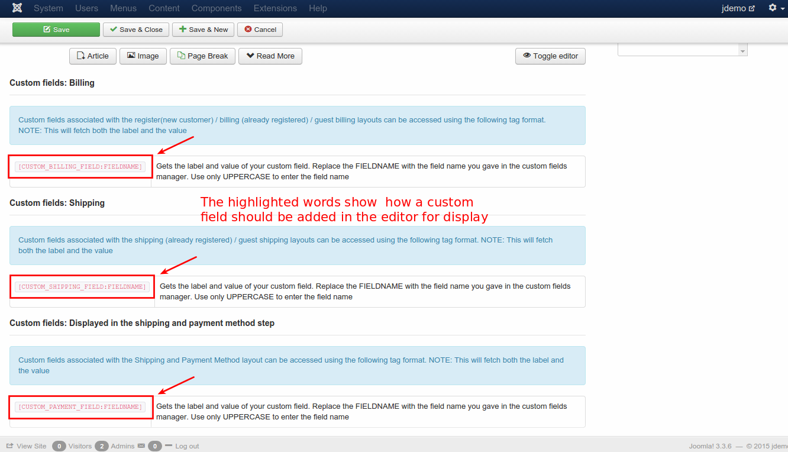
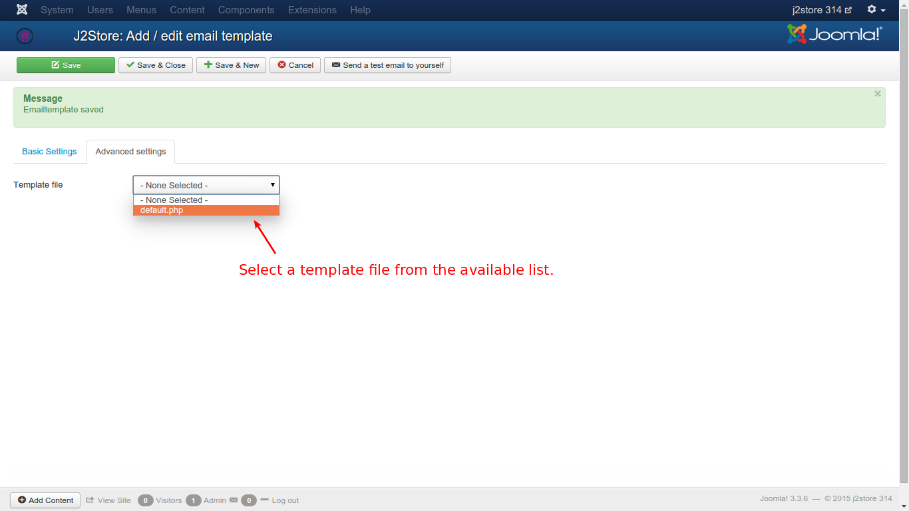
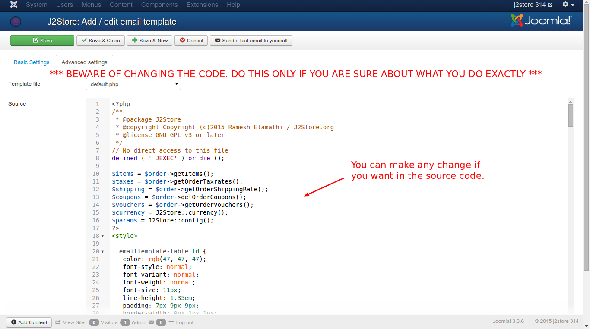

# Email Template

You can customise the email notifications sent to the customers when they place an order. The email templates offer a wide range of short codes to include dynamic data like order information, customer information in the email notification.

##Customising the template 

###Free version

Write a language override for the following constants

J2STORE_ORDER_EMAIL_TEMPLATE_STANDARD_SUBJECT
This is the subject of the email

J2STORE_ORDER_EMAIL_TEMPLATE_STANDARD_BODY
This controls the body of the email.

Refer below all the short codes that can be used in the email template

###PRO version
  
  In Pro version, you have the ability to create the email template from the backend. And you also have the ability to apply different restrictions for them.
  
To create an email template, follow the steps as shown with the help of images.

From the resulting page, click on **New** in the top left corner.

You will get two settings tabs to be filled up for creating an email template. They are 
* Basic
* Advanced

### Basic
The fundamental requirements of a template. Let us see one by one.

#### Language
The languages for which the template is compliant, is set here. You can select **All** for all languages.
#### Order Status
A specific order status can be selected for emailing the necessary intimation to be sent. It can be any one of all the options listed. If email has to be sent for multiple options, then multiple templates has to be created.

#### Groups
Here the user group from which the email can be sent is selected.

#### Payment Methods
The payment methods that are covered for emails can be selected here.

#### Enabled
It has to be enabled first to send email.

#### Subject
A short one line info about the content of the email.

#### Template Body Source
The source used to design the email template is selected here. There are two options to choose from. They are:
1. **Simple Editor**
2. **Template List**

After you select an option from the list, you have to **Save** once. Then only you can set the advanced tab.

In **Simple Editor**, the content of the email body can be designed here. There are so many options available to customize the content. There is a rich text editor that helps formatting the content.
The facilities that are available in the editor:
* Cut, Copy, Paste
* Insert links or images
* Formatting the text in the body like, bold, italicize, line spacing, underlining, and much more
* Insert tables
* Insert source code etc

Full articles can also be added to the content, from other external sources.

In **Template List**, you can have a list of templates in the form of .php files. You can select from the available one in the advanced tab.

### Advanced
If you have selected **Simple Editor** in the **Basic Tab**, then the **Advanced Tab** will look like the below image.

There are a number of tags listed in the extreme right of the editor from where they can be added to the editor content.

Also, you can add custom fields you have created in the editor. To add a custom field in the editor for display, you need to follow the format given below:

[CUSTOM_BILLING_FIELD:FIELDNAME]

Keep in mind, the following, when you add a custom field to the editor:

* The custom field should be enclosed in []
* All the letters should be in CAPITAL letters
* 'CUSTOM' is the first word inside the []
* Next, the section in which you have created the field, like, 'BILLING_FIELD'
* And finally, the field name

Refer the image below for more clear understanding.

If you have selected **Template Files** in the **Basic Tab**, then in the **Advanced Tab**, you can select the **Template File** and you can see the **Source** of the file, as shown below.

The source code of the template file is shown below in the editor and if the user wants to make any changes, they can make as they wish.

##Short codes
        [SITENAME]
				[SITEURL]
				[INVOICE_URL]
				[ORDERID]

				[INVOICENO]
				[ORDERDATE]
				[ORDERSTATUS]
				[ORDERAMOUNT]

				[CUSTOMER_NAME]	
				[BILLING_FIRSTNAME]
				[BILLING_LASTNAME]
				[BILLING_EMAIL]	
				[BILLING_ADDRESS_1]
				[BILLING_ADDRESS_2]
				[BILLING_CITY]
				[BILLING_ZIP]	
				[BILLING_COUNTRY]
				[BILLING_STATE]	
				[BILLING_COMPANY]
				[BILLING_VATID]
				[BILLING_PHONE]
				[BILLING_MOBILE]

				[SHIPPING_FIRSTNAME]
				[SHIPPING_LASTNAME]
				[SHIPPING_ADDRESS_1]
				[SHIPPING_ADDRESS_2]
				[SHIPPING_CITY]
				[SHIPPING_ZIP]
				[SHIPPING_COUNTRY]
				[SHIPPING_STATE]
				[SHIPPING_COMPANY]
				[SHIPPING_VATID]
				[SHIPPING_PHONE]
				[SHIPPING_MOBILE]

				[SHIPPING_METHOD]
				[SHIPPING_TYPE]
				[SHIPPING_TRACKING_ID]

				[CUSTOMER_NOTE]
				[PAYMENT_TYPE]
				[ORDER_TOKEN]	
						
				[COUPON_CODE]
        [ITEMS]  (This displays all items in the order)
  
##Troubleshoot Email Issues

####Administrator / customer is not receiving order notification emails

J2Store uses the Joomla's default mail wrapper (JMail) class for sending the order notifications to the store administrator and the customers.

There can be a number of reasons why a customer or the store administration has not received the emails. The following are a few scenarios and solutions.

* ***Is your site in localhost?***

   In this case, you won't receive any emails. Please host your site with a webhosting service provider.
   
* ***Did you set up the 'From' email and Admin email in shop settings***

  **Version 2.x:**
  Go to Joomla admin -> J2Store - Options - Shop settings

  Set your Default From email and the Admin Email there.  IMPORTANT: Make sure that your 'From' email and the Admin email are different.
  
  **For Version 3.x:**
  Go to Joomla admin - Global Configuration - Server tab

  Check your From email and other mail settings.

  Then go to J2Store - Configuration - store settings

  Make sure the Store administrator email is not same as the From email set in the global configuration.

  Many email servers and clients will flag an email as spam if the 'From' email and the admin email are the same.  So using two different emails solves the problem.

  **Example:** If your from email id is: myemail1@gmail.com then your Admin email could be someotheremail@gmail.com
  
* ***What is the status of the order?***

  Most of the Payment Plugins for J2Store are configured to send an order notification to the administrator and the customer, only when the order status is CONFIRMED. However, a few plugins such as Bank transfer, Cash on Delivery, Money Transfer, Offline Payment plugins, will send the notification for all order statuses.

  So if you are not receiving an email, then check the status of the order. Most of the Payment gateways send a feedback after a customer makes a payment successfully. Based on the feedback received, the Payment plugins set the order status and trigger the email. Occasionally, the payment gateways may not send the feedback or it may not reach your server for a variety of reasons. For those reasons, email might not be sent.
  
* ***Mail server issues***

  Sometimes, your host mail server may have issues. It might not send the emails. Here is an easy way to find out if your mail server has an issue:

  Go to Joomla admin -> User Manager. Create a new user by entering a valid email. If you did not receive any notification about the new user creation, then your mail server has an issue.

  Contact your hosting service provider. They will help you out.
  
* ***Customer receiving the email, but the store administrator is not getting or vice versa.***

  If this issue occurs, then J2Store is successfully sending the order notifications using Joomla mail functions. No problems with your Joomla installation.

  The problem is with the customer's or the administrator's email. Ask your customer / store administrator to check their SPAM folders. If still not there, contact your hosting service provider.
  

  Still have issues ? Post your issues in the community forums if you are a free version user. Subscribers, create a private ticket providing super user logins to your site.