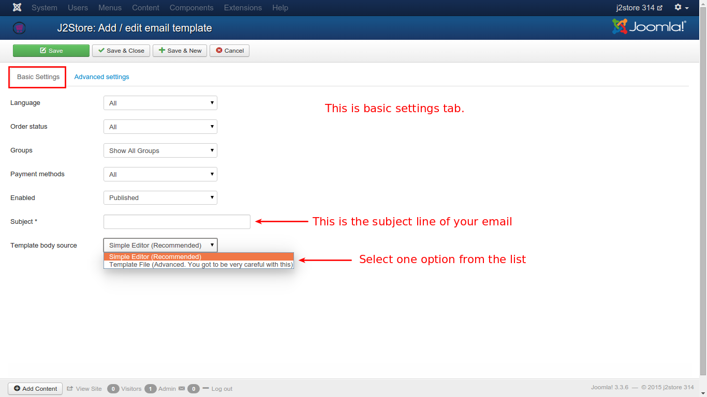
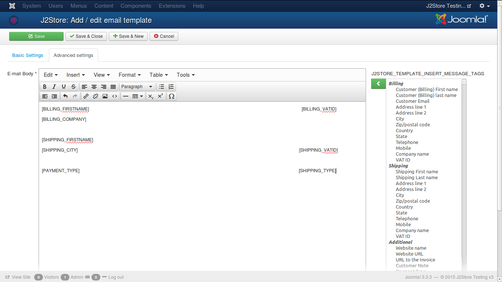

# Email Template

A template, or in other terms, a predefined layout, is necessary to make things easy when you're about to email a customer about the status of the order, or the invoice generated for the order, etc. The fields that are required for an email template are explained briefly here.

To create an email template, follow the steps as shown with the help of images.

From the resulting page, click on **New** in the top left corner.

You will get two settings tabs to be filled up for creating an email template. They are 
* Basic
* Advanced

### Basic
The fundamental requirements of a template. Let us see one by one.

#### Language
The languages for which the template is compliant, is set here. You can select **All** for all languages.
#### Order Status
A specific order status can be selected for emailing the necessary intimation to be sent. It can be any one of all the options listed. If email has to be sent for multiple options, then multiple templates has to be created.

#### Groups
Here the user group from which the email can be sent is selected.

#### Payment Methods
The payment methods that are covered for emails can be selected here.

#### Enabled
It has to be enabled first to send email.

#### Subject
A short one line info about the content of the email.

#### Template Body Source
The source used to design the email template is selected here. There are two options to choose from. They are:
1. **Simple Editor**
2. **Template List**

After you select an option from the list, you have to **Save** once. Then only you can set the advanced tab.

In **Simple Editor**, the content of the email body can be designed here. There are so many options available to customize the content. There is a rich text editor that helps formatting the content.
The facilities that are available in the editor:
* Cut, Copy, Paste
* Insert links or images
* Formatting the text in the body like, bold, italicize, line spacing, underlining, and much more
* Insert tables
* Insert source code etc

Full articles can also be added to the content, from other external sources.

In **Template List**, you can have a list of templates in the form of .php files. You can select from the available one in the advanced tab.

### Advanced
If you have selected **Simple Editor** in the **Basic Tab**, then the **Advanced Tab** will look like the below image.

There are a number of tags listed in the extreme right of the editor from where they can be added to the editor content.

If you have selected **Template Files** in the **Basic Tab**, then in the **Advanced Tab**, you can select the **Template File** and you can see the **Source** of the file, as shown below.

The source code of the template file is shown below in the editor and if the user wants to make any changes, they can make as they wish.

