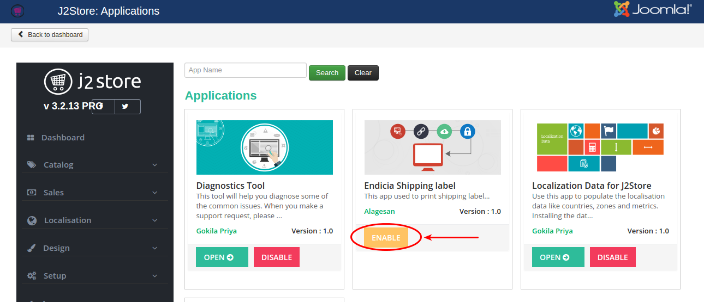
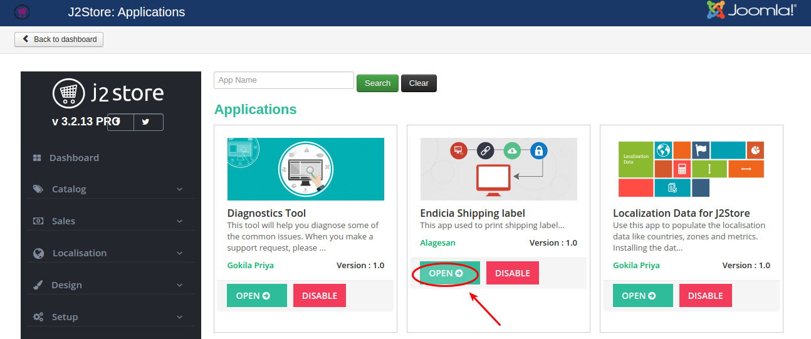
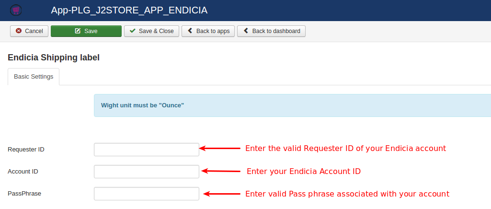
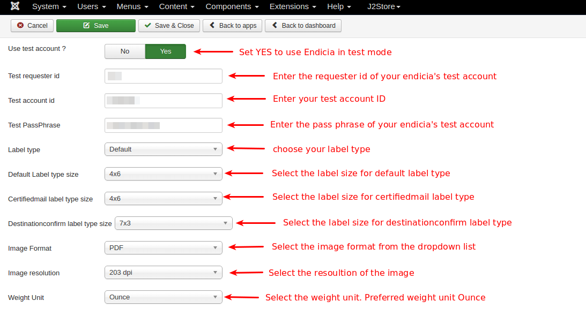
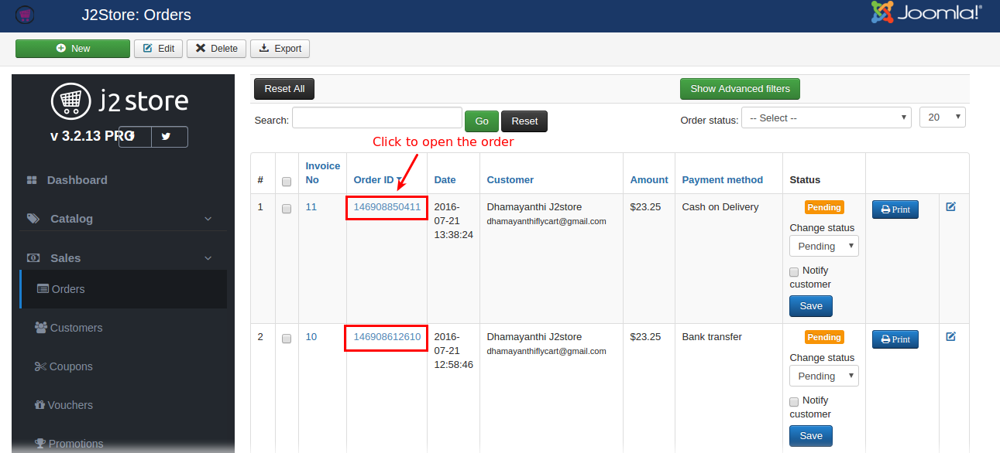
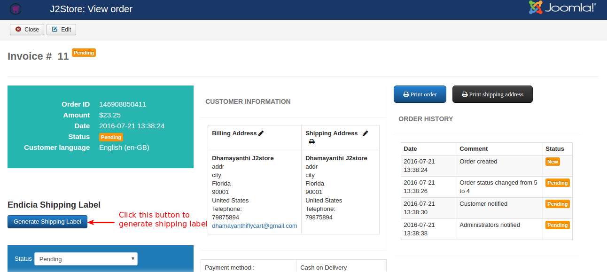
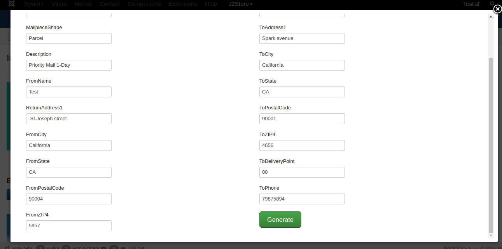
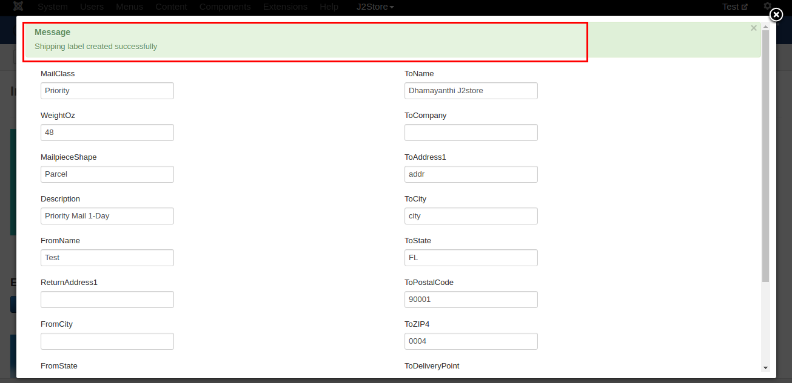
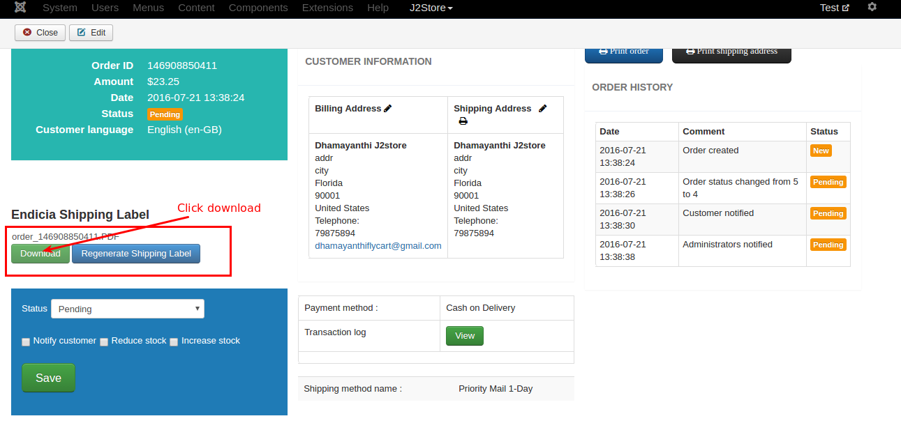
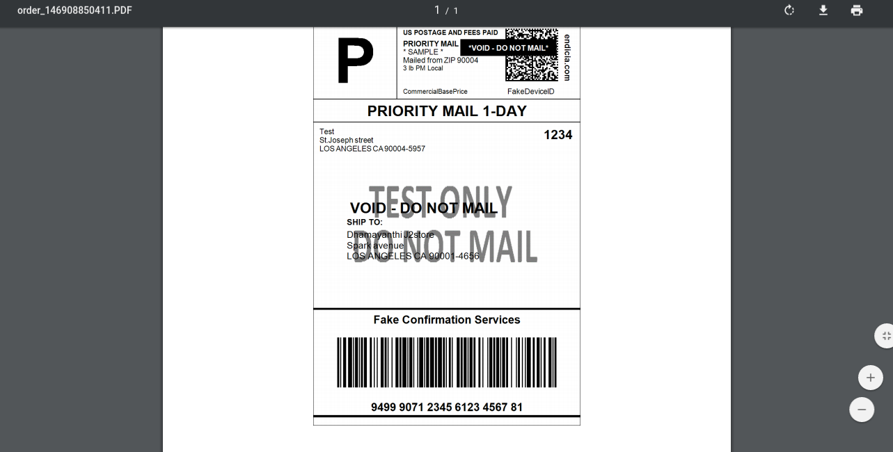

# USPS Shipping label via Endicia

This app integrates Endicia API method with J2Store Joomla eCommerce solution. Now it will be very easy to print shipping label for U.S.Postal Service via endicia.

#### Requirements

* PHP 5.4 or higher

* Joomla 3.3 or above

* J2Store 3.2.x or above

#### Installation

* Use the joomla installer to install the app.

* In the backend, go to J2Store > Dashboard > Apps.

* Click Enable in the Endicia shipping label app as shown in the image below.


* Once app is enabled, click open to setup the Basic settings of the app.


#### Basic Settings

**Requester ID :** Enter the valid Requestor ID associated with your Endicia account.

**Account ID :** Enter the valid the Account ID which is provided by Endicia when you signed up.

**Pass Phrase :** Enter your account's Pass Phrase which connects you to your online account. You must have this information to print postage.

**Use test account ? :** Endicia offers you the test suite. Set this **YES** to use the Endicia in test mode.

**Test requester id :** Here you have to enter the requester ID of your Endicia test acoount.

**Test account id :** Enter your test account ID.

**Test Pass Phrase :** Enter the Pass Phrase of your test account.

**Label type :** Endicia offers three different types of labels **Default**, **Certified Mail**, **Destination Confirm**. Choose the types of labels you plan to print.

**Default Label type size :** Select the label size for Default Label type. The label will be printed based on the size chosen here.

**Certifiedmail label type size :** Select the label size for Certified Mail label type. The label will be printed based on the size chosen here.

**Destinationconfirm label type size :** Select the label size for Destination confirm label type. The label will be printed based on the size chosen here.

**Image Format :** Select the Image format here. You will be having your label image in the format of the option you selected here.

**Image resolution :** Choose the resolution of the label image.

**Weight Unit :** Choose the Weight unit here. Preferred weight unit is **Ounce**



#### How Endicia works with J2Store

Once finished setting up Basic settings, go to your storefront and place the order with USPS shipping method.

After placing, in the backend go to J2Store > Sales > Orders and open the order history.


In the backend order history page, you can see the button **Generate Shipping Label** as like below image. Click on this button to generate the label for the order.


Click on Generate shipping label button will show you the popup screen where you will have fill all the fields.
```
Important : Enter the proper state, postal code and zip4 code. Other wise the label will not be generated.
```


Once completed filling the form, press **Generate** button. If the label generated successfully, you will get the success message on top of the popup.



Now reload the order history page and you will see the download button as like below image. Clicking on this button will download the label.


