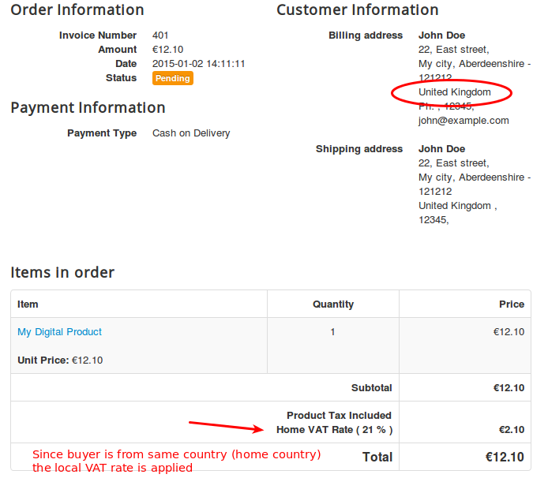
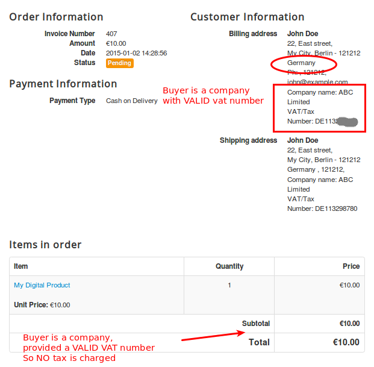

# A simplified guide for New EU VAT rules 2015 for digital goods and setting them up in J2Store

* [The New VAT rules](#new_vat_rule)
* [Implementing VAT rules in J2Store](#implement_vat_rule)
	* [EU VAT plugin](#eu_vat_plugin)
	* [Implementation](#implementation)
		1. [Store Configuration](#store_config)
		2. [Tax rule for Home Country](#tax_rule_home)
		3. [Tax rule for an EU Country](#tax_rule_eu)
		4. [Setting up the tax profile](#setting_up_tax_profile)
		5. [Applying tax profile to a product](#apply_tax_profile)
* [Application of VAT rules with Examples:](#application_vat_example)
	* [Example 1](#ex_1)
	* [Example 2](#ex_2)
	* [Example 3](#ex_3)
	* [Example 4](#ex_4)

If you are a seller of digital goods and services, you would probably wondering about the new European VAT rules that came into effect from January 1, 2015.

Since the rules are a bit of pain, we have come up with a simplified guide which will help you implement the new rules easily in your J2Store joomla shopping cart.

##The New VAT rules

In simple terms, the new VAT rules are:

* if the company sells to any countries in the EU, they will have to charge VAT in the country of the buyer instead of the seller.

* if the buyer of the digital goods is an individual, the company has to charge the VAT percentage from the country of the buyer

* if the buyer of the digital goods is a company (with a valid VAT number), there is a 0 percent VAT charge.

* if the buyer of the digital goods is a company without a VAT number or has an incorrect VAT number, then VAT of the country of the buyer must be charged.

* if the company sells digital goods to companies or individuals in their own country, local VAT needs to be charged.

##Implementing VAT rules in J2Store

###EU VAT plugin

We have created a VAT plugin that helps you implement the VAT rules automatically.
Download and install the plugin from here:
[http://j2store.org/extensions/general-plugins.html](http://j2store.org/extensions/general-plugins.html)

Then go to Joomla admin -> Plugin Manager and Enable the EU VAT plugin

###Implementation

>Let us assume that your company is located in : United Kingdom, Bristol
And your home country (local ) VAT is 21 %

**1. Store Configuration**
 Go to Joomla admin – J2Store – Set up – Configuration - Store tab
 
 Set the Default Country to United Kingdom
 Set your Default Zone to Bristol
 

**2. Tax rule for Home Country**
 First, we should define the geozone and tax rates for the home country, that is the country in which your shop is located.

 **2.1 Define Geozone**

Go to Joomla admin – J2Store – Localization – Geozones – New        

 **Geozone Name:** Home VAT Zone ( It can be anything. It is used just as reference )    
 
   **State :** Published

   **Add country / Zone**

   Choose United Kingdom from the Dropdown list and add it

   Save and close

 **2.2. Define Tax rate:**

Go to Joomla admin – J2Store – Localization – Tax Rates – New
        
Name        : Home VAT Rate
Tax Percent    : 21
Geozone     :  Home VAT Zone    
Status     : Published

**3. Tax rule for an EU Country**
 Let us take Germany for this example.   Let us say, Germany's VAT charge is:  25 %
 >A few countries might have same VAT rate for the digital goods. You can group them under one geozone.
 
 For this example, I am going to stick with one EU country, that is Germany.

  **3.1 Define Geozone**
  

   Go to Joomla admin – J2Store – Localization – Geozones – New
   Geozone Name : Germany VAT Zone ( It can be anything. It is used just as reference )
    State : Published

   Add country / Zone
    Choose Germany from the Dropdown list and add it
>If some other EU countries also implement a 25 % VAT, then you can group them under this geozone itself

   Save and close

   **3.2. Define Tax rate:**

   Go to Joomla admin – J2Store – Localization – Tax Rates – New

   Name        : Germany VAT Rate
   Tax Percent    : 25
   Geozone     :  Germany VAT Zone
   Status     : Published
   

**4.Setting up the tax profile**

It is sufficient to set up ONE tax profile for digital goods, in which we can associate many tax rates.

Go to Joomla admin → J2Store – Localization → Tax profiles → New
    
Tax Profile Name    : Digital Goods Tax Profile
State            : Published

**Tax Rates Mapping**
    
  4.1. Choose Home VAT Rate 21 %  and choose Billing Address as the Associated Address.

  4.2. Choose the Germany VAT Rate 25 %  and choose Billing Address as the Associated Address.

  Save.
  

**5. Applying tax profile to a product**

J2Store uses native Joomla articles as products. So go ahead and create a product.

Go to Joomla admin – Article Manager – New or open your digital product.
    
In J2Store Tab → Item Tax , Choose Digital Goods Tax Profile.

Fill in other relevant fields for your product and save.

##Application of VAT rules with Examples:

Now we have successfully configured the tax rules in J2Store. Let us see how they will get applied for different scenarios

###Example 1: Buyer  ( can be an INDIVIDUAL or company ) from the same country (Home country )

Our shop is located in United Kingdom. And the buyer is from the same country. So local tax of 21 percent applies.

###Example 2: Buyer ( INDIVIDUAL ) from a different EU country (Germany )

The buyer is from Germany and he is an Individual customer. So we are charging him the Germany's VAT rate of 25 %

 
###Example 3: Buyer ( COMPANY ) from a different EU country WITHOUT a valid VAT Number

The customer is from Germany. He has entered a company name. But his VAT number is INVALID.  So we apply the Germany's VAT rate of 25 %.

(the EU VAT plugin validates the VAT number provided against the EU database )

###Example 4: Buyer ( COMPANY ) from a different EU country WITH a valid VAT Number

The customer is from Germany.  His VAT number is VALID.  So NO tax is applied.
 
If you have any questions or suggestions, please post in the [community forum](http://j2store.org/forum/index.html)
