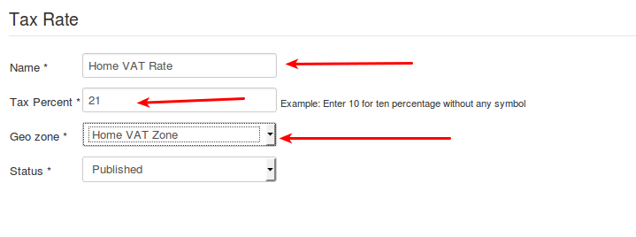

# Setting up European VAT rules for selling physical goods with J2Store

* [The VAT rules are:](#vat_rules)
* [Implementing VAT rules in J2Store](#implement_vat_rules)
	* [Store Configuration](#store_configuration)
	* [Geozone](#geozone)
	* [Tax rate](#tax_rate)
	* [Setting up the tax profile](#setting_tex_profile)
	* [Applying tax profile to a product](#apply_tax_product)

Setting up the European VAT system in J2Store is relatively easy.  We have created a plugin that automatically validates the VAT number and helps you apply the rules.

This guide walks you through the tax configuration for EU.

## The VAT rules are:

* Home country's residents & businesses are charged VAT (Home country's rate. That is, the rate defined by you in the Tax Profile)

* EU residents & businesses with no valid VAT number will be charged VAT (Home country's rate, That is, the rate defined by you in the Tax Profile)

* EU (Non Home country) and with a valid VAT number are charged 0% VAT

* Non EU residents & businesses are charged 0% VAT

## Implementing VAT rules in J2Store

We have created a VAT plugin that helps you implement the VAT rules automatically.
Download and install the plugin from here:
[http://j2store.org/extensions/general-plugins.html](http://j2store.org/extensions/general-plugins.html)

Let us assume that your company is located in : United Kingdom, Bristol
And your home country (local ) VAT is 21 %

### Store Profile

Go to Joomla admin – J2Store – Set up – Configuration - > Store tab.

Set the Default Country to United Kingdom
Set your Default Zone to Bristol

### Geozone
Go to Joomla admin – J2Store – Localisation – Geozones – New
    
Geozone Name : VAT Zone ( It can be anything. It is used just as reference )
State : Published

Add country / Zone
Choose United Kingdom from the Dropdown list and add it

** IMPORTANT: According to the rule, EU residents & businesses with no valid VAT number has to be charged based on the home country's rate. **

** So it is advised that you add all the EU countries in this geozone itself. Choose EU Vat countries and add them. Refer this article to know all EU VAT countries. [http://en.wikipedia.org/wiki/European_Union_value_added_tax](http://en.wikipedia.org/wiki/European_Union_value_added_tax) **

(You can also add all other European countries. or create a separate geozone. But then you will have to create tax rate and map that in the tax profile. Kind of a double work!).

   Save and close

### Tax rate

Go to Joomla admin – J2Store – Localisation – Tax Rates – New
        
Name        :  VAT Rate
Tax Percent    : 21
Geozone     :  VAT Zone    
Status     : Published

### Setting up the tax profile

It is sufficient to set up ONE tax profile

Go to Joomla admin → J2Store – Localisation → Tax profiles → New
    
Tax Profile Name    : My Tax Profile
State            : Published

**Tax Rates Mapping**

1. Choose VAT Rate 21 %  and choose Billing Address as the Associated Address.

Save.

## Applying tax profile to a product

J2Store uses native Joomla articles as products. So go ahead and create a product.

Go to Joomla admin – Article Manager – New or open your digital product.
    
In J2Store Tab → Item Tax , Choose My Tax Profile.

Fill in other relevant fields for your product and save.     

#### Implementation

Let us assume that your company is located in : United Kingdom, Bristol
And your home country (local ) VAT is 21 %

**1. Store Profile**

Go to Joomla admin – J2Store – Set up – Store Profiles - > Your store profile.

Set the Default Country to United Kingdom 
Set your Default Zone to Bristol

**2. Tax rule for Home Country**

First, we should define the geozone and tax rates for the home country, that is the country in which your shop is located.

   * **2.1 Define Geozone**

   !

    Go to Joomla admin – J2Store – Localization – Geozones – New        

    Geozone Name: Home VAT Zone ( It can be anything. It is used just as reference )    
    State : Published
    Add country / Zone    

        Choose United Kingdom from the Dropdown list and add it

       Save and close

   * **2.2. Define Tax rate:**

    

    Go to Joomla admin – J2Store – Localization – Tax Rates – New
        
    Name        : Home VAT Rate
    Tax Percent    : 21
    Geozone     :  Home VAT Zone    
    Status     : Published

**3. Tax rule for an EU Country**

Let us take Germany for this example.   Let us say, Germany's VAT charge is:  25 %

NOTE: A few countries might have same VAT rate for the digital goods. You can group them under one geozone.
For this example, I am going to stick with one EU country, that is Germany.

   * **3.1. Define Geozone**

   

    Go to Joomla admin – J2Store – Localization – Geozones – New
    
       Geozone Name : Germany VAT Zone ( It can be anything. It is used just as reference )
       State : Published

    Add country / Zone
    Choose Germany from the Dropdown list and add it
    
    NOTE: If some other EU countries also implement a 25 % VAT, then you can group them under this geozone itself

    Save and close

  * **3.2. Define Tax rate:**

   

    Go to Joomla admin – J2Store – Localization – Tax Rates – New
        
    Name        : Germany VAT Rate
    Tax Percent    : 25
    Geozone     :  Germany VAT Zone    
    Status     : Published
    

**4. Setting up the tax profile**

It is sufficient to set up ONE tax profile for digital goods, in which we can associate many tax rates.

    Go to Joomla admin → J2Store – Localization → Tax profiles → New
    
    Tax Profile Name    : Digital Goods Tax Profile
    State            : Published

    Tax Rates Mapping
    
  4.1. Choose Home VAT Rate 21 %  and choose Billing Address as the Associated Address.

  4.2. Choose the Germany VAT Rate 25 %  and choose Billing Address as the Associated Address.

  Save.

**5. Applying tax profile to a product**

J2Store uses native Joomla articles as products. So go ahead and create a product.

    Go to Joomla admin – Article Manager – New or open your digital product.
    
    In J2Store Tab → Item Tax , Choose Digital Goods Tax Profile.

    Fill in other relevant fields for your product and save.

Application of VAT rules with Examples:
Now we have successfully configured the tax rules in J2Store. Let us see how they will get applied for different scenarios

Example 1: Buyer  ( can be an INDIVIDUAL or company ) from the same country (Home country )

Our shop is located in United Kingdom. And the buyer is from the same country. So local tax of 21 percent applies.

Example 2: Buyer ( INDIVIDUAL ) from a different EU country (Germany )

The buyer is from Germany and he is an Individual customer. So we are charging him the Germany's VAT rate of 25 %

 

Example 3: Buyer ( COMPANY ) from a different EU country WITHOUT a valid VAT Number

The customer is from Germany. He has entered a company name. But his VAT number is INVALID.  So we apply the Germany's VAT rate of 25 %.

(the EU VAT plugin validates the VAT number provided against the EU database )

Example 4: Buyer ( COMPANY ) from a different EU country WITH a valid VAT Number

The customer is from Germany.  His VAT number is VALID.  So NO tax is applied.

