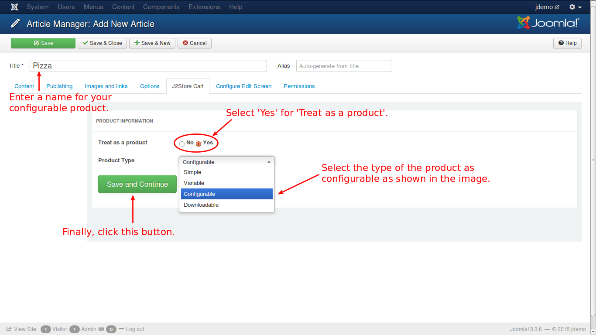
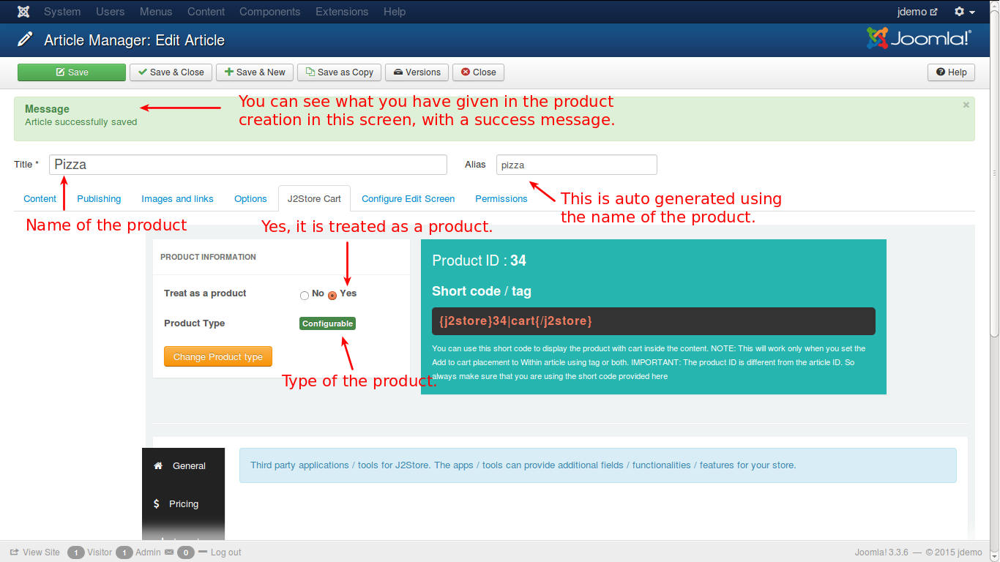

# Example to Create a Configurable Product

**J2Store** implements an innovative concept in creating products. It uses the Joomla articles as products. So to create a product is to create an article.

So, lets create an article.

### Creating an Article

Have a look at the image below:

As given in the above illustration, click in the top menu or in the left pane of the control panel. You will get a new screen like this.

Enter all the details and necessary selections to create a new product and save it in the cart tab. Your product will be created and the screen will look like this.

