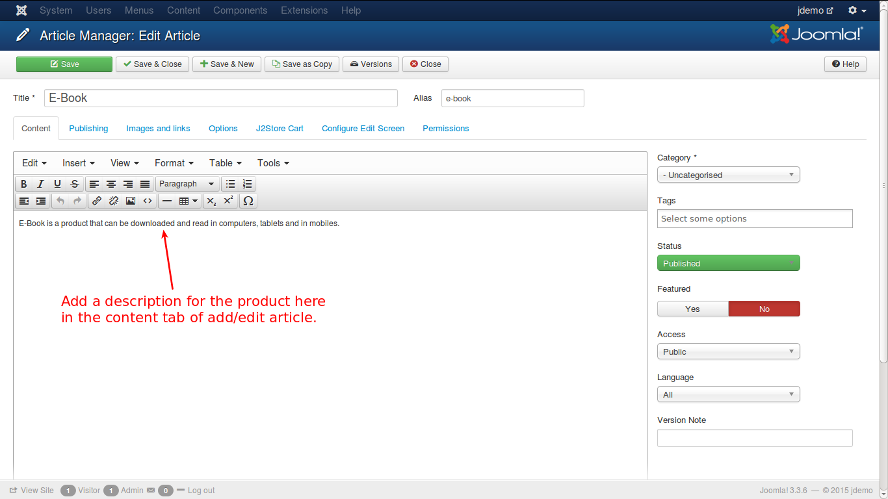
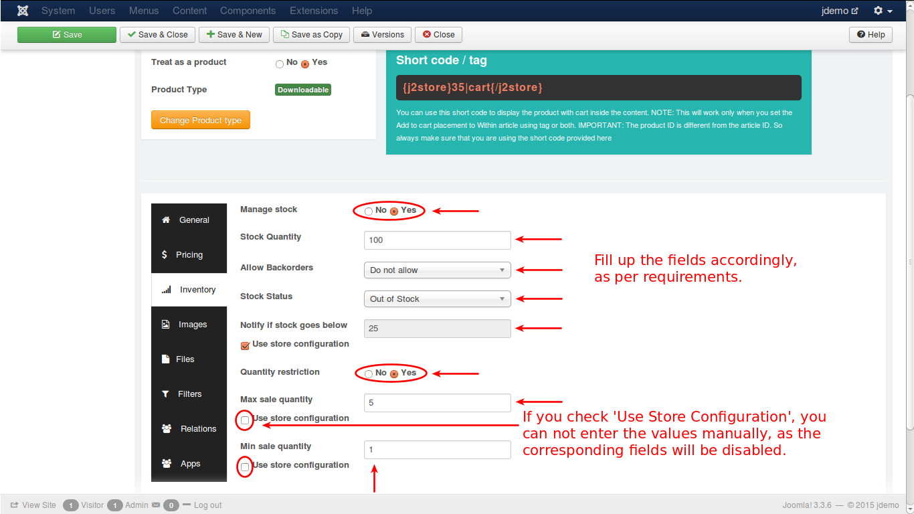
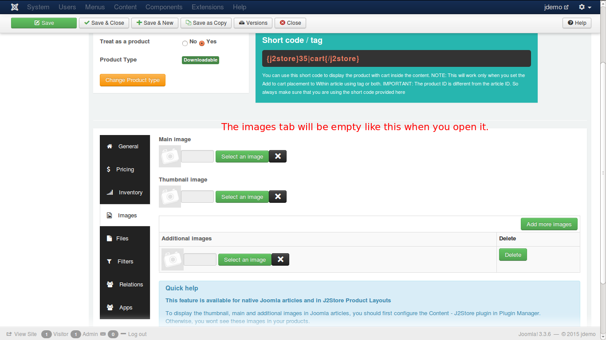
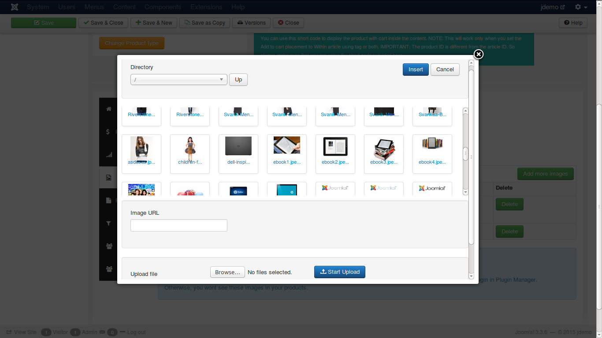
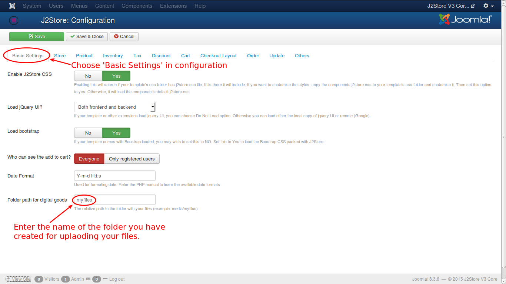
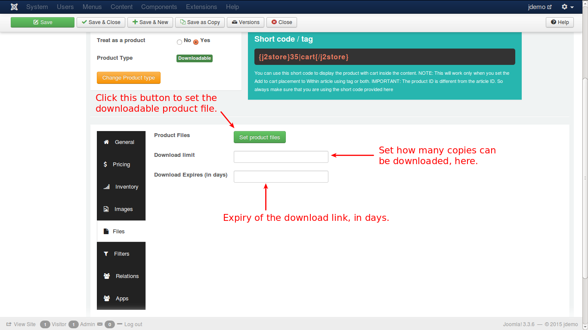

# Example to Create a Downloadable Product

**J2Store** implements an innovative concept in creating products. It uses the Joomla articles as products. So to create a product is to create an article.

So, lets create an article.

### Creating an Article

Have a look at the image below:

As given in the above illustration, click in the top menu or in the left pane of the control panel. You will get a new screen like this.

A downloadable product is one that has no physical existence. It can be downloaded as per the terms and conditions of the seller. It can be a book, a video, a music album or even a software extension like joomla extension. To create a downloadable product, follow the steps:

* Enter the name for your product. 
* Since you are creating article, you need to tell that the article be treated as product. So, select 'Yes'. 
* Select the type of the product, i.e., 'Downloadable'.
* Now, click the 'Save and Continue' button.

Your product is successfully created and a message will be displayed like this.

Add a description for the product, as illustrated below.

The Configuration process follows:

#### General

Enter the details as required by the fields in the tab, like, SKU, UPC/EAN, brand, vendor, tax profile and the caption for the cart button. Once you enter them, you can navigate to the next tab, pricing.

#### Pricing

In Pricing you can set the price for your product. You have the option to set up advanced prices, like discount offers, as shown in the following images.

In the above image you set up the regular price for the E-Book. Click the set prices button to set advanced/special prices. It will pop-up a window to set the special prices, like this.

In the above image, you can set a date range for the special price, otherwise, you can leave it empty for the special price to be applied always. For example, if a customer buys 2 or more copies of the E-Book, you can offer a discount in price, throughout the year. Now, you have entered the values, and click the blue 'Create' button and you will get the special price listed below, as shown in the image.

#### Inventory

Now, configure the Inventory tab.

In this tab you set the initial stock, whether or not to allow backorders(order placement even if stock is not available), low stock alert quantity, purchase quantity restriction for any customer etc. 

Consider the below image:

#### Images

When you select the images tab, you will get a screen like this.

Click on the select an image button. You will get a pop-up window, where you can select suitable image for your ebook, as shown below:

Once you finish the selection, your tab will be like this.

#### Files
Unlike other products, you do not have options and shipping tabs for a downloadable product. But there is a unique tab, **Files** is present here. You must have a separate folder or directory in your site to place the downloadable products. From that folder, the product will be downloaded, when the buyer fulfills the requirements for the download.

The following steps will guide you to set up a folder with downloadable product.

##### Step 1 : Create a folder on your site to upload the files

You can use your Hosting Provider's CPanel File manager or an FTP client like FileZilla, to access your web root (public_html / www / httpdocs ).

Once you are in the web root, you can create a folder. Name it as: myfiles.

##### Step 2: Protect the folder from outside access

We do not want people to access this folder using their browser and download files. So let us protect this folder using a **.htaccess** file.

Create a file called htaccess.txt in your computer and open it with your favorite text editor. Add the following lines to it.

    order deny, allow

    deny from all

Save the file. Now upload it to the folder we just have created in our web root. In our example, it is myfiles.

>**IMPORTANT**: Rename the file as ***.htaccess*** 

All the files uploaded to this folder, are now protected.

##### Step 3: Point J2Store to use the files in this folder.

Go to Joomla admin -> j2store Dashboard -> Set up -> Configuration -> Basic settings

In File attachment path field, enter the name of the folder that contains your files. In our example, it is: **myfiles**.

Check the image below:

Finally, save the configuration. You have created a folder to upload your digital products like ebook, pdf files, image files etc., set up protection mechanism from unauthorized access and configured the folder in your configuration page.

Now, Configure your **Files** tab in your downloadable product creation.

The tab will look like this:

When you click the set files button, you will get a pop-window to select the file to be downloaded. See the picture.

And select the file and click the create button, and you will get the product listed below as shown in the picture.

#### Filters
The filters will help to narrow the product search, for specific products. For e.g., if you add filter with value 'music', the search will display only music files.

See the image below:

#### Relations

The next tab is Relations. Here, you can add products of higher value than the one being viewed by the customer and recommend the customer to buy that product, citing its advantages and additional features. This is an upsell.

Refer the image below:

Also, you can add some other products to convince the customer to buy theses products additionally. This is cross sell.

For more detailed explanation, refer to the **Relations** section of the **Downloadable Product**.

#### Apps

In this tab, you can add third party tools or plugins, that are available, to enhance the J2Store functionality, like adding additional fields, applications, functions or features.

Now, lets have a look on how your product is viewed in your online store. Check the image below:

