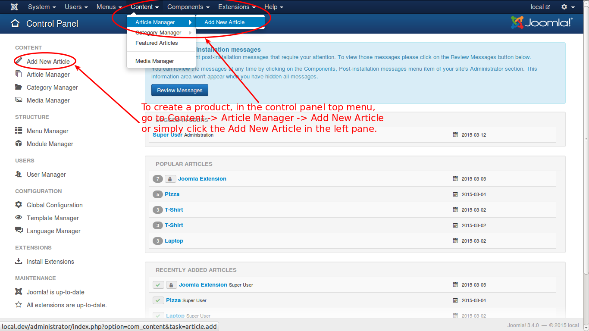
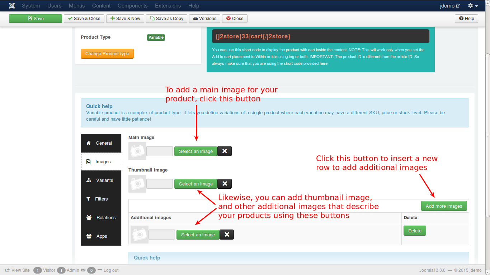

# Example to Create a Variable Product

**J2Store** implements an innovative concept in creating products. It uses the Joomla articles as products. So to create a product is to create an article.

So, lets create an article.

### Creating an Article

Have a look at the image below:

As given in the above illustration, click in the top menu or in the left pane of the control panel. You will get a new screen like this.

* Enter the name for your product. 
* Since you are creating article, you need to tell that the article be treated as product. So, select 'Yes'. 
* Select the type of the product, i.e., 'Variable'.
* Now, click the 'Save and Continue' button.

Your product is successfully created and a message will be displayed like this.

Now you need to configure your product with necessary details. Begin with general tab.

* If you select 'Yes' in the first option, your product will be displayed in the storefront
* Select the brand or manufacturer of the product from the list
* Select the vendor to order the product
* Select the taxprofile that mathces the product profile

Now switch to Images tab.

You can add main, thumbnail and additional images relevant to your product in this tab. Click the 'select an image' button to get a pop-up window to select the image.

Move on to variants tab.

