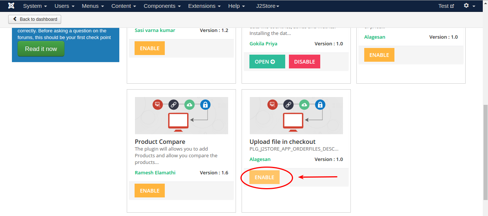
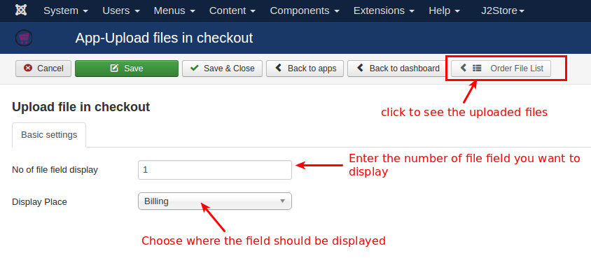
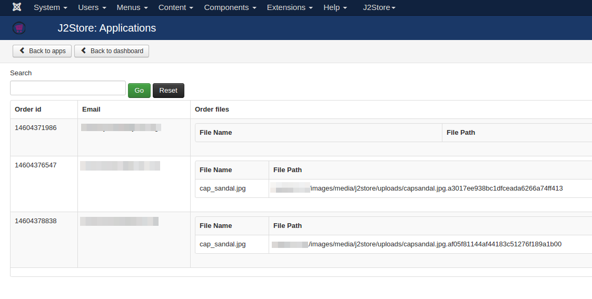
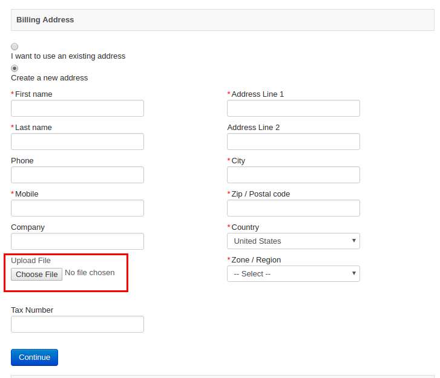

# Upload file in checkout

Allow customers to upload one or more files during the order. The app will come in handy for store owners selling products like printed materials. The customer can upload an image or PDF to their order.

The store owner can download it from the app's backend and manage all the uploaded files for an order.

#### Requirements

* PHP 5.4 or higher

* Joomla 3.3 or above

* J2store 3.2.x or above

#### Installation

1. Use the Joomla installer to install the app.

2. In the backend, go to J2Store Dashboard -> Apps as shown in the image below.

3. Click Enable in the Upload file in checkout app.
   

4. Once the app is enabled, open the app to configure the settings.

#### Configuration

***No of file field display***

   Enter the number of fields to be displayed in the checkout.
   
***Display Place***

   Choose the place where the upload field should be displayed. You can choose either **Billing** or **Shipping**.
   
   
***Display upload file field after?***

   The upload file field will be displayed after the checkout fields selected here. For example, if you choose Last name, the field will appear after the field Last name.
   
***Upload file types***

Add your file format types here. If you don't have any file formats added here, the app will not allow you to upload the file in that format. For example, if you would like to upload the file in .pdf, make sure that you have added this format in this field.
   
#### Manage uploaded files

By clicking **Order File List** button on top of the app's settings page, you can find all the files uploaded by the customer. It displays the file name with the path where the file locates.
  
  
#### Shortcodes

Below shortcodes helps you to notify customer that he / she has attached file in this order.

1. **[ORDERFILE_NOTIFY]** - This shortcode will display just the message or information saying that order contains file attachment.

2. **[ORDERFILE_LIST]** - This shortcode allows you to include download link in email. Use this shortcode in your email template so when customer receives order email, he/she can see the link to download the file that was uploaded.
  
#### Frontend

