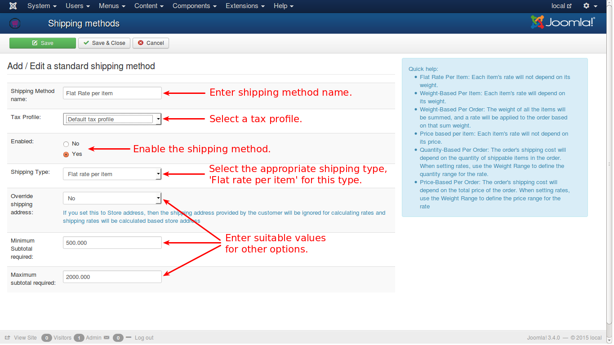

# Flat rate per item

This method of shipping charges a flat shipping for every item, irrespective of the price or weight or any other attribute of the item. For e.g., the price of an item may $ 100 or $ 1000, $ 20.00 will be its shipping cost. Then it will be multiplied with the total number of products i.e., if the total number of products purchased is 10 nos, then shipping cost will be $ 20.00 X 10 which is $ 200.00.

N.B.: In this type, only one rate can be configured per geozone and weight will not be considered for shipping cost.

Consider the image below:

Enter the necessary details as in other shipping methods, and enable the method to be listed in shipping types.

For this shipping method, you need to select **Flat rate per item** in shipping options type list.