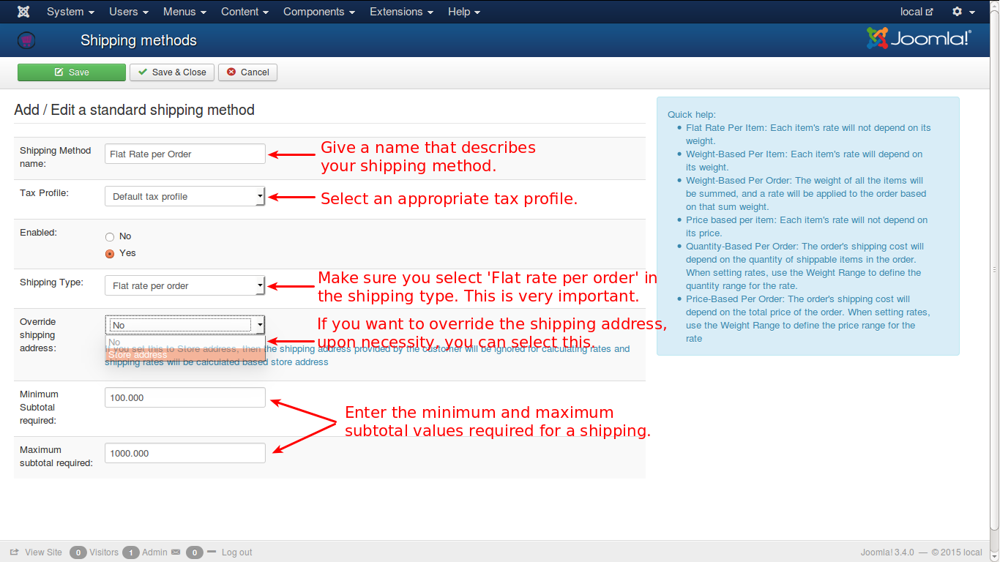

# Flat rate per order

A fixed rate will be charged for every order. For e.g., if the shipping cost is levied at $ 50.00 for every order, then the shipping cost is set to $ 0.00. This type of shipping can be termed as Store Pickup Method or Free Shipping Method.

See the image below on how to configure this shipping type.

You can give a meaningful name for the **Shipping Method** so that the customer understands it easily.

Select a suitable **Tax Profile** from the available list.

For any shipping method, to make it available for selection, always ensure that it is **Enabled** with '**Yes**'.

Select the **Flat rate per order** in the list.

If the shipping address needs to be overridden with store address, you can select it here.

Finally, set the minimum and maximum subtotals that are required for availing this shipping type.