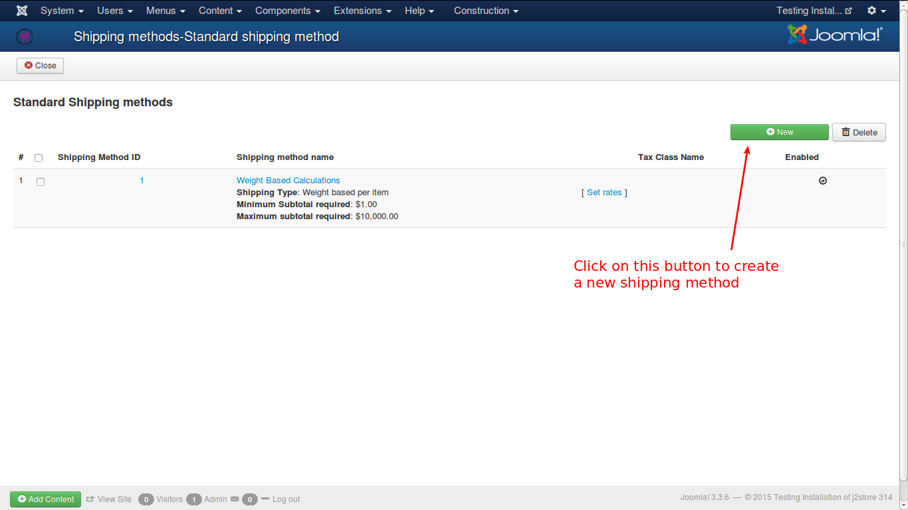
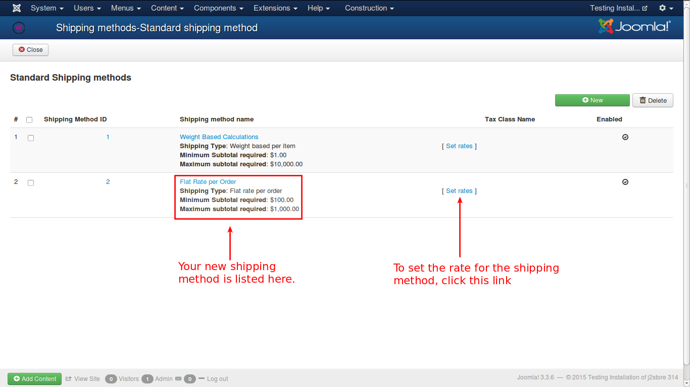

# Flat Rate per Order - Example

To create a shipping method of type **Flat rate per Order**, follow the steps given below:

1. Go to **J2Store Dashboard**

2. Select **Set Up -> Shipping Methods**

3. From the list, click on the **Create / Edit / Link** in the **Standard Shipping Methods** category

4. From the obtained window, click on the **New** button

5. You will get the form to add a new shipping method

6. **Save & Close** window. Now you can see the created shipping method in the list as show in the image below.

Now, you need to set the rate for the shipping method. To do that, click on the link **Set Rates**.

7. 