# Flexible Variable

* **[Introduction](#introduction)**
* **[Product Settings]()**
    * **[General](#general)**
    * **[Images](#images)**
    * **[Variants](#variants)**
    * **[Filters](#filters)**
    * **[Relations](#relations)**
    * **[Apps](app)**

## Introduction

Flexible Variable is an another new product type that we came up with . It is similar to variable product type but it has quiet differnet feature when compare to variable product type. 

Like variable product type, it also lets you define variations of a product where each variant may have a different attributes, e.g. SKU, price and stock level.

The only different is that this product type does not generate variants automatically. The variant has to be generated manually by clicking on **Add variant** button. So that store owner could remove / delete the variant that has zero stock available and add variant once it is available.

Since adding / removing a single variant will be possible with this product type, it will be more easy for you manage variants which are out of stock.

### Product settings

* **[General](#general)**
* **[Images](#images)**
* **[Variants](#variants)**
* **[Filters](#filters)**
* **[Relations](#relations)**
* **[Apps](#app)**

#### General

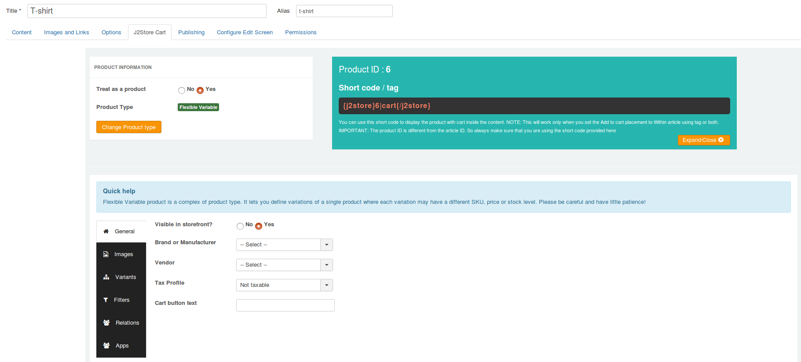

* **Visible in Storefront** - First select whether the product is to be displayed in front of the store. If it is, set the option to **'Yes'**
* **Brand or Manufacturer** - Select the brand or manufacturer of the product from the available list
* **Vendor** - Select the vendor from whom the product is available for purchase - ***This is J2Store PRO feature***
* **Tax Profile** - Specify whether the product is taxable and if it is, select the taxprofile relevant to the product
* **Cart button text** - It allows you to define the custom text to be displayed in the add to cart button

### Images

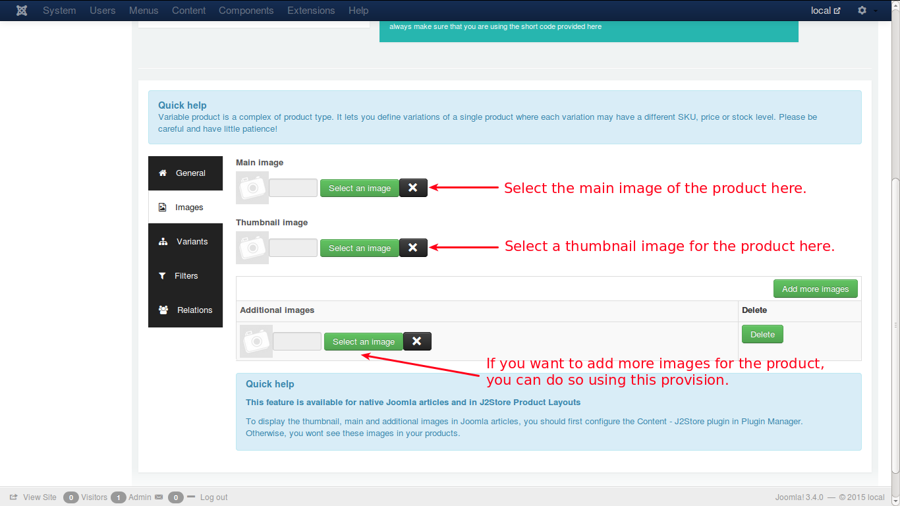

This feature is available for native Joomla articles and in J2Store Product Layouts

To display the thumbnail, main and additional images in Joomla articles, you should first configure the Content - J2Store plugin in Plugin Manager. Otherwise, you wont see these images in your products.

Lets assume that a customer would like to purchase a car. Now, car images need to be loaded in this tab. 

* **Main Image** - The main image will be a general photo image of the car, that has to be uploaded by clicking on the 'Select an image' button and select the appropriate image from the files.

* **Thumbnail Image** - The thumbnail image would be something that represents the original product, but it would be a much smaller one to fit into a button, that will be shown up in the cart. By seeing this, the customer will understand that his product is displayed on the button and will click the button to see more details about the car.

* **Additional Images** - Additional images help the customer to know more details about the car, which will be showing the car view in many angles, and the customer will understand it clearly how it looks like, what the technical details of the car, the colour, and so on.

### Variants

Variants are products of same type and nature but with different attributes. For e.g., consider a T-shirt of a particular brand with certain attributes, say

* **Color - Blue**
* **Size  - Large**
* **SKU   - TSL001**
* **Price - $12**
* **Brand - Flying machine**

and so on. This is a variant of the particular brand. Now, the same product with same brand, will be another variant with some attributes changed, like
* **Color - Black**
* **Size  - Small**
* **SKU   - TSL002**
* **Price - $15**
* **Brand - Flying machine**

For both the items, brand name may be same, but the attributes like color, price and SKU differs. These are two variants of a particular Tshirt brand.

* A variant defines how this product differs from other products of same type
* It may be SKU no, price, stock level or color

Lets discuss it with some image illustrations:

Select size option from the dropdown list and then click on Add option. The size will be added as variant option.

And then choose the color option and add it to the variant options list in same way.

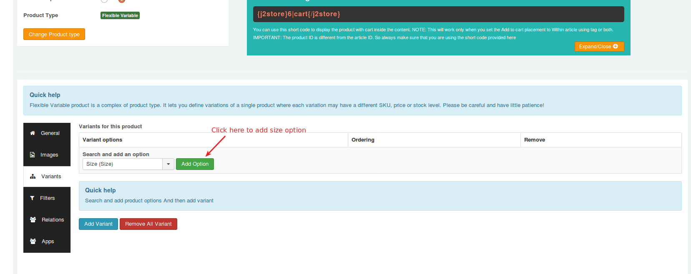

After adding size and color, your screen will look like below:

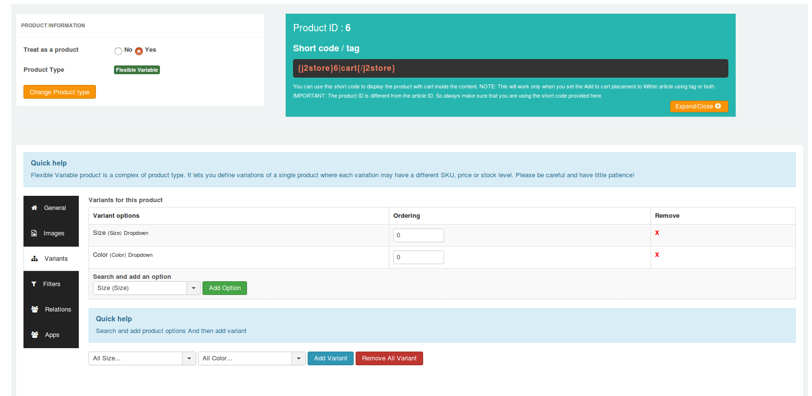

Now you will get options to add variants to the product. Choose size from the dropdown "All size" and then choose the color and click on **Add variant** button.

For example, select **L** from size and select **Black** from color and click on **Add variant** button.
Likewise, add all the variants you wants.

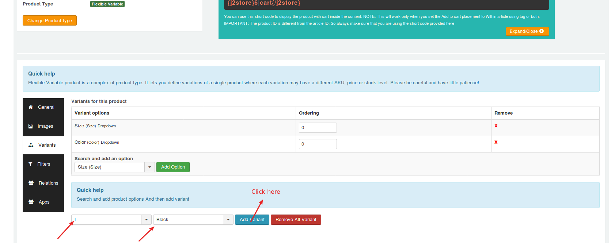

Now the screen will look like below:

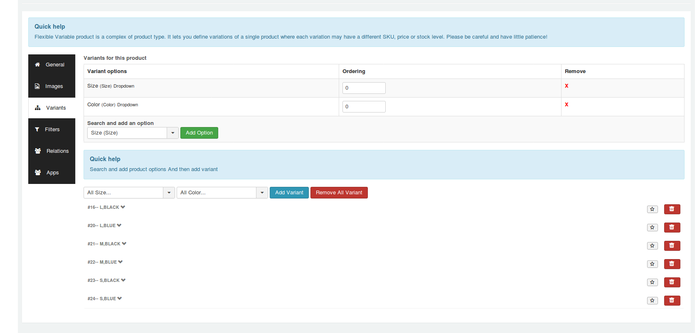

If you want to edit the properties of the variants, open each variant by clicking on small down arrow given next to the variant name. You will get the screen like below:

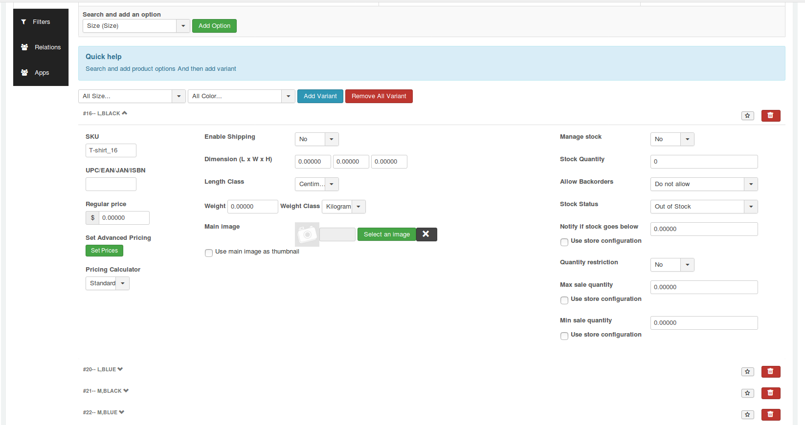

If any one of your variants comes **out of stock** and you wants to hide that variant displaying in frontend, you could do so by clicking on delete icon.

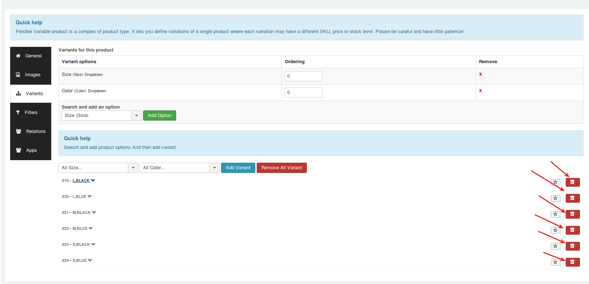

Below is the screenshot of how flexivariable product shows in site's frontend.

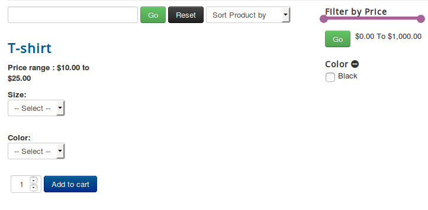

### Filters

Filters are certain attributes that help narrow the search of a particular product.

For e.g., assume that a customer searches for purple t-shirts in the store. Now, the productfilter is set as color > Black, to narrow the search. See the image below:

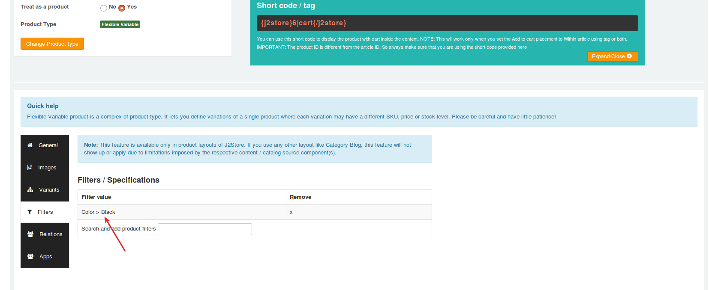

Now the cart will display only the Black t-shirts.

### Relations

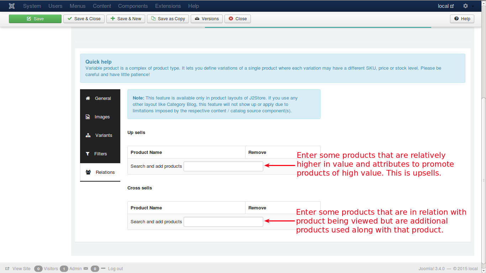

* In this tab page, relations are set for Upsells and Cross sells
* An ***upsell*** is to get the customer to spend more money – buy a more expensive model of the same type of product considered for purchase.
* A ***cross-sell*** is to get the customer to spend more money buy adding more products from other categories, additionally, along with the product intended for purchase.
* **Example**:
    The terms cross-sell and upsell are often used interchangeably because, let’s face it, this gets confusing. Say the customer is viewing a Laptop with 2GB/500GB for $500.

    * 4GB/500GB-> $550 - Upsell, same product family, more expensive
    * 4GB/1TB -> $700  - Upsell, same product family, more expensive
    * Laptop Bag -> $25 - Cross sell, related product, additional sell

### App

Custom fields / settings from applications will be displayed in this tab.