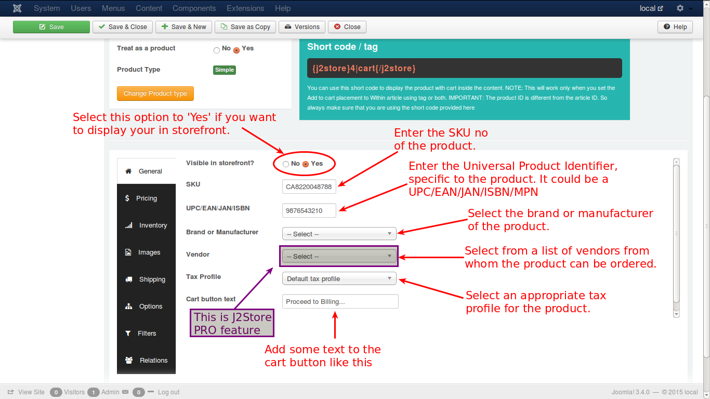

# General

The general tab has several fields, in which we need to enter the necessary and relevant details, attached with the product.

Have a look at the image below:

* **Visible in Storefront** - First select whether the product is to be displayed in front of the store and this is a mandatory option to be selected
* **SKU** - Enter the SKU number of the product
* ***UPC/EAN/JAN/ISBN*** - Enter ***UPC/EAN/JAN/ISBN*** code for the product whichever is relevant
    * **UPC** - Universal Product Code (In US/North America)
    * **EAN** - European Article Number (Outside North America/Europe)
    * **JAN** - Japanese Article Number (Only in Japan)
    * **ISBN** - International Standard Book Number (Globally)
    * **MPN** - Manufacturer Part Number (Globally)
* **Brand or Manufacturer** - Select the brand or manufacturer of the product from the available list
* **Vendor** - Select the vendor from whom the product is available for purchase - ***Note: This feature is available in J2Store PRO version only***
* **Tax Profile** - Specify whether the product is taxable and if so, select the tax profile relevant to the product
* **Cart Button Text** - Enter the text to be displayed in the cart button
