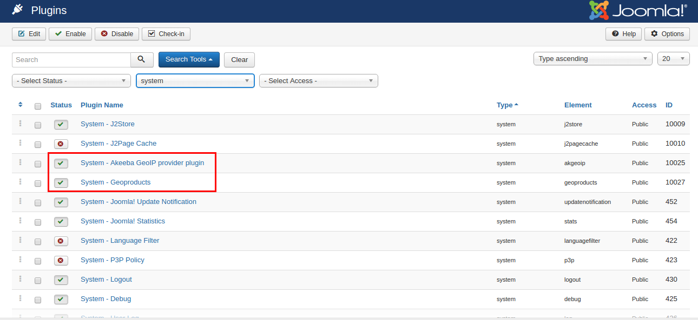
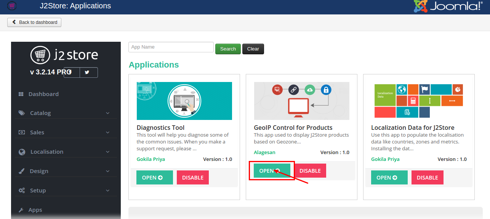
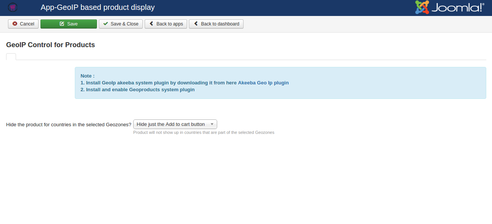
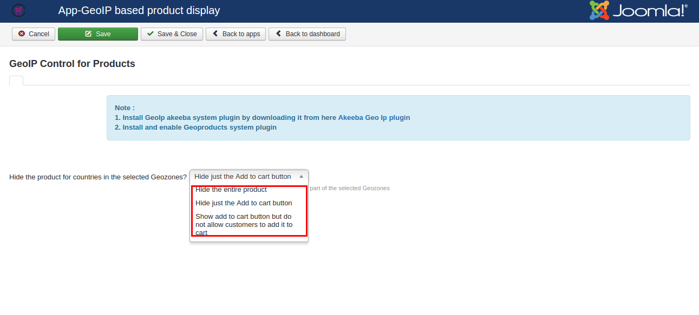
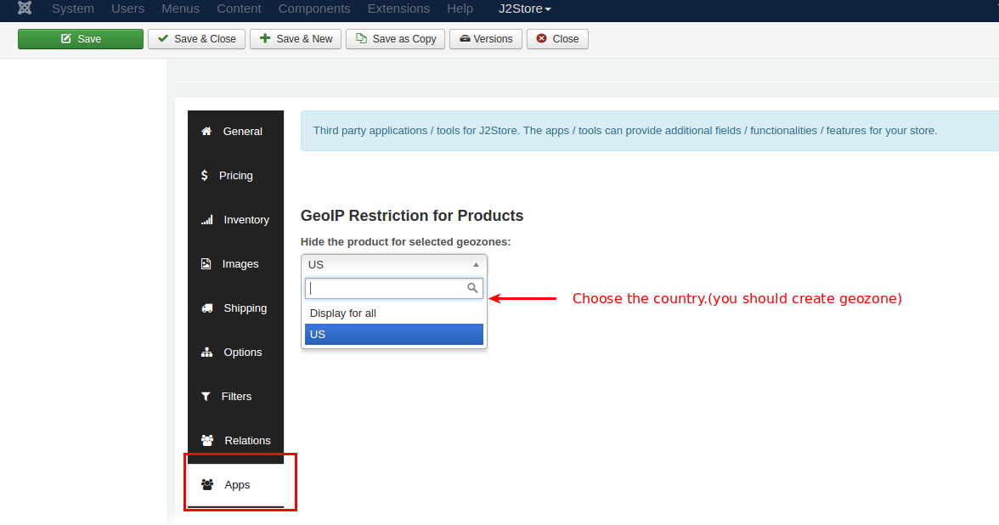
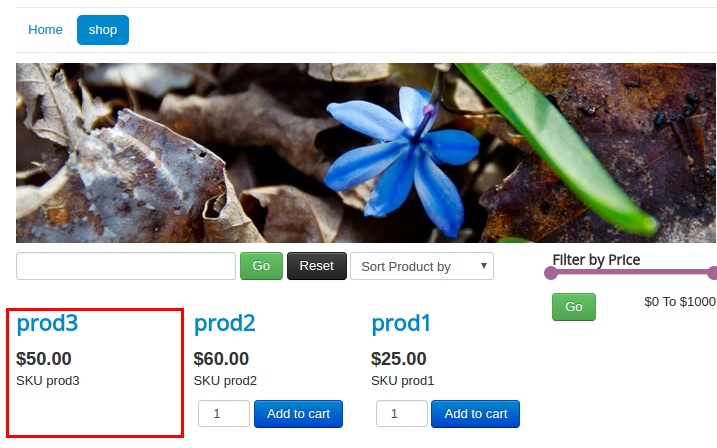

# Geo IP Restricts

Geo IP restricts helps you restrict customers from a certain geographical region from purchasing your products. With this app you can restrict purchase in two ways. You can block products from being viewed on certain regions. Or you can display a customised message that informs the customer that product is not available in his gepgraphical area.

#### Requirements

* PHP 5.4 or higher

* Joomla 3.x

* J2Store 3.2.14 or higher

* Akeeba Geoip provider plugin

#### Installation

Before installing the app, you must install the **Akeeba geo ip provider plugin** to find the location of the customer using IP address. Download the Akeeba geo ip provider plugin from here https://www.akeebabackup.com/download/akgeoip.html


After finish Installing Akeeba Geopip provider, download the Geo IP Restricts app from our site's extensions section. Once downloaded, you must extract the downloaded package and you will be having two zip files.

Install them one by one using Joomla installer.

Go to J2Store > Dashboard > Apps and enable the Geo IP Restricts app.


Now go to Extensions > Plugins and choose search type **System** and enable System - Akeeba GeoIP provider plugin and System - Geoproducts plugin.


#### Configuration

**Step-1**
Go to J2Store > Dashboard > Apps and open the Geo IP Restricts app.


**Step-2**
On opening the app, you will be having the option to choose how the product should be hidden. For example, you can hide only the cart button or hide the entire product or restrict adding product to the cart.

Choose your option from the dropdown list and press **Save** button.




**Step-3**

* Now Go to Article manager and open / edit your product.

* Move to J2Store cart tab and navigate to Apps tab.


* Choose the customer's country to which the product should be hidden.
```
NOTE: You should create geozone for the country in J2Store -> Localization -> Geozones
```

#### Frontend demo

If customer comes from US, add to cart button has been hidden.

