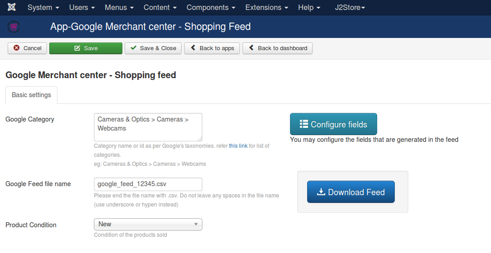

# Google Merchant Center - Shopping feed 

The app helps you export products for Google Shopping feed. 
New to the term Google Merchant? More details can be found at [Google Merchant Center ](https://www.google.com/retail/merchant-center/)

If you have any doubts or queries regarding Merchant center service, visit [Google merchant Support center](https://support.google.com/merchants/)

### Parameters

1. **Google Category** - Google has its own detailed taxonomy (or) classification of products. Input the category to which all your products belong to. For list of categories provided by Google, refer this [link](https://support.google.com/merchants/answer/1705911).

2. **CSV file Name** - 
Name of CSV file used to upload in merchant center. Make sure the file name does not contain any spaces (use underscores or hyphen symbol instead of space).

3. **Product Condition** -
Please select your product condition from this list. There are three options (New, used, refurbished)

### Configure Fields
* There are a list of fields to be uploaded to google merchant center feed. 
* You may enable or disable the fields in this section.
* The fields in **Enabled** state are considered during Feed generation.
* Please refer [Google's Documentation for List of Fields](https://support.google.com/merchants/answer/188494?hl=en-GB) used for the Google Shopping Feed and their detailed specifications.

#####Below is a list of fields that are supported by the app.

| Field name              | description                                                                                                    |
|-------------------------|----------------------------------------------------------------------------------------------------------------|
| id                      | Product id                                                                                                     |
| title                   | Product name                                                                                                   |
| description             | Product Short Description or article content                                                                   |
| google_product_category | Value given in the parameters section                                                                          |
| product_type            | Product's Category (Joomla category)                                                                           |
| link                    | Link to the J2Store Single Product view                                                                        |
| mobile_link             | Link to the J2Store Single Product view                                                                        |
| image_link              | Link of the main image. Chosen under J2Store Images Section.                                                   |
| additional_image_link   | Link of the thumbnail image. Chosen under J2Store Images Section.                                              |
| condition               | As per settings in above parameter. (New by default)                                                           |
| availability            | Availability is calculated and based on the product inventory (in stock, out of stock, preorder ) is supplied. |
| price                   | Price of the product                                                                                           |
| sale_price              | Price of the Product                                                                                           |
| gtin                    | custom field                              
| mpn                    | sku (product sku is supplied)                                                                                          |
| brand                  | Manufacturer                                                                                                    |
|  identifier_exists     | Calculated based on Google's constrains (takes two values TRUE or FALSE)                                                                                                    |

#### Generate Feed and upload to Merchant center
Click on the **Download Feed** button to download the feed. Verify the fields and upload the feed to the merchant center for publishing your products to Google Shopping service.

More details on configuring your merchant account and uploading shopping feed can be found at [Google merchant Support center](https://support.google.com/merchants/)
