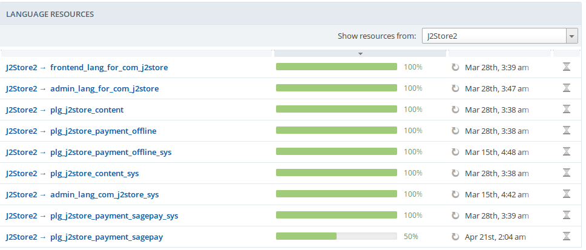
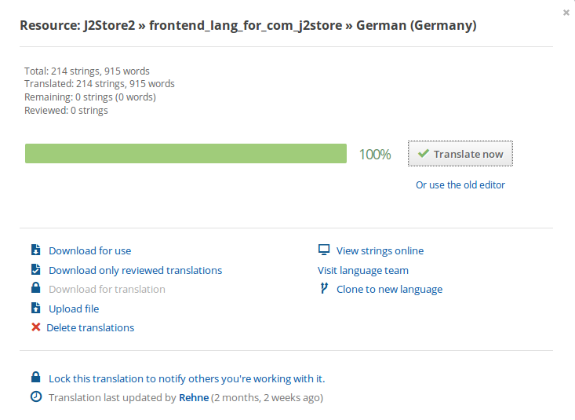
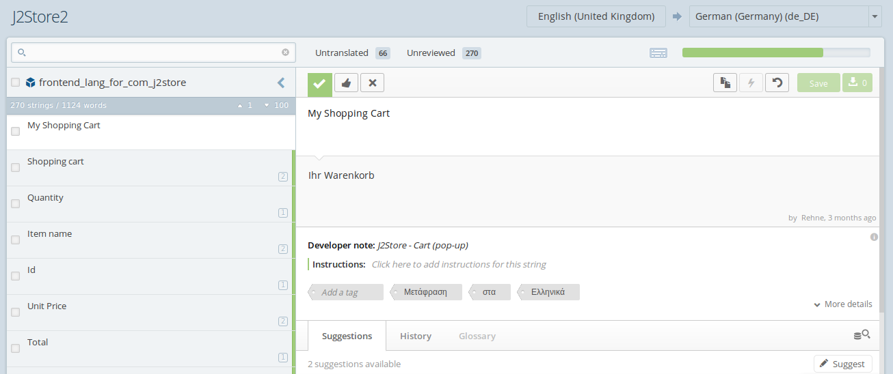

# Translate J2Store in your Language

Translating J2Store in your language is very easy. All the language files are managed in Transifex, an effective localization platform. This guide should help you get J2Store to work in your language with a few easy steps.

#### Check exisiting translations

Go to http://J2Store.org/translations.html to check if the translation for your language is available. If you see your language listed and the progress bar indicating 100 %, then you can click on the name of your language to download the translation pack.

It is an installable pack. You can install it via the Joomla installer.

#### Translations for my language is not complete

If you see the translation for your language is not complete or dont see your language listed at all, you need to translate the J2Store. Dont worry. It is easy to translate J2Store to your language. Transifex makes it easy.

**Step 1**

Go to http://transifex.com and create an account. Its FREE.

**Step 2**

Joomla has a group of volunteers for translation. The group works under the name of Open Translators. Its a hub project for the translation of all joomla extensions. So go to the Open Translators hub project at https://opentranslators.transifex.com

You will see almost all languages listed there. In case, you dont find your language, you can Request language. But that wont be necessary as all the languages are already listed.

So go ahead and click your language. Say, you need German translation. Click the German language. This will take you to German translations page listing translations for all extensions of Joomla.

**Step 3**

Join the team of your language. You can find the Join team button on the top right of the page. See the image below

It would take some time for the co-ordinators of the language team to approval your joining request.

**Step 4**

Once you joined, go to https://opentranslators.transifex.com and the choose J2Store from a list of child projects. Start typing a few letters in the box and you can get to see J2Store project. See the image below.

Once you choose J2Store you can see a list of the language resources. They are normally the standard Joomla language ini files for admin and site side of the J2Store component. We call these files in Transifex as resources.

**Step 5**

Click a resource to start translating. For example click on the J2Store →  admin_com_J2Store_menu. This will open a pop up.

Click on the translate now. This will take you to the translations mangement window.

In the top right corner, you can see the source language and language of file being translated.

The left columns lists the strings. Clicking on a string will present space to enter your translations.

Once you translated all the strings, click save and exit.

Translate all the language resources in the same fashion.

Once you have translated, inform us. We will make an installable package and make it available for download at http://J2Store.org/translations.html immediately.

Still have questions, contact us.
