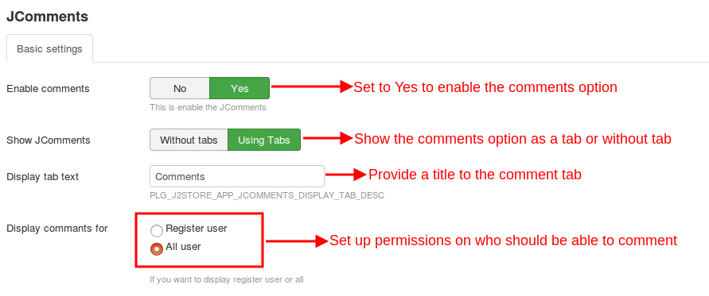
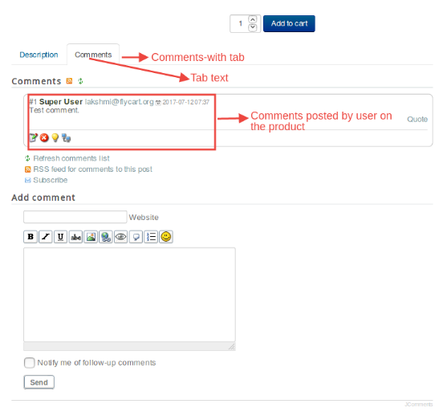
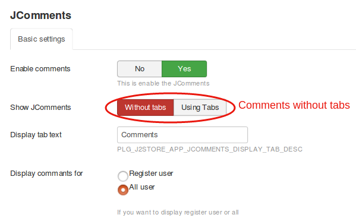
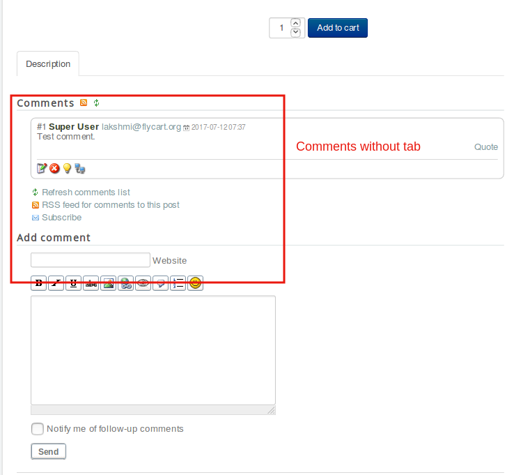

#JComments

Get comments and reviews from usrers through this app.This app could be used to receive user comments for the products.All you have to do is just install and configure this app.

## Installation
This app can be downloaded from our site and installed using the default joomla installer.

However,another component has to be installed to integrate JComments with j2store.

This component can be found in the joomla extensions directory.

After installing both the JComments component and the plugin,follow the below steps:
* Go to j2store->Apps.

* Click the Enable option in JComments app.

* Click Open to configure the app.

## Configuration

* **Enable comment**

 Set this to Yes to enable the comments option in the product page.
* **Show JComments**

 The comments can be shown in tab format or without tabs.
* **Display tab text**

 To give a title to the comments tab.
* **Display comments for**

 Control who can post comments on your products,All users or only registered users.

**Relevant Screenshot**

For the above settings the product view page will be like the one given below:

This depicts the setting for displaying comments without tab:

The following screenshot shows how comments are displayed without tabs:

