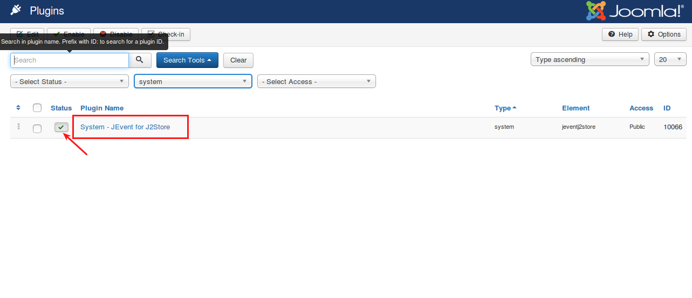
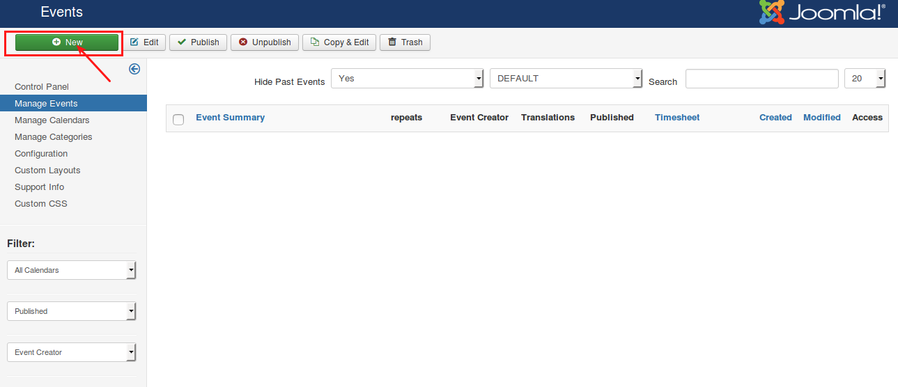
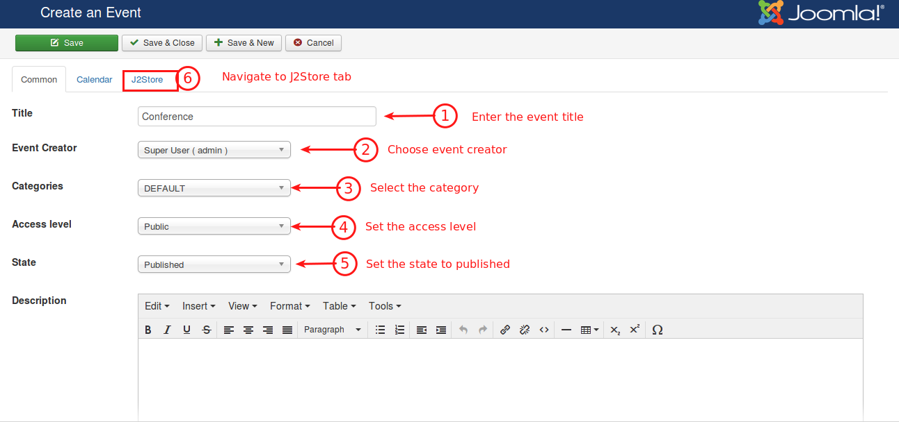
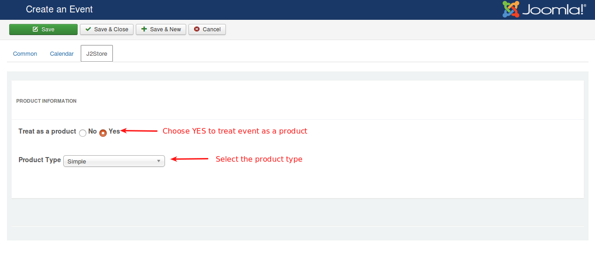
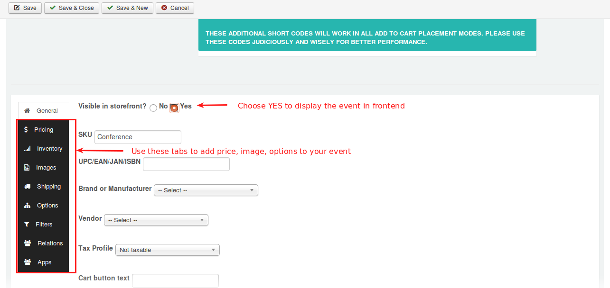
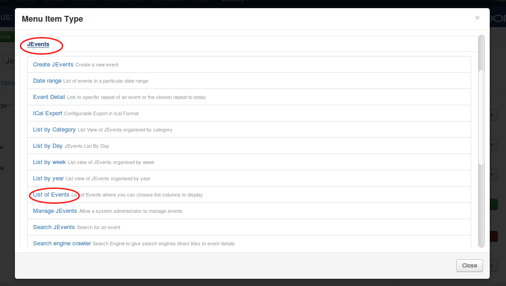
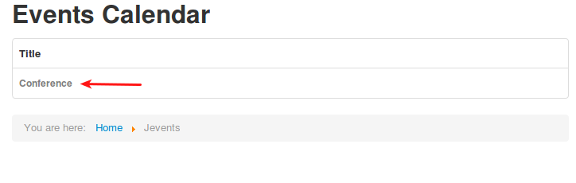
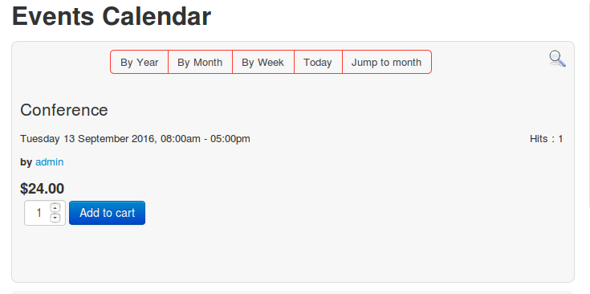

# JEvents

This plugin integrates JEvents with J2Store Joomla eCommerce solution. Now you can treat events as products.

#### Requirements

* PHP version 5.4 or higher
* Joomla 3.x or higher
* J2Store 3.1.6 or higher
* JEvents 

#### Installation

1. Download JEvents Joomla component from Joomla Extension Directory and install it using Joomla Installer.
2. Now download J2Store's JEvents integration plugin from our site's extension section and install it using Joomla installer.
3. Now Go to Extensions > Plugin and choose the search type **System**.
4. Find the plugin System - JEvent for J2Store and enable it.

#### Use JEvents as J2Store products

**Step-1:**

Configure JEvents configuration settings when you install JEvents first time in your site. If you are installed JEvents already in your site, skip this step and go to nxet.

**Step-2:**

Now Go to JEvents > Control Panel and click on **Manage Events**.

**Step-3:**

Click **NEW** button on top left of the Events page

**Step-4:**

Enter the event title, choose the category, access level and set the state to Published.

Now move to J2Store tab and choose **YES** to Treat as a product and select the product type and then click save.

**Step-5:**

Once you saved, again go to J2Store tab / scroll down and navigate to **General** tab.

Set **YES** to Visible in storefront

And then navigate to pricing tab, images tab, etc to add price, image for your event.

Save & close the event.

**Step-6:**

Go to menu manager and create new menu item with menu type as JEvents > List of Events.

#### Frontend Demo

