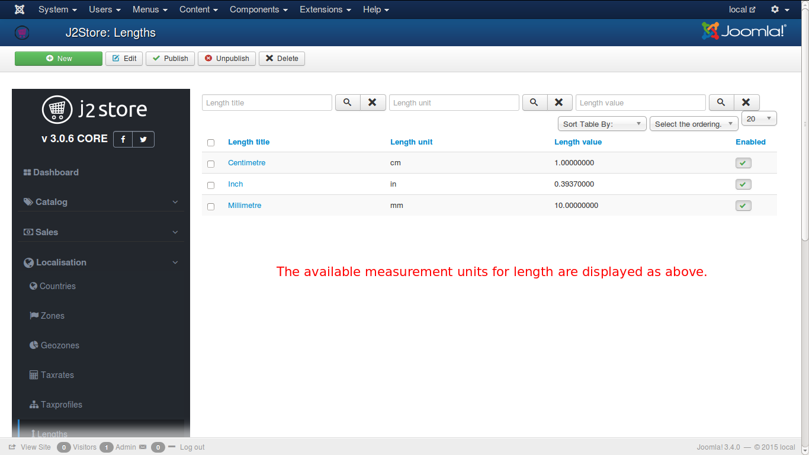
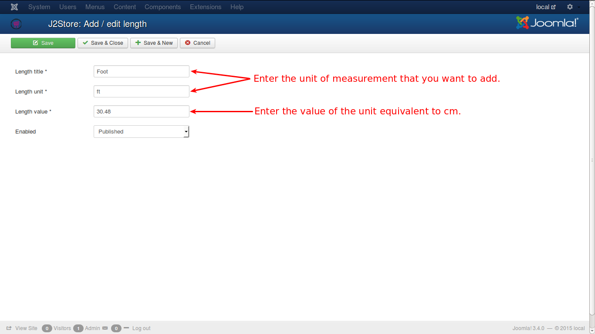

# Lengths

Length classes are used to assign length specifications to products in J2Store cart.

This class needs the following details: 

#### Length Title
Formal name of measurement unit for base quantity length. (e.g. Centimetre)

#### Length Unit
Short form of measurement unit. (e.g. cm)

#### Length Value
This is set to be 1 for default. All other measuring units for base quantity length are relative the given example unit and the value entered for those units must be in correlation to this unit.
* For e.g., there are 10 mm in 1 cm. likewise, 0.39370000 inch is in 1 cm
* Like this, every value should be relative to cm

Refer the image below.

You can add new units, if you need, as illustrated below.

