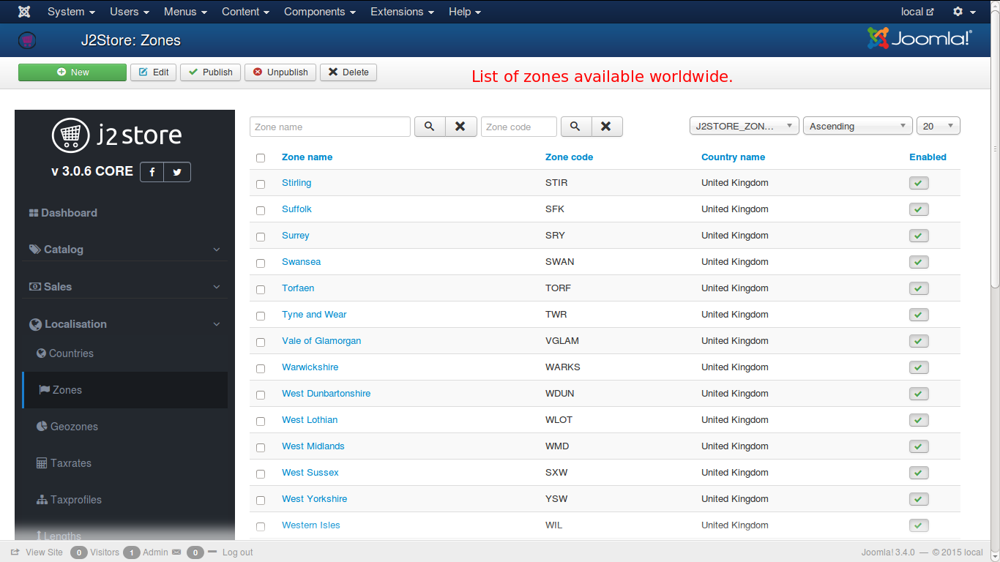
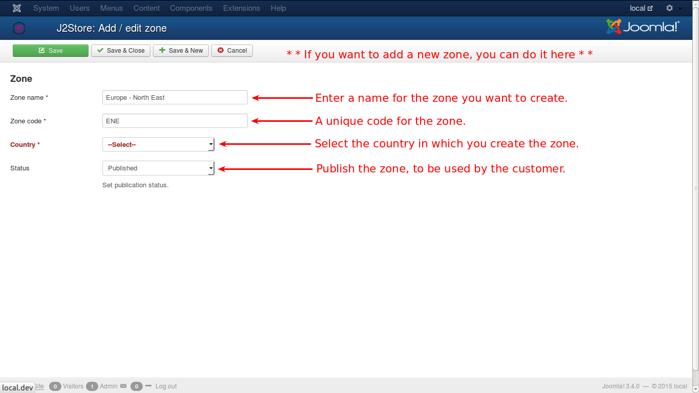
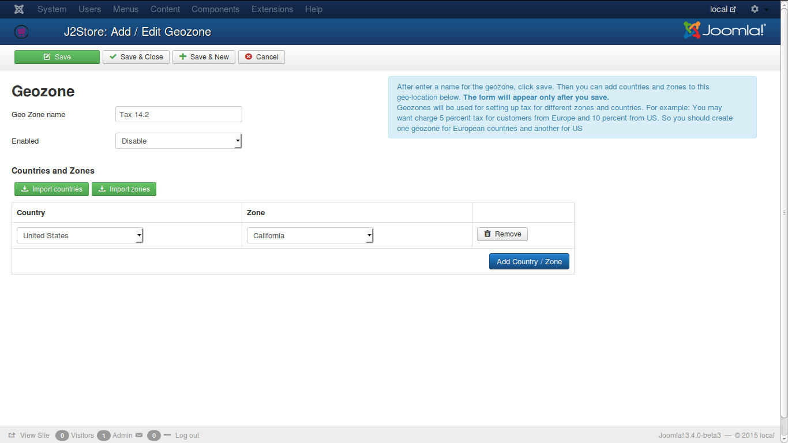
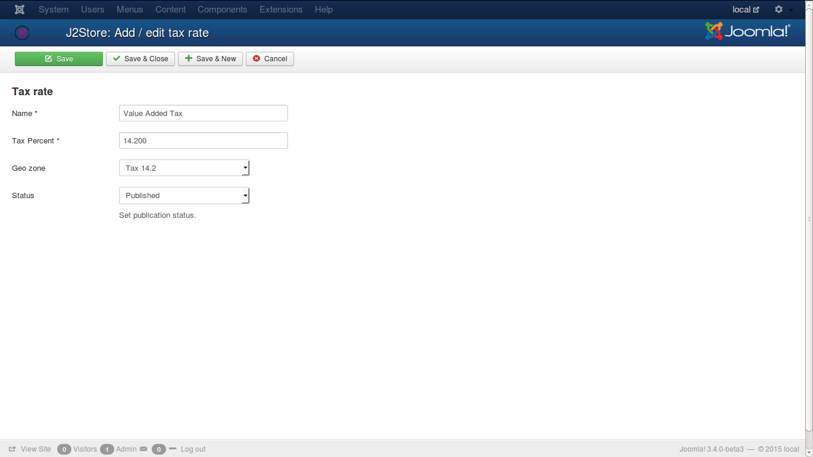
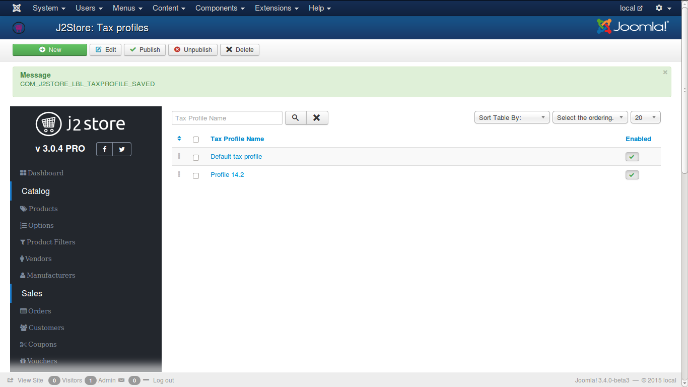
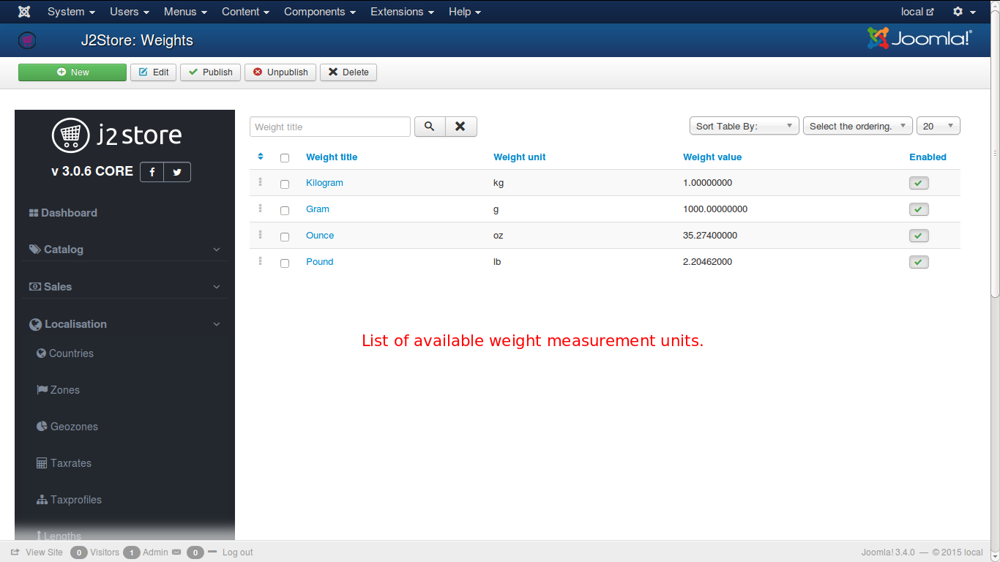
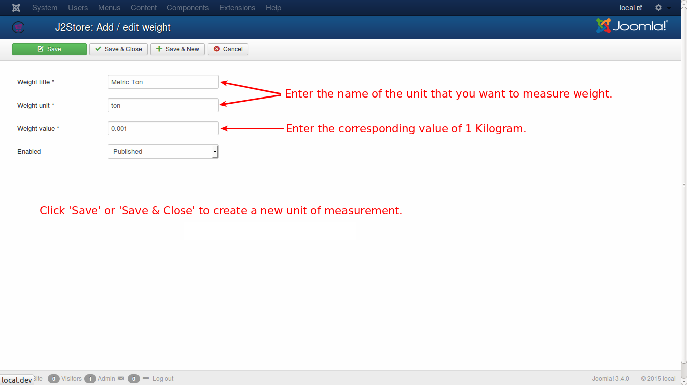

# Localisation

- **[Introduction](#introduction)**
- **[Countries](#countries)**
- **[Zones](#zones)**
- **[Geozones](#geozones)**
- **[Tax rates](#tarates)**
- **[Tax profiles](#taxprofiles)**
- **[Lengths](#lengths)**
- **[Weights](#weights)**
- **[Order statuses](#order-statuses)**

##Introduction

These are basically properties that help you to configure your store to your local/regional needs. Primarily for taxation purposes. You can also add/edit countries, zones, group the countries/zones as geozones, length, weight measurements. You can also create more custom order statuses

## Countries

A list of most of the countries in the world. You can choose one from the list. If any odd one, that is not found in the list, you can very well create that. The fields are:

* **Country Name** - Name of the country
* **Country code** - 2 digit international standard code
* **Country code** - 3 digit international standard code
* **Enabled** - Published or Unpublished i.e., only if the country is published, it will be available for the customer
 
Check the image below:

The listing of countries will be like this in your J2Store.

## Zones

Zones are regions that are separated by geographical area for ease of administration purpose, with in a country. Generally, in every country, the state or province, as the case may be, is treated as a zone.

Just have look on the image below which displays the list of zones.

Almost all the zones are loaded by default in J2Store but if you need to create one as and when the situation arises, you can very well do so, as illustrated in the image below.

The required fields for a zone are as follows and are fairly self explanatory...
* **Zone Name** - Name of the new zone
* **Zone Code** - Code attached to the zone
* **Country** - Country to which the zone belongs to
* **Status** - Whether it is enabled for use by the customer

## Geozones

Geozones are created based on geographical locations that have common tax profiles. Geozones are used to set up different tax practices for different countries and zones.
* For instance, if tax percentage for Europe is set at 5% and for US at 10%, then two geozones are created for this purpose and countries belonging to Europe are added in one geozone and US to other geozone.

If a geozone is created and saved, then an option row will be displayed to add countries and zones to the new geozone. Like this any number of zones or countries can be added or removed in geozones.

* In the configuration page, go to **Store** tab and create a profile with United States in the country field and California as state
* Now create a geozone with a meaningful name of your choice. In this example, it is 'Tax 14'
* Map the country and zone in the fields show below with United States and California

See the image

## Tax rates

Create tax rates for your region (geozone)

## Tax profiles

One or more tax rates are grouped to form a tax profile. 
You can map the tax rates to either the customer's billing or shipping address.
IMPORTANT: Make sure your taxes are mapped correctly. If you choose Billing here, then in your Configuration - Tax, the Calculate tax based on should also be set to the same address type. 

Generally, tax is calculated for billing address. But in some countrues, where it is calculated for shipping.

Let an example help understand how it works.
This example assumes that the store is located in the state of California, US.

Now create a tax rate in that page by entering the sample data.

* Name        : Tax
* Tax Percent : 14.2 (Enter only numbers and a single . for decimal. No other symbols should be used)
* Geozone     : 14.2 (Select the geozone from the list)
* Status      : Published

Now check the Tax Rate image

Now go to tax profiles and add a new profile.

* Taxprofile Name  : Profile 14.2 (any name of your choice)

Now click the green button 'Save' only and no other button.

Now you can map the taxrates by assigning one to an address type as described below:

**Rate** - select the added 'Value Added Tax' from the list.

**Associated Address** - select 'Billing Address' from the list.

Check the image below:

## Lengths

By default, J2Store adds the most commonly used length measurements. If you require more measurement units, you can add here.

#### Length Title
Formal name of measurement unit for base quantity length. (e.g. Centimetre)

#### Length Unit
Short form of measurement unit. (e.g. cm)

#### Length Value
This is set to be 1 for default. All other measuring units for base quantity length are relative the given example unit and the value entered for those units must be in correlation to this unit.
* For e.g., there are 10 mm in 1 cm. likewise, 0.39370000 inch is in 1 cm
* Like this, every value should be relative to cm

Refer the image below.

You can add new units, if you need, as illustrated below.

## Weights
By default, J2Store adds the most commonly used weight measurements. If you require more measurement units, you can add here.

#### Weight Title
Formal name of measurement unit for base quantity weight. (e.g. Kilogram)

#### Weight Unit (short form)
The short form of measurement unit. (e.g., kg)

#### Weight Value
The default value for kg is set to be 1. This should be in relativity with other units of measurement.
* For e.g., there are 1000 grams in 1 Kg, and hence the grams should be set to 1000 when Kg is set to 1.

If you want to add a new meausring unit for weight, you can do it as illustrated below:

## Order statuses

By default, J2Store comes with the following core order statuses.

* CONFIRMED
* PROCESSED
* FAILED
* PENDING
* NEW
* CANCELLED

You can add more order statuses if needed.

