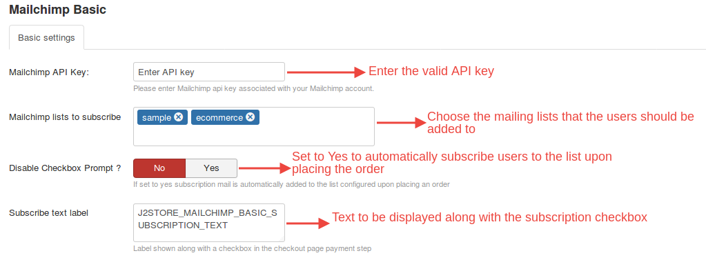
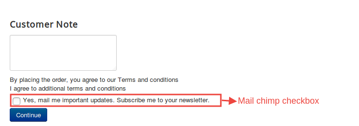

# Mailchimp

The Mailchimp Integration app integrates Mailchimp with J2Store and allows your customers to automatically subscribe to mailchimp newsletters.
Your customers may choose to subscribe to mailchimp newsletters during purchase at the checkout page.

Returning customers and sales from returning customer play an important role in every business.

Track your paying customers and add them to your mailchimp lists.

## Installation
This plugin could be downloaded from our site and installed using the default joomla installer.

Once installed, you could enable the app by navigating to J2store->Apps.

## Configuration

### Basic Settings

* **Mailchimp API key**

 Enter the valild mailchimp key and click Save.   

* **Mailchimp lists to subscribe**

 Once the API key has been input and saved,this textbox will prompt the mailinglists that are available in mailchimp.

 You could choose the lists that users have to be added.

* **Disable checkbox prompt**

 Setting this to Yes will not display the checkbox asking users to subscribe to newsletters but the users will automatically be subscribed upon placing the order.

* **Subscribe text label**

 Text to be shown along with the checkbox asking for mailchimp subscription.

 Click Save to finish Configuration.

** Relevant Screenshot**

The screenshot given below explains the settings for mailchimp:

For the specified settings,the mailchimp feature will appear like this:

