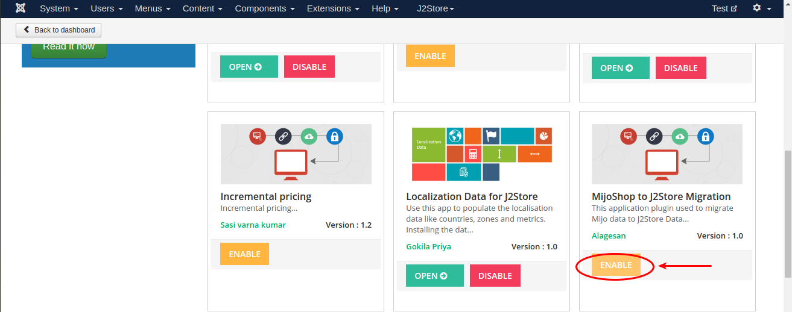
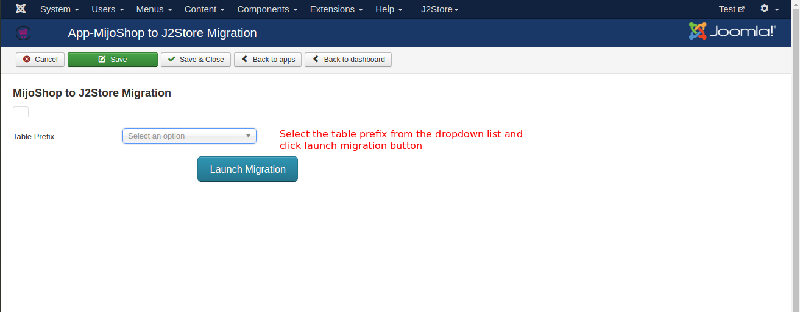
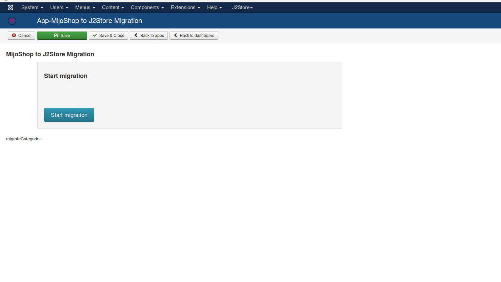
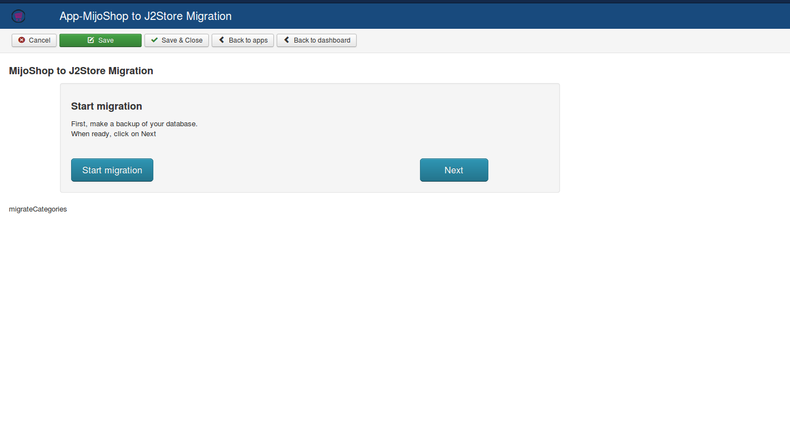
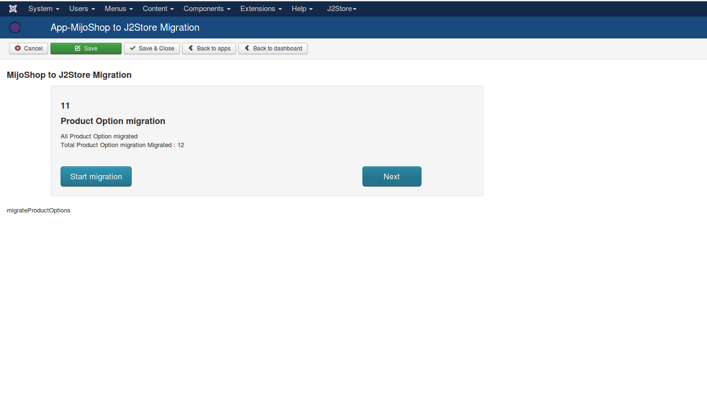
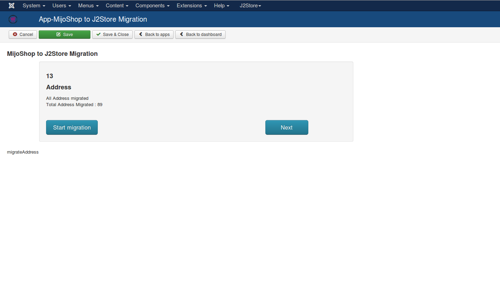
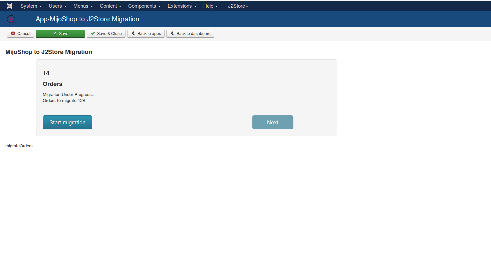

#Mijoshop Migration App for J2Store

This app imports store data from Mijoshop to J2Store 3.x.

**Note:** This migration tool / app is in BETA stage and should only be used in TEST sites. It SHOULD NOT BE USED IN LIVE sites.

This app is compatible only with J2Store 3.x and Joomla 3.x.

If you run mijoshop in a Joomla 2.5 then you may copy all the mijoshop tables to a Joomla 3 test site, install J2Store 3.x and install this migration app and start the migration process.

####Requirements

1. PHP 5.4 or higher

2. Joomla 3.3 or above

3. J2Store 3.1.10 or above

####Installation Instructions

1. Use the Joomla installer to install the app.

2. In the backend, go to J2Store Dashboard -> Apps as shown in the image below.

3. Click Enable in the MijoShop to J2Store Migration app.


4. Once the app is enabled, click on Open to set the configuration for the app.

####Migration

```
NOTE : Before starting migration, please set Error reporting to None in the Global configuration.
```

Select the table prefix from the dropdown list and click on **Launch Migration** button to start the migration and follow the on screen instructions.



**NOTE**: When migration is under progress, the next button is disabled and please do not refresh the page and wait until the process gets completed.

#### Launch Migration

Click Start Migration



Click on next will start migration step by step



Product option migrated. Click next to initiate next migration step.



