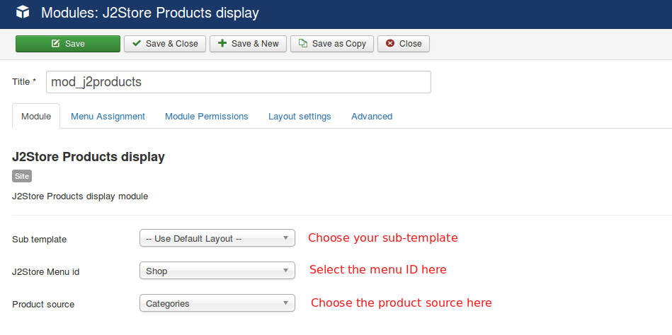
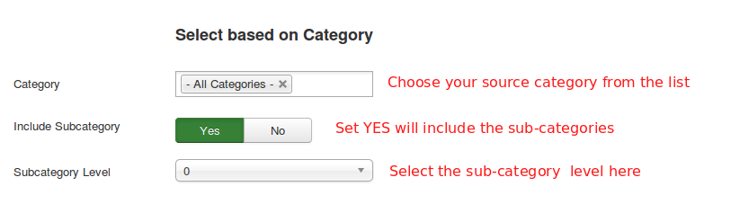
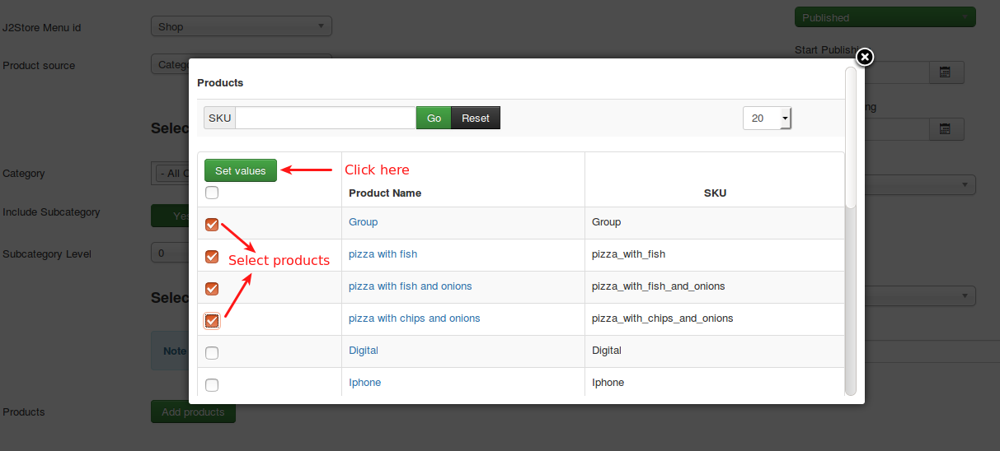
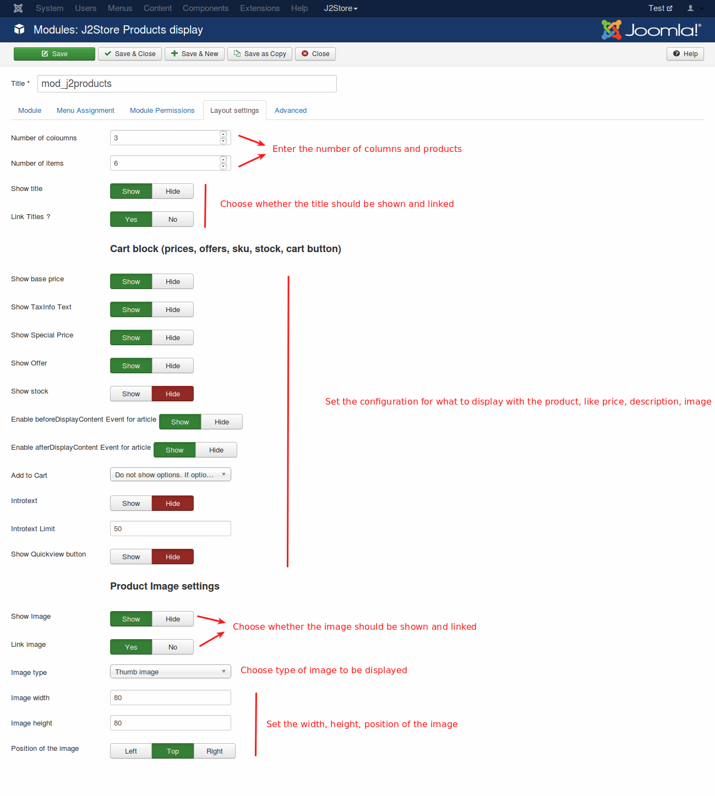
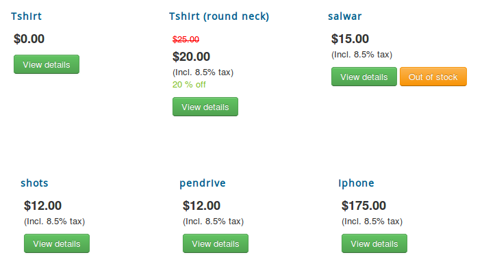

# Product Module

The J2Store Product Display Module allows you to display the products in carousel view and in normal view. using this module you can display J2Store products anywhere in your site.

## Requirements

1. PHP 5.4 or higher

2. Joomla 3.3 or above

3. J2Store 3.2.x or above

## Installation

1. Use the joomla installer to install the module package.

2. Go to Extension > Modules.

3. Find the Products - J2 module and enable it.

4. Open the module to configure the settings.

## Configuration

### Module

**Sub-Template**

Module will display the products with the layout chosen here. You can choose any of the following three sub-templates.

- **Default** - It uses bootstrap2 styles. Choose this sub-template, if your template does not have Bootstrap 3 support.
- **Bootstrap** - It uses bootstrap version 3.
- **Carousel** - Choose this sub-template, if you would like to display your products in carousel mode.

**J2Store Menu ID**

You should have atleast one menu item with type as J2Store > Product List View and chosen here. Other wise, the module does not work.

**Product source**

Choose any one of the following three source types to display the products.

- Categories - If you would like to display your products from any specific category, choose the source type as Categories.
- Selected products - It is possible to display specific products by using this source type.
- Top Best selling products - Choose this source type to display top selling products in your store.

### Select based on category

**Category**

Choose the category or categories from which you would like to display the products.

**Include Subcategory**

Choose **YES** will include the sub-categories.

**Subcategory level**

If you wants to include the sub-category please choose your sub-category level here.(For example Level 1, Level 2, etc)

### Select based on Product Ids

You will have to use this option when you select your source type as Selected products.

Click Add products button. On clicking this button, the popup window will show all your products you have created. Select the products and click on Set values button.

### Menu Assignment

Choose the page where the module should be shown your products.

### Layout Settings

Enter the number of products to be displayed in the text box provided and the number of columns in which the product display is divided.

Also you can see other options such as Price, image, SKU, stock, etc.. You can set HIDE / SHOW to those options as per your choice.

# Frontend screen shots

#### Normal layout

#### Carousel layout

