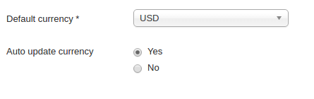
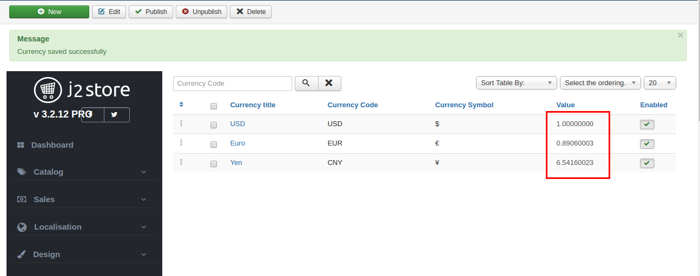
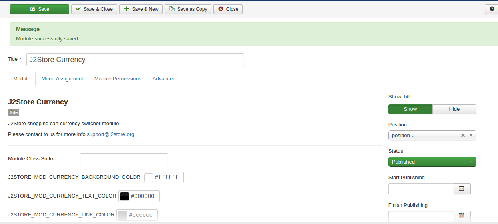
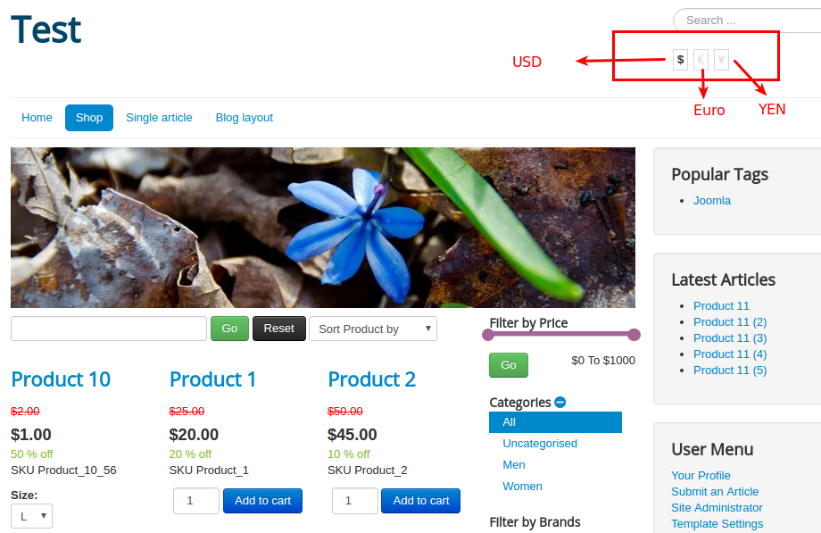

#J2Store Multi Currency

J2Store multi currency feature allows store owner to setup multiple currencies. For example, if the location of store is  United States and the store owner wants his store to be accessed by customers from Japan and European countries, then he / she will have to create one primary currency (for united states) and two secondary currencies (one for Japan and other for European countries).

#### How to setup Primary or default currency?

First you have to decide your primary or default currency for your store. The **value** option in currency settings is used to set the default currency. If the value is set be 1.000000 for a particular currency, it will serve as the default currency.

For e.g., if US $ is been set the value 1, it will be the default currency and the corresponding value will be 0.81 for Euro. In this way J2Store will calculate the prices for products based on currency transitions.

To make the currency value auto update, go to **J2Store > Configuration > Store tab** and choose **YES** to Auto Update Currency.

Choose the Default Currency as **USD** in your store configuration.

After choosing Auto update currency to YES, when you are going to create secondary currency, the value of the currency will be updated automatically. See the below picture,

####J2Store Currency Switcher

Go to Extension > Modules. 

Find the J2Store currency module and enable it.

Open the module, set the module position to any one of your template's positions.

Assign it to the All pages or to the particular menu and Save it.

####Frontend

