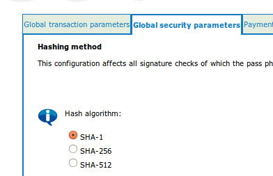
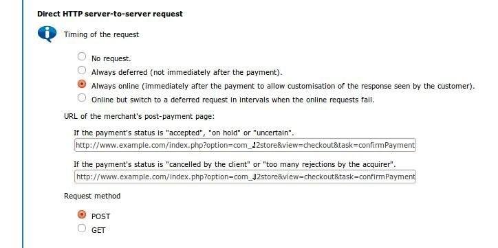

# Ogone Payment Plugin

The Ogone Plugin enables you to receive payments via Ogone Payment Gateway. Getting a Ogone account is very easy. Look at more about Ogone here http://ogone.com 

>NOTE: Please sign in for a test account at Ogone and then download the user guides for Configuring the Ogone account. Reading basic e­commerce integration and advanced e­commerce integration will be useful for developers.

The following links to download these guides are working as of March 10, 2015:

https://secure.ogone.com/ncol/Ogone_Testacc_EN.pdf 
https://secure.ogone.com/ncol/Ogone_e­Com­BAS_EN.pdf
https://secure.ogone.com/ncol/Ogone_e­Com­ADV_EN.pdf

The plugin uses the E­commerce Integration method of Ogone.

#### Requirements
* PHP 5.2 or higher
* Joomla 2.5.x
* J2Store 1.0 or above 

#### Installation Instructions 
1. Use the Joomla installer to install the plugin. 
2. In the backend, go to Extensions­>Plugin Manager and open the Ogone 
Payments plugin (type=**j2store**). 
3. Enable the plugin 
4. Enter the parameters (read the explanation about each parameter given below) 
5. Save and close it. 

Now you can see the Ogone Payments as an option during the Check out process.

**Parameters**
***Ogone Vendor PSPID***

This is your Unique Merchant ID provided by the Ogone

***Client language***

This will set the language of the Ogone Payment Page. (Nothing 
to do with your Joomla installation. If no language is given en_US will be the default.

***SHA1-IN Signature***

**This is the SHA­1 IN signature set up by you in the Ogone 
settings (see below for the required settings to be done at your Ogone account). This ensure security of your transaction.**

***SHA1-OUT Signature***

**This is the SHA­1 OUT signature set up by you in the Ogone settings (see below for the required settings to be done at your Ogone account)** 

***Ogone Test Account***

Ogone offers a testing suite. Before going live, it is advised to test your store using the Ogone test server. Read more about Ogone test account at the Ogone's official website

>NOTE:  IN LIVE SITE, THIS SHOULD BE SET TO NO. 

***Thanks Msg Joomla Article ID***

You can create a Joomla Article to say thanks to the users, who purchased in your online store. Enter the article ID here.

#### Required Ogone settings
##### Default operation code
**Sale**: This will enable you to receive instant payment.  
**Authorisation**: This you have to either manually or automatically capture it.

For Sale, a successful payment will return Status code 9 and for Successful Authorisation, the status code is 5. Both the cases will be treated as Success and Confirmed by the 
Ogone plugin.

>NOTE: If you are selling digital goods, it is advised to use SALE as operation 

The following parameters in your Ogone account (Technical Information) should be set as instructed below.

##### Hashing method (Tab: Global security parameters)

Should be set to SHA­1. The plugin will not work with the other methods. Refer the image below.

##### Checks for E­Commerce (Tab: Data and origin verification)
URL of the merchant page containing the payment form that will call the page: orderstandard.asp: 

This should be set to http://www.yourdomain.com

##### Post sale configuration : (Tab: Transaction feedback)
This is required to update our database after the payment is done. Under the heading “Direct HTTP server­to­server request”, set both the URLs of the merchant's post­payment page as below:

http://www.yourdomain.com/index.php?option=com_j2store&view=checkout&task=confirmPayment&orderpayment_type=payment_ogone&paction=process&tmpl=component

Request method: POST

(see the picture below with example urls.)

#### Support

Still have questions? You can reach us in support@j2store.org or post in our support forum: http://j2store.org/forum/index.html 

Thank you for using our extension.

