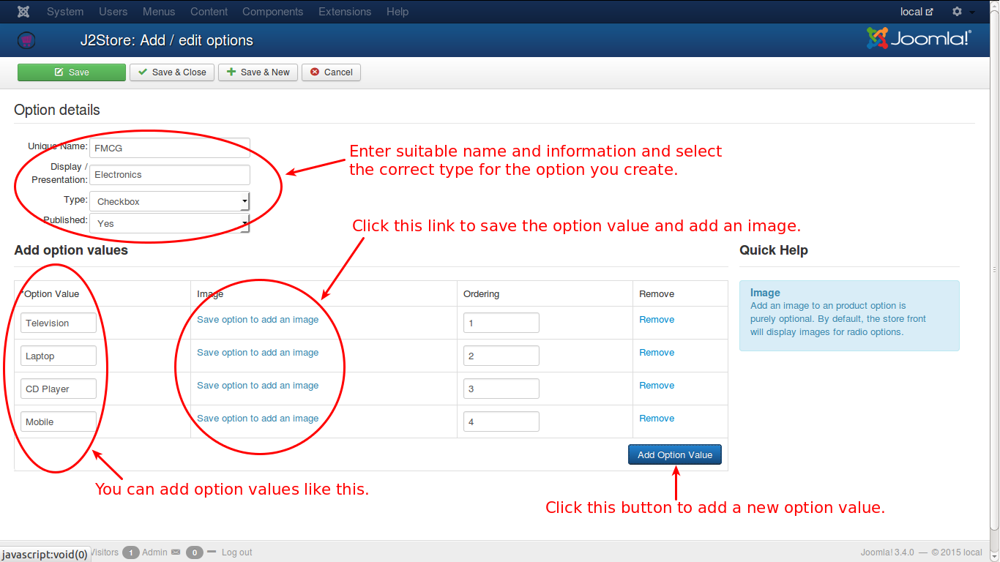
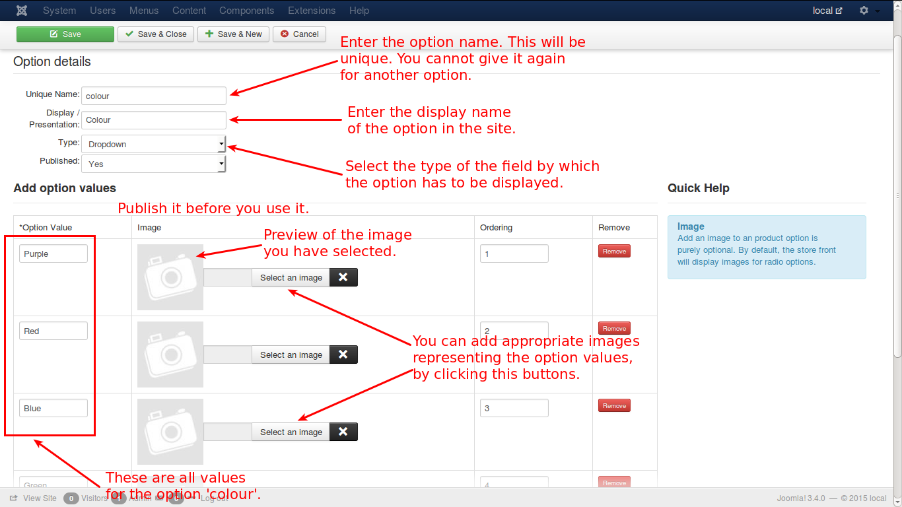

# Option Values

The option values are the choices that are associated with a particular option to choose from. For example, you create an option with name 'Electronics', you can add many values for that particular option, like television, CD Player, Laptop, Music System, etc.

This can be understood from the image below.

Here, under the option 'Electronics', you have the values as
* Television
* Laptop
* CD Player
* Mobile

For better understanding, refer the image below:

 
