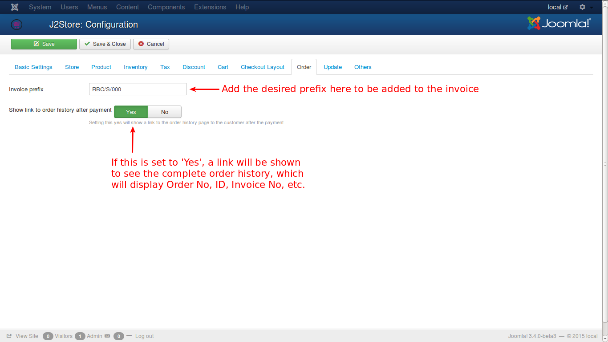

# Order

Two options are available in this tab.

* ***Invoice Prefix***

    This is the prefix of the Invoice generated when payment is done. For e.g., the system generates only numbers and if one wants to add some prefix to the invoice number to add information about the invoice, it can be done by setting this field with the prefix.
    * Let's assume a company with a name RB Corporation, sells some products and the invoice prefix can be anything customized by the owner of the company. Some of the possibilities are:
        * **RBC/S/000**
        * **RBC-2015-S-000**

In the above example, **RBC/S/000**, ***RBC*** is the initials of the company, ***S*** can be added for sales classification, ***000*** for number prefix.

Likewise, in ***RBC-2015-S-000***, all are same and the extra 2015 may be added for the sales for the year ***2015***.

Now the system generated invoice number, say 1, will be appended with this prefix, and will be displayed as **RBC/S/0001** in the invoice.

For a better understanding, check the image below.

* ***Show Link to Order History after payment***
    
    Enabling this will show the user a link which will take to the user's order history page. This will be done only after payment.