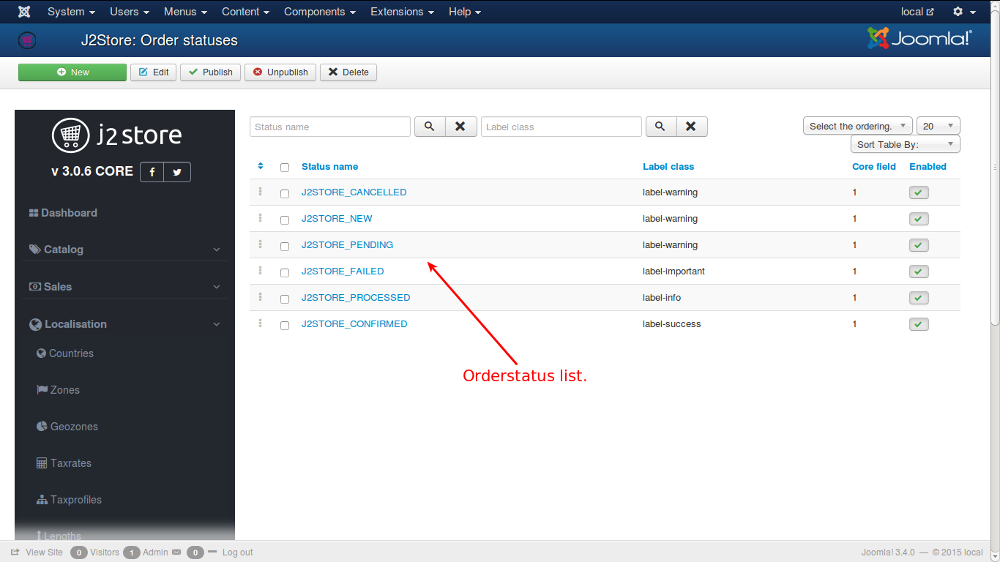
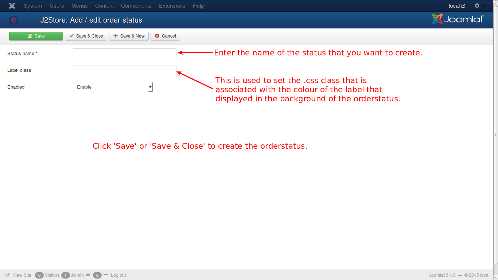

# Order Statuses

These are the processing level of the orders placed in the cart at a particular point of time.

There are six levels to notify the status. They are as follows:
* CONFIRMED
* PROCESSED
* FAILED
* PENDING
* NEW
* CANCELLED

#### CONFIRMED
This means that the order has been completed with all aspects.

#### PROCESSED
This status informs that the order is under processing and may be completed with in a specific span of time.

#### FAILED
The order has been failed to be executed may be due mismatch of required documents or any kind of non-compliance of order processing requirements.

#### PENDING
The order is yet to be completed and may be in need of some supportive information or anything similar to that.

#### NEW
This is a new order.

#### CANCELLED
This status shows the cancellation of order by the customer.

The available orderstatus messages are as shown in the image:

You can a new one as illustrated in figure below:

