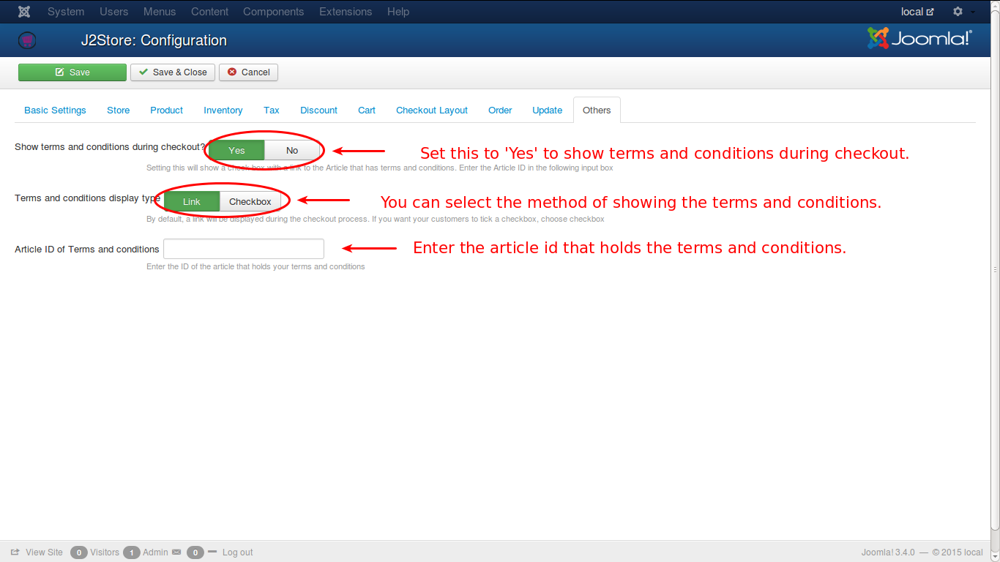

# Others

This tab has some options that are related to terms and conditions of the store.

* ***Show Terms and Conditions during Checkout***

    If this option is set with a **Yes**, a checkbox with a link to the article that contains the Terms and Coditions will be shown. 

* ***Terms and Conditions Display Type***

    This is to decide how the Terms and Conditions link is to be displayed. By default, it will be a **Link** but if it is desired to be a check box, it is possible by selecting **Checkbox**.

* ***Article ID of the Terms and Conditions***

    The ID of the article that holds the Terms and conditions is to be given here.
    
Check the image below for a better idea.

