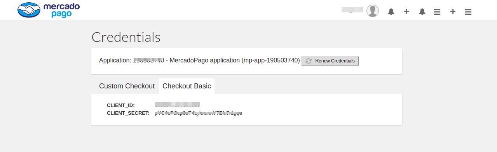
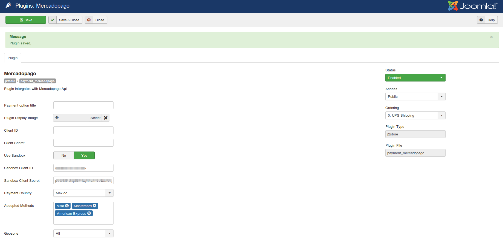

# Mercadopago payment

MercadoPago is one of the popular payment gateway in Latin America. The plugin integrates MercadoPago with the J2Store Joomla shopping cart.

You can configure the plugin in less than 10 minutes and start accepting payments. It supports credit card and other payment methods.

The plugin also allows you to the test your integration before going production.

**Supported countries**

Argentina, Bolivia, Chile, Colombia, Costa Rica, Cuba, Dominicana, Ecuador, Honduras, Guatemala, Mexico, Nicaragua, Panamá, Perú, Portugal, El Salvador, Uruguay, Venezuela

### Requirements

* PHP version 5.5 +

* J2Store version 2.7.3 +

* Joomla version 3.x

### Installation

1. Download the payment plugin from our site and install it via Joomla installer

2. After installing the plugin, go to J2Store > Setup > Payment methods and enable Mercadopago.

3. Once activated, open the payment plugin and configure the basic settings of the plugin.

### How to get client ID and Client secret key ?

**Step 1** - Access the Market credentials page  and log in. If you do not have an account yet, create a new one .

**Step 2** - After loggin in you will see your Client ID and Client Secret.

### Configuration

**Payment option title**

The value entered here will be used as the title for this payment method. Customer will see this value when he checks out.

**Plugin Display Image**

This image will be displayed while payment options are listed in the checkout page.

**Client ID**

Enter the client ID provided by the Mercadopageo payment.

**Client secret**

Enter the secret key associated with your Mercadopago account.

**Use Sandbox**

Mercadopago payment offers a testing suite called Sandbox. Before going live, you can test your store using the pagseguro's sandbox feature.

**Sandbox Client ID**

Enter your mercadopago's sandbox Client ID.

**Sandbox Client secret**

Enter the sandbox secret key associated with your Mercadopago account.

**Payment country**

Choose the country to which you have actually opened the Mercadopago account.

**Accepted Methods**

Choose the payment methods from available payment methods you have in your Mercadopago dashboard.

**Geozone**

By selecting a geozone here, you can restrict this payment method to only customers of that geo-region. Choose All geozones to show this method to all customers.

**Thank you message Article**

You can create a Joomla Article to say thanks to the users, who purchased in your online store. Enter the article ID here.

**Display text on selection**

The text entered here will be displayed when customer selects this payment method. You can enter a language constant as a value here if you are using a multi-lingual site and then write a language override. For example, enter a language constant:

J2STORE_TEXT_TO_DISPLAY_ON_SELECTION.

Now you can go to Joomla admin-> Language Manager->Overrides and create overrides for the language constant in all your languages.

**Display text before payment**

The text entered here will be displayed to the customer at the order summary screen before he makes the payment. You can enter a language constant as a value here if you are using a multi-lingual site and then write a language override. Refer the Display text on selection parameter. 

**Display text on after payment**

The text entered here will be displayed when customer completes the payment.

You can enter a language constant as a value here if you are using a multi-lingual site and then write a language override. Refer the Display text on selection parameter.

**Display text on error in payment**

The text entered here will be displayed to the customer when there is an error in the payment process.

You can enter a language constant as a value here if you are using a multi-lingual site and then write a language override. Refer the Display text on selection parameter.

**Display text if customers cancels payment**

The text entered here will be displayed to the customer when he cancels the payment at the gateway (NOT in your site).

You can enter a language constant as a value here if you are using a multi-lingual site and then write a language override. Refer the Display text on selection parameter.

**Payment button text**

Text entered here will be added as the name of the payment button.

You can enter a language constant as a value here if you are using a multi-lingual site and then write a language override.

**Debug**

Choose YES to enable the debug mode. If you set this to yes, then debug messages will be logged and saved in the cache folder in your Joomla root directory. DO NOT select YES in the live site. 

#### Support

Still have questions? You can post in our support forum: http://j2store.org/forum/index.html

Thank you for using our extension.
