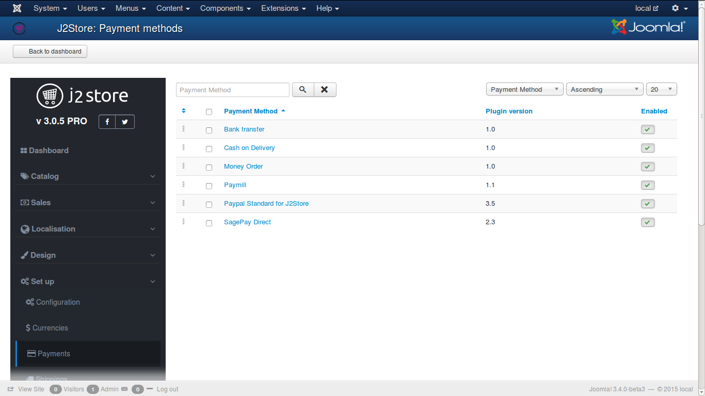
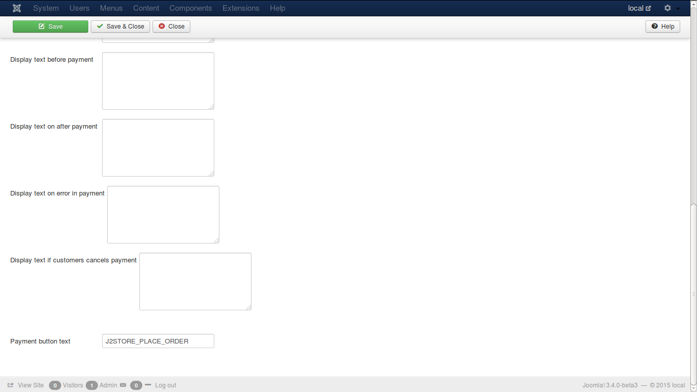
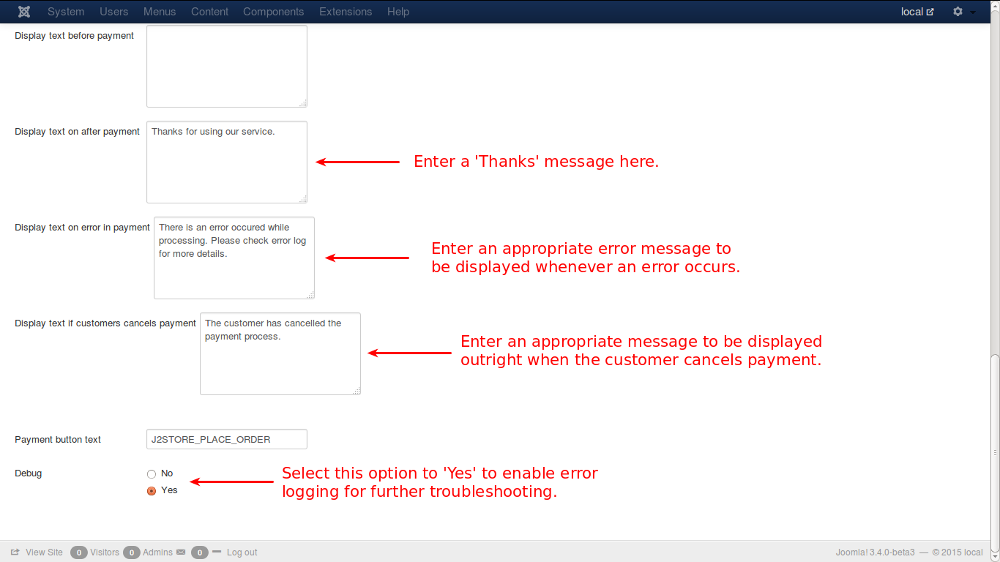

# Payment Methods

This page lists all the payment methods currently available for payment process, as listed below:

The available payment methods are as follows:

* [Bank Transfer](http://j2store.gitbooks.io/user-guide/content/bank_transfer.html)
* Cash on Delivery
* Money Order
* Paymill
* Paypal standard for J2Store
* Sagepay Direct

* ***Money Order***

These methods are payment gateways provided on-line to facilitate users for a secure and swift money transaction for both selling and buying. For all the methods listed below, customer needs to create an account with the service providers.

* ***Paymill***

You need an account with ***Paymill*** to choose this method. If you have/create one, you will be provided with private and public keys for facilitating payments. You need to enter them in the respective fields.

In these payment types, unlike Bank Transfer or Money order methods, the customer has the option to cancel the payment. Also, if any error occurs during payment process, that will be logged. These will be notified through the additional text boxes provided. Check the image below.

* ***Paypal Standard for J2Store***
 
In this method also, you need to have an account for making payments.

The email id associated with Paypal needs to be given for further proceedings. For testing the integration with Paypal, one cannot use the live Paypal account. a separate sandbox has to be created for testing purposes.
You have the option to use **SSL**(Secure Socket Layers) which ensures online data security between the browser and the website.

You can display the 'Thanks' message in your desired location. Check the image below.

For successful payment, or if an error occurs or if the customer cancels the payment, you can set appropriate messages to alert the customer. See the image below.

* ***SagePay Direct***

Select a payment method to customize as you wish. Check the images below to understand how it will be

