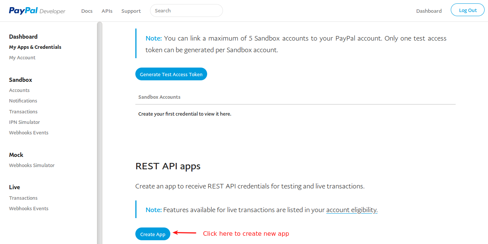

# Paypal Plus

PayPal Plus for J2Store Joomla eCommerce solution uses PayPal's REST API to provide a PayPal-hosted checkout experience directly on your website. This provides the opportunity for the buyer to credit card data directly into your website without redirecting to PayPal in order to process a payment, and it also provides the PayPal option within the same checkout flow for the users who pay so.

#### Supported countries

Paypal Plus for J2Store is compatible with dealers in the following countries

1. Germany

2. United Kingdom

#### Requirements

1. PHP 5.4 +

2. Joomla 3.x or higher

3. J2Store 3.x or higher

#### Installation

1. Download Paypal plus payment plugin from our site and install it using Joomla installer.

2. After installing the plugin, go to J2Store > Setup > Payment methods and enable the PayPal Plus plugin.

3. Once enabled, open the plugin to configure the basic settings.

#### How to identify your Client ID and Secret key?

1. Go to https://developer.paypal.com/ and login.

2. After logging in, click **Dashboard** on top right of that page.

3. From the left menu panel, select **My Apps & Credentials**

4. Under the REST API apps section, you will have to create an app to receive REST API Credentials.

5. Click on Create App button to create a new app. After creating an app, it will be listed below.

6. Click on your app name

7. On clicking app name, it will show your Client ID and Secret key.

#### Configuration

**Payment option title**

Enter a title for this payment option. The value entered here will displayed at checkout payment step.

**Plugin Display Image**

This image will be displayed while payment options are listed in the checkout page.

**Paypal Rest Client ID**

Enter the Paypal Rest API client ID associated with your Paypal account.

**Paypal Plus Secret Key**

Enter the Paypal plus secret key associated with your Paypal account.

**Transaction process method**

Choose your transaction method here.

**Sale :** If you choose **Sale**, you don't need to accept the payment.

**Authorization only :** If you select authorize, you will have to accept the payment in Paypal dashboard.

**Payment method type** 

Choose whether the payment should be collected directly or redirected rto Paypal.

**Direct Debit :** If you choose **Direct Debit**, it allows buyers to enter their card data directly into your website without redirecting to PayPal in order to process a payment.

**Paypal account :** If you select Paypal account, then the customer will be redirected to Paypal to process the payment.

**Card type**

The checkout payment form will display the card types selected here.

**Use Paypal sandbox**

Before going live, you can test your store using the paypal's sandox feature. Choose **YES** to enable sandbox mode.

**Test Paypal Plus Client ID**

Enter Paypal Plus client ID associated with your paypal's sandbox account.

**Paypal Plus Secret Key**

Enter Paypal Plus secret key associated with your paypal's sandbox account.

**Surcharge Percent**

You can collect a percent of the total order value as surcharge / fee for using the Paypal option from your customers using this option. You can enter a value here (for example: 2 ). If you enter 2 here, then 2 % of the total order value will be added as a handling cost to the order.

This is optional parameter.

NOTE: DO NOT enter any symbol like % here.
Leave empty if you dont want to charge.

**Surcharge fixed value**

You can collect a fixed surcharge / fee for using the Paypal option from your customers in addition to the order value. You can enter a value here (for example: 2 ). If you enter 2 here, then 2 will be added as a handling cost to the order.

Leave empty if you dont want to charge.

This is an optional parameter.

**Geozone**

By selecting a geozone here, you can restrict this payment method to only customers of that geo-region. Choose All geozones to show this method to all customers.

**Display text on after payment**

The text entered here will be displayed to the customer after he makes the payment. You can enter a language constant as a value here if you are using a multi-lingual site and then write a language override.

**Display text on selection**

The text entered here will be displayed when customer selects this payment method. You can enter a language constant as a value here if you are using a multi-lingual site and then write a language override. Refer the tips below

Tip - ONLY FOR MULTI-LINGUAL SITES
For example, enter a language constant:

J2STORE_TEXT_TO_DISPLAY_ON_SELECTION.

Now you can go to Joomla admin-> Language Manager->Overrides and create overrides for the language constant in all your languages.

**Display text before payment**

The text entered here will be displayed to the customer at the order summary screen before he makes the payment. You can enter a language constant as a value here if you are using a multi-lingual site and then write a language override.

**Display text on error in payment**

The text entered here will be displayed to the customer when there is an error in the payment process.

You can enter a language constant as a value here if you are using a multi-lingual site and then write a language override.

**Payment button text**

The text of the payment button. The button will be displayed at the final checkout step.

**Debug**

Choose YES to enable the debug mode. If you set this to yes, then debug messages will be logged and saved in the cache folder in your Joomla root directory. DO NOT select YES in the live site.

#### Frontend

Use below test card details for testing purposes.

**Card number :** 4148529247832259

**Month :** 11

**Year :** 2019

**cvv :** 012

