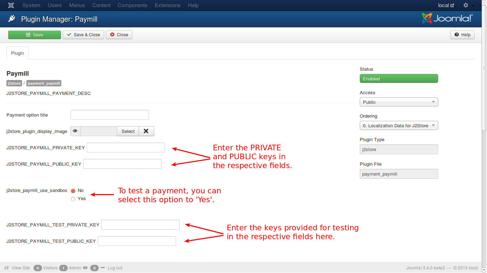
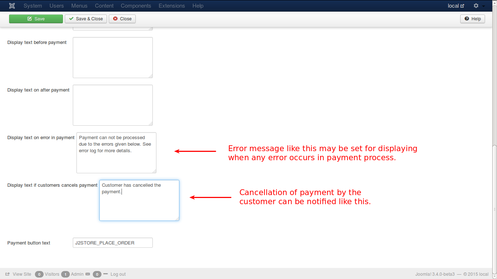

# Paymill

You need an account with ***Paymill*** to choose this method. If you have/create one, you will be provided with private and public keys for facilitating payments. You need to enter them in the respective fields.

In these payment types, unlike Bank Transfer or Money order methods, the customer has the option to cancel the payment. Also, if any error occurs during payment process, that will be logged. These will be notified through the additional text boxes provided. Check the image below.

