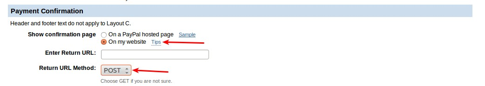
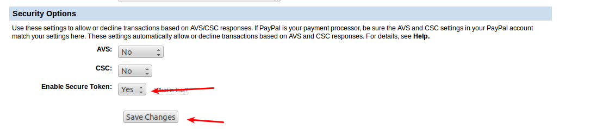

# Paypal Advanced Payment Plugin

PayPal Payments Advanced is a PCI-compliant solution. Even customers without a PayPal account can make purchases through PayPal’s secure payment gateway using the credit card. Accepted cards include Visa, MasterCard, Switch/Maestro, and Solo credit cards in the United States. 

PayPal Payments Advanced is available only for merchants in US and Canada.

#### Requirements 
* PHP 5.3 or higher
* Joomla 2.5.x
* J2Store 2.0.2 or above 

#### Installation Instructions 

Use the Joomla installer to install the plugin like you do for other extensions

#### Configuration
##### Step 1: Configure Your PayPal Account

Before you begin, you must configure your PayPal Payments Advanced account on the PayPal website. 

**Log in to your PayPal Advanced account at manager.paypal.com. **

Go to **Service Settings -> Hosted Checkout Pages -> Set Up**, and make the following settings:

* 1 - Set Transaction Process mode to TEST or LIVE depending on your requirement.

* 2 - Under the Billing Information

**Make these fields required:** Check CSC box

**Make these fields editable:** Check CSC box

See the picture below

* 3 - Under the Payment Confirmation, set

**Show confirmation page:** On my website

**Return URL Method:** POST  (This is very IMPORTANT)

* 4 - Under Security options, set

• AVS: No
• CSC: No
• Enable Secure Token: Yes

Save the settings.

##### Step 2: Customise the Layout

In J2Store Paypal advanced plugin settings, you can choose the Payment window type.

**If you chose, Payment window type as: Your Website (Using iFrame):**

In Paypal manager, go to Service Settings > Hosted Checkout Pages> Customize. Choose the Layout C. 

See the screenshot below

**If you chose, payment window type as Redirect :**

In Paypal manager, go to Service Settings > Hosted Checkout Pages> Customize. Choose the Layout B

